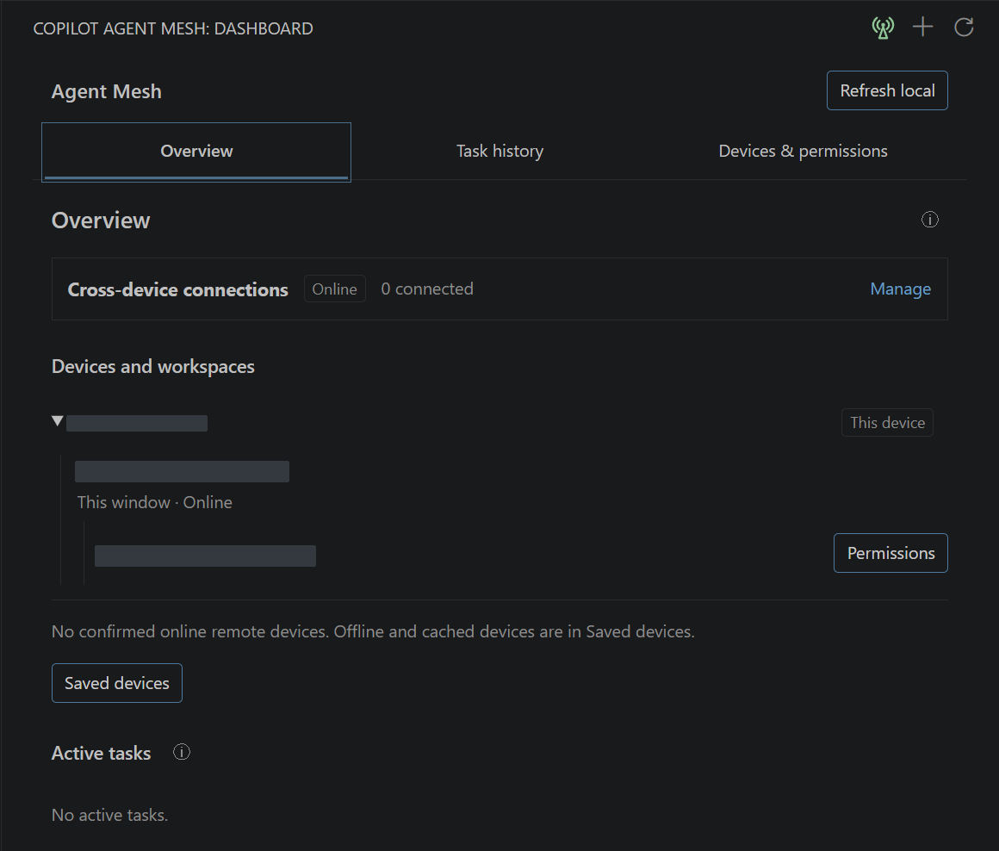
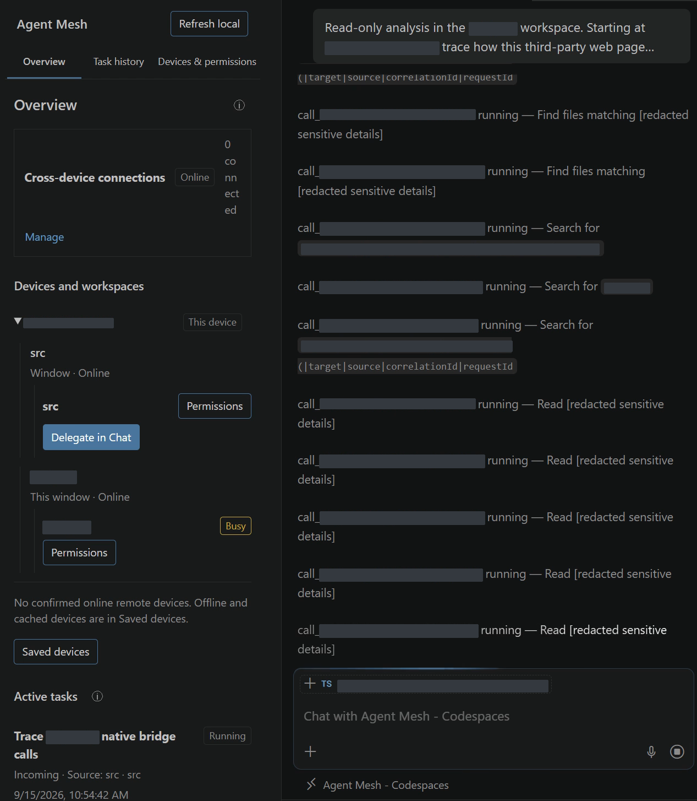
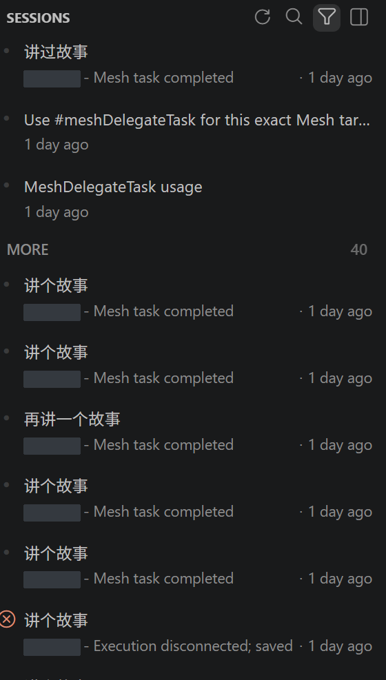
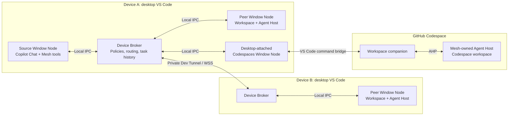

# Copilot Agent Mesh

Let Copilot coordinate work across **VS Code windows, devices, and
desktop-attached GitHub Codespaces**. Describe a task in Copilot Chat, delegate it
to an authorized workspace, and bring the results back to the original conversation.

**Preview:** execution is experimental, requires workspace/task authorization,
and may consume Copilot quota. See [supported platforms and limitations](./docs/project-guide.md#preview-prerequisites-and-limitations).

## Features

| Feature | What you can do |
| --- | --- |
| Peer window delegation | Send work to another local VS Code window without switching projects or using a cloud relay. |
| Cross-device collaboration | Discover same-account devices through native VS Code sign-in and connect through private Dev Tunnels. Connections are opt-in. |
| Desktop Codespaces | Run tasks inside a trusted Linux Codespace through its matching workspace companion. Browser Codespaces are not supported. |
| Task lifecycle | Submit tasks, wait for results, answer questions, cancel work, and continue a completed task in its retained live session. |
| Permissions and control | Choose allowed source/target workspaces, enable incoming tasks, and keep task approval separate from device trust. |
| Dashboard | View devices, windows, workspaces, connection status, and task history in English or Chinese. |

Use Copilot Chat in **Agent mode**. The six Mesh tools handle discovery,
delegation, status, input, cancellation, and history; see the
[tool workflow](./docs/project-guide.md#mesh-tool-workflow).

## Screenshots

Real VS Code captures. Only identifying names, paths, and IDs are masked;
controls, task actions, and statuses remain visible. Unrelated panes are cropped out.

**Dashboard overview**



**Task delegation and live progress in a desktop-attached Codespace**



**Retained Mesh sessions**



## Architecture



Each device shares one Broker per VS Code User Data directory. Local delegation
stays on-device; remote devices are peers, not a central server. A Codespace runs
behind its attached desktop window, not as another Mesh device.

## Install

Install desktop VS Code first. Once the installer scripts on `main` and their
matching GitHub release assets are published, run the command for your platform.

**Windows (PowerShell 5.1 or newer):**

```powershell
& ([scriptblock]::Create((Invoke-WebRequest -UseBasicParsing -Uri 'https://raw.githubusercontent.com/weivea/copilot-agent-mesh/main/scripts/install.ps1' -ErrorAction Stop).Content))
```

**macOS (Terminal):**

```bash
installer="$(curl --fail --silent --show-error --location --proto '=https' --proto-redir '=https' https://raw.githubusercontent.com/weivea/copilot-agent-mesh/main/scripts/install.sh)" && /bin/bash -c "$installer"
```

These commands execute repository code: review the [Windows](./scripts/install.ps1)
or [macOS](./scripts/install.sh) script first. For updates, CLI selection, and
Codespaces setup, see [installation details](./docs/project-guide.md#install-from-github-releases).

## Documentation

- [Project guide](./docs/project-guide.md): detailed capabilities, workflows, permissions, and Preview evidence.
- [Development](./docs/development.md): prerequisites, builds, debugging, tests, and project layout.
- [Release engineering](./docs/mvp/release.md): packaging, version synchronization, and GitHub release assets.
- [Desktop Codespaces](./docs/desktop-codespaces.md): companion setup, native Chat POC, and execution design.
- [Technical implementation](./docs/technical-implementation.md) and [product requirements](./docs/product-requirements.md): design background and historical scope.
