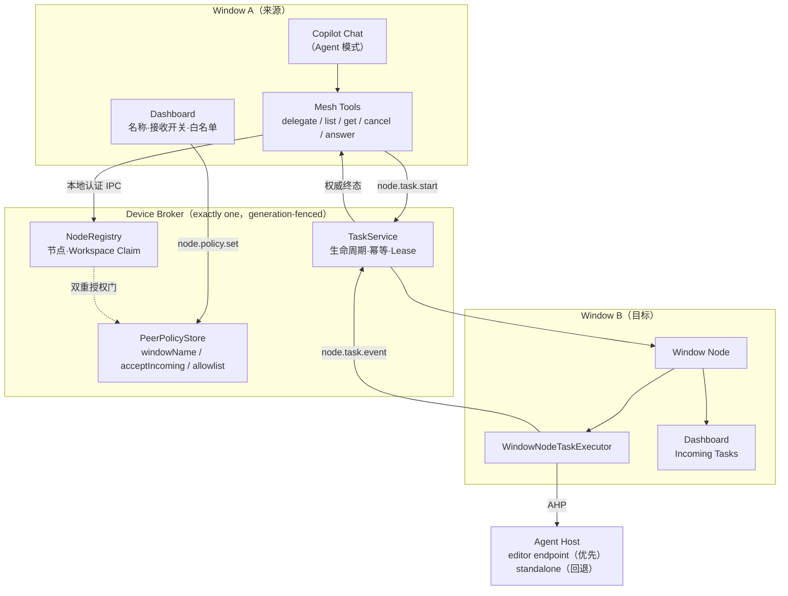
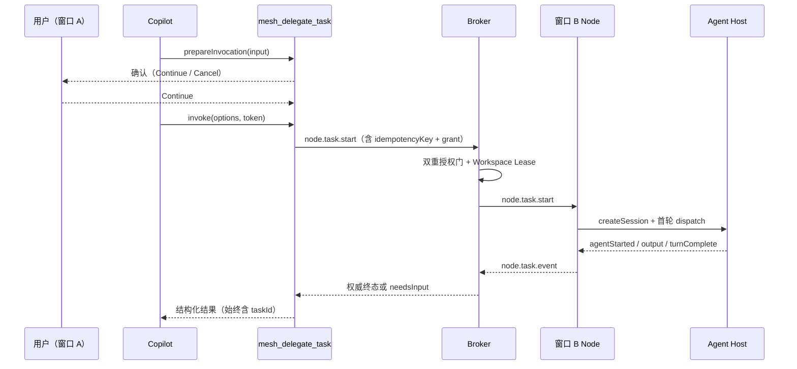

# Copilot Agent Mesh 0.4.0 技术设计：Peer Window Delegation

> 状态：设计草案（等待实现）<br>
> 日期：2026-08-30<br>
> 需求依据：[0.4.0 需求文档](0.4.0-peer-delegation-requirements.md)<br>
> 调研依据：[Editor Agent Host Endpoint Spike](spikes/editor-agent-host.md)<br>
> 基线：`0.3.0`，分支 `weivea-same-device-collaboration`，HEAD `3cd0646`

## 1. 设计原则

1. **不重写地基。** Device Broker、Window Node、Workspace Lease、本地认证 IPC、Task
   幂等与 generation fencing、脱敏边界全部保留，只替换编排层与 UX 层。
2. **鉴权只认稳定身份。** 一切授权判定基于 `workspaceIdentity`（`sha256:` 前缀的
   domain-separated 摘要）与 `nodeInstanceId`。显示名永远不参与判定。
3. **策略由 Broker 拥有。** 窗口是策略的编辑者，Broker 是策略的**唯一裁决者**。窗口
   不能自证「我被授权了」。
4. **默认拒绝。** 白名单默认空、接收开关默认关、Preview 开关默认关。
5. **失败必须显式。** 未授权、离线、超时、降级都返回可区分的错误码，绝不返回
   success-shaped 的空结果。

## 2. 架构总览



要点：

- Tool 调用**不**直连目标窗口，一律经 Broker 裁决与路由。
- Agent Host 连接由**目标窗口**建立（在目标 Workspace 上下文中），不是由来源窗口建立。
- 依据 Spike，`editor` endpoint 是**实例级**的，所有窗口共用一个；窗口寻址仍然只能靠
  `NodeRegistry` 的 Device → Node → Workspace 三层路由。

## 3. 模块清单

### 3.1 新增

| 模块 | 职责 |
| --- | --- |
| `src/broker/PeerPolicyStore.ts` | 按 `workspaceIdentity` 持久化窗口名、接收开关、对等白名单；原子写入、重启恢复、generation-fenced |
| `src/broker/PeerPolicyService.ts` | 策略读写 RPC 的服务端实现；名称唯一性裁决；白名单上限；双重授权门求值 |
| `src/agentHost/EditorAgentHostLocator.ts` | 推导平台 user-data 目录、执行 `code agent endpoints`、筛选 `type: "editor"` 且 `protocolVersion` 兼容的条目 |
| `src/agentHost/UnixSocketWebSocketConnector.ts` | `net.connect(path)` + WebSocket Upgrade（`?tkn=`），产出可交给 `WebSocketTransport.fromSocket` 的 socket |
| `src/agentHost/AgentHostSourceSelector.ts` | 先 editor 后 standalone 的选择与降级上报 |
| `src/node/DelegationGrant.ts` | 单次任务授权范围的定义、序列化与判定 |
| `src/tools/DelegationWaiter.ts` | 长时委派的等待、预算、取消与终态归一 |
| `src/ui/WindowIdentityPanel.ts` | Dashboard 的 This Window / 接收开关 / 白名单绑定 |

### 3.2 删除

| 模块 | 说明 |
| --- | --- |
| `src/broker/CollaborationService.ts` | 整体删除 |
| `src/domain/collaboration.ts` | 整体删除 |
| `shared/protocol/collaboration.ts` | 整体删除 |
| `src/tools/LocalBrokerCollaborationFacade.ts`、`collaborationToolFacade.ts`、`collaborationToolsCore.ts` | 整体删除 |
| `MESH_TOOL_NAMES.startCollaboration / getCollaboration / cancelCollaboration` | manifest 与 runtime 同时移除 |
| Dashboard Collaboration Runs 面板与 Answer Input 流程 | 移除 |
| `mesh-state/collaborations/` | 启动时忽略并清理，不迁移 |

> `src/tasks/ArtifactStore.ts` **保留**。它与 Collaboration 解耦后仍然是子任务返回受限
> 结构化 JSON 结果的载体。

### 3.3 修改

| 模块 | 修改点 |
| --- | --- |
| `shared/protocol/nodes.ts` | 节点/Workspace 摘要增加 `workspaceIdentity`、`windowName`、`acceptsIncoming`；新增策略方法与 schema |
| `src/broker/NodeRegistry.ts` | `list` 结果按双重授权门过滤；`taskStart` 前置授权校验 |
| `src/broker/DeviceBroker.ts` | 新增 `node.policy.get/set` 分发；移除 collaboration 分发 |
| `src/node/WindowNodeClient.ts` | 策略读写；上报 `workspaceIdentity`；移除 `answerCollaboration` |
| `src/node/WindowNodeTaskExecutor.ts` | 按 `DelegationGrant` 自动批准 `toolConfirmation`；`toolAuthentication`/`chatInput` 一律升级为 `needsInput` |
| `src/agentHost/AhpAgentRuntime.ts` | 接受注入的连接器；创建 Session 时设置 Mesh 标题 |
| `src/tools/taskTools.ts`、`taskToolsCore.ts`、`toolManifest.ts` | `mesh_delegate_task` 改为长时等待；移除三个 collaboration tools |
| `src/ui/DashboardFacade.ts`、`DashboardMessages.ts`、`media/dashboard.js` | 新面板与脱敏校验；移除 collaboration 视图模型 |

## 4. 策略存储与协议

### 4.1 存储布局

沿用既有 `mesh-state/` 根，新增：

```
mesh-state/
  peers/
    policy.json          # 单文件，原子写入（tmp + rename），带 schemaVersion
```

`policy.json` 结构：

```jsonc
{
  "schemaVersion": 1,
  "entries": {
    "sha256:<workspaceIdentityA>": {
      "windowName": "frontend",
      "windowNameFold": "frontend",        // 大小写折叠后的唯一性键
      "acceptsIncoming": false,
      "allowlist": ["sha256:<workspaceIdentityB>"],
      "updatedAt": "2026-08-30T09:00:00.000Z"
    }
  }
}
```

约束：

- `entries` 条目数上限 `256`；单个 `allowlist` 上限 `32`。
- `windowName` 复用 `PROTOCOL_LIMITS.nameBytes` 上限。
- **不存储任何路径**。`workspaceIdentity` 已经是不可逆摘要，Workspace 显示名由在线节点
  在运行时提供，不落盘。
- 写入走既有的原子写入 + generation fencing 通道；非 leader Broker 不得写入。

### 4.2 新增协议方法

```ts
LOCAL_BROKER_METHODS = {
  // ...既有
  policyGet: 'node.policy.get',
  policySet: 'node.policy.set',
};
```

```ts
export const nodePolicyGetParamsSchema = nodeIdentityParamsSchema;

export const nodePolicySetParamsSchema = nodeIdentityParamsSchema.extend({
  workspaceIdentity: workspaceIdentitySchema,
  windowName: utf8String(PROTOCOL_LIMITS.nameBytes, 'window name', 1).optional(),
  acceptsIncoming: z.boolean().optional(),
  allowlist: z.array(workspaceIdentitySchema).max(32).optional(),
});

export const nodePolicyResultSchema = z.strictObject({
  workspaceIdentity: workspaceIdentitySchema,
  windowName: utf8String(PROTOCOL_LIMITS.nameBytes, 'window name', 1),
  acceptsIncoming: z.boolean(),
  allowlist: z.array(workspaceIdentitySchema).max(32),
});
```

`workspaceIdentitySchema` 从既有的 `z.string().regex(/^sha256:[A-Za-z0-9_-]{43}$/u)`
提取为具名 schema 复用。

### 4.3 节点目录扩展

`nodeWorkspaceSummarySchema` 增加：

```ts
workspaceIdentity: workspaceIdentitySchema,
acceptsIncoming: z.boolean(),
```

`windowNodeDescriptorSchema` 的既有 `label` 字段**复用**为窗口显示名：Broker 在返回
目录时用 `PeerPolicyStore` 中的 `windowName` **覆盖** `label`，未设置时回退到 Workspace
名，再回退到短节点 ID。这样不引入并行字段，避免两个名字打架。

### 4.4 `node.policy.set` 的裁决规则

1. 调用者必须已注册且 `nodeInstanceId` 有效。
2. `workspaceIdentity` 必须是调用者**自己已 claim** 的 Workspace，否则
   `POLICY_FORBIDDEN`。这就实现了「只能重命名自己」。
3. `windowName` 校验顺序：长度 → 字符（拒绝 `/`、`\`、`:` 组合、以 `~` 或盘符开头等
   路径形状）→ Secret 形状（长十六进制、`ghp_`/`gho_` 等前缀、Base64URL 长串）→
   大小写折叠唯一性。冲突返回 `WINDOW_NAME_CONFLICT`，**不**静默改名。
4. `allowlist` 中不得包含自身；条目必须是合法 `workspaceIdentity` 形状；不校验目标是否
   在线（离线目标允许保留）。
5. 写入成功后广播策略变更，使所有窗口的 Dashboard 与 `mesh_list_workers` 立即一致。

## 5. 双重授权门

### 5.1 求值

```
visible(source, target) :=
      target.acceptsIncoming
  AND target.workspaceIdentity ∈ policy[source.workspaceIdentity].allowlist
  AND target.node.status == 'online'
  AND target.workspaceClaim == 'claimed'
  AND target.workspaceCount == 1
```

### 5.2 执行点

| 执行点 | 行为 |
| --- | --- |
| `node.list`（服务 `mesh_list_workers`） | 过滤掉不可见节点；不泄漏其存在 |
| `node.task.start` | 再次求值。不可见时按原因返回可区分错误码 |
| Dashboard 节点列表 | **不**过滤：用户需要看到全部本设备节点才能勾选，但显示每项的门状态 |

> 注意 `node.list` 与 Dashboard 的差异是刻意的：Tool 面必须遵守最小可见性，配置面必须
> 能看到候选项。两者走不同的 Broker 方法，Dashboard 用的那条**只**返回显示名、
> Workspace 名、在线状态与门状态，不返回任何路径。

### 5.3 错误码

| 码 | 触发 |
| --- | --- |
| `PEER_NOT_ALLOWED` | 来源未勾选目标 |
| `PEER_NOT_ACCEPTING` | 目标接收开关关闭 |
| `PEER_OFFLINE` | 目标节点不在线 |
| `PEER_MULTI_WORKSPACE` | 目标 claim 了多于一个 Workspace |
| `WINDOW_NAME_CONFLICT` | 重命名冲突 |
| `POLICY_FORBIDDEN` | 试图修改非自身 Workspace 的策略 |
| `DELEGATION_RECURSION` | 子任务上下文发起委派 |

`PEER_NOT_ALLOWED` 与 `PEER_NOT_ACCEPTING` 必须可区分，因为二者的用户修复动作不同
（一个在来源窗口勾选，一个在目标窗口开开关）。

## 6. 委派：长时 Tool 调用

### 6.1 `mesh_delegate_task` 生命周期



### 6.2 等待器（`DelegationWaiter`）

```ts
type DelegationOutcome =
  | { kind: 'completed'; taskId: string; result: BoundedResult }
  | { kind: 'needsInput'; taskId: string; inputId: string; question: string }
  | { kind: 'failed'; taskId: string; code: string; message: string }
  | { kind: 'cancelled'; taskId: string; reason: 'token' | 'budget' | 'peer' };
```

规则：

1. 等待条件为**权威**状态变更事件，不是轮询快照。
2. 预算来自既有输入字段 `timeoutMinutes`：**默认 60**，上限由 0.3.0 的 `1440` **收紧到
   `60`**——调用现在会阻塞整轮对话，1440 分钟的上限不再合理。由单个 timer 驱动，
   **必须**在所有出口路径 dispose。
3. 预算耗尽 → 发 `node.task.cancel` → **继续等待**权威 `cancelled`/`failed` → 返回
   `{ kind: 'cancelled', reason: 'budget' }`。**不允许**在未确认终态前返回。
4. `token.onCancellationRequested` 走同一条精确取消路径，`reason: 'token'`。
5. `needsInput` 是**正常返回**，不是失败：把问题交回父 Copilot，让它在 A 的对话里问
   用户，再用 `mesh_answer_task` 投递到精确 `inputId`。
6. 无论哪条出口，返回体**始终**包含 `taskId`。这是「调用被宿主中断也不丢任务」的唯一
   保障。

### 6.3 结果契约变更

0.3.0 的紧凑结果是「已受理 + pending」语义（`s` 0=accepted pending、1=reconcile、
2=error、3=persistence pending，配合 `t`/`d`/`e`/`r`）。0.4.0 改为终态语义，需要重新
定义并同步 `modelDescription`：

| 字段 | 含义 |
| --- | --- |
| `s` | `0` completed、`1` needsInput、`2` failed、`3` cancelled |
| `t` | `taskId`（**所有**分支都必须存在） |
| `d` | `delegationRequestId` |
| `e` | 稳定错误码（`s=2`/`s=3` 时） |
| `i` | `inputId`（仅 `s=1`） |
| `q` | 有界问题文本（仅 `s=1`） |
| `r` | 有界结构化结果摘要（仅 `s=0`） |
| `x` | 取消原因 `token` / `budget` / `peer`（仅 `s=3`） |

`modelDescription` 必须明确写出：**不再需要用 `mesh_get_task` 轮询正常路径**；
`mesh_get_task` 的定位收敛为「调用异常中断后的追查」与「查询他人发起的任务」。

### 6.4 幂等

`mesh_delegate_task` 输入携带 `delegationRequestId`（沿用 0.1 Spike 已验证的语义）。
Broker 以 `(callerWorkspaceIdentity, delegationRequestId)` 为幂等键：

- 首次 → 创建任务，记录 `taskId`；
- 重试（同键、同语义）→ **复用**原 `taskId`，不重复启动；
- 同键但语义不同 → `IDEMPOTENCY_CONFLICT`。

Broker 接管（generation 变更）后，幂等表随任务状态一起从持久化恢复，因此接管不会导致
重复执行。

### 6.5 确认 UI

依据 Spike 第 7 节，`PreparedToolInvocation.confirmationMessages` 只有 Continue /
Cancel。因此：

```
title:   Delegate to “backend”
message: 目标窗口：backend
         目标项目：orders-service
         任务：新增订单查询接口并补充契约
         本次任务内将自动批准：该项目内的终端命令与文件修改
         永不自动批准：网络认证、跨项目写入、密钥访问、对外发布
         继续将启动一个真实 Agent 任务，最长 60 分钟。
```

`invocationMessage` 设为 `Delegating to “backend”…`，作为长时调用期间唯一的原生进度
提示。

## 7. 授权范围（DelegationGrant）

```ts
interface DelegationGrant {
  readonly taskId: string;
  readonly workspaceIdentity: string;   // 仅此 Workspace
  readonly autoApprove: readonly ['localTerminal', 'localFileWrite'];
  readonly neverAutoApprove: readonly ['networkAuth', 'crossWorkspaceWrite', 'secretAccess', 'externalPublish'];
}
```

`grant` 随 `node.task.start` 下发，由目标窗口的 `WindowNodeTaskExecutor` 执行。映射到
既有的 `AgentInputKind`：

| `AgentInputKind` | 处理 |
| --- | --- |
| `toolConfirmation` | 若操作落在 `grant.workspaceIdentity` 内且属于 `autoApprove` 类别 → 自动批准；否则升级 `needsInput` |
| `toolAuthentication` | **一律**升级 `needsInput` |
| `chatInput` | **一律**升级 `needsInput` |

`grant` 的生命周期严格等于任务生命周期，随任务终态一起销毁。**不写盘、不按节点对缓存、
不跨任务复用**。既有的 `FirstTaskConfirmation`（`'once' | 'always' | 'deny'`）在 0.4.0
中收敛为 `'once' | 'deny'`：`'always'` 语义与「仅限本次任务」冲突，予以移除。

判定必须**默认拒绝**：无法确定某次 `toolConfirmation` 的目标路径是否在
`grant.workspaceIdentity` 内时，升级为 `needsInput`，而不是放行。

## 8. Agent Host 来源选择

### 8.1 选择顺序

```
1. EditorAgentHostLocator.locate()
   → code agent endpoints --user-data-dir <推导目录>
   → 筛选 type === 'editor' 且 protocolVersion 满足 ^1.0.0
   → 命中：UnixSocketWebSocketConnector 连接，source = 'editor'
2. 失败 → AgentHostLauncher（0.3.0 现状），source = 'standalone'（降级）
```

`source` 必须上报到 Dashboard 与 E2E 证据。降级时 UI 显式标注
`Standalone (degraded)`，并说明子任务不会出现在 Chat Sessions 列表中。

### 8.2 user-data 目录推导

不得硬编码。按平台与运行形态推导，并允许配置覆盖：

| 平台 / 形态 | 目录 |
| --- | --- |
| macOS 稳定版 | `~/Library/Application Support/Code` |
| macOS Insiders | `~/Library/Application Support/Code - Insiders` |
| Linux | `$XDG_CONFIG_HOME/Code` 或 `~/.config/Code` |
| Windows | `%APPDATA%\Code` |
| 便携模式 / 自定义 | 由新增配置 `copilotAgentMesh.agentHost.userDataDir` 覆盖 |

推导失败或 `code agent endpoints` 的 `userDataPath` 与预期不符时**直接回退**到
standalone，不做猜测重试。

### 8.3 传输

```ts
// 概念代码
const socket = net.connect(endpoint.endpoint.path);
const ws = await upgradeToWebSocket(socket, `/?tkn=${endpoint.connectionToken}`);
const transport = WebSocketTransport.fromSocket(ws);
const client = new AhpClient(transport, { requestTimeoutMs: 30_000 });
```

Extension Host 的全局 `WebSocket` 不能拨号 Unix socket（见 Spike 第 3 节），因此握手在
Node 侧完成后再交给既有 transport。`ws@8.21.3` 已是仓库依赖，无需新增。

### 8.4 敏感值处理

`connectionToken`、socket 路径、user-data 路径进入既有 `sanitizeError` 的 redaction 集合。
新增测试断言：这三类值不出现在任何 Webview 消息、任务输出、日志或错误消息中。

### 8.5 Session 标题

`createSession` 无 `title` 字段（Spike 第 5 节），标题需在会话建立后通过
`session/titleChanged` action 设置：

```
Mesh · <来源窗口名> → <任务摘要，有界>
```

标题必须经过与 Webview 相同的脱敏校验：不含路径、不含 Secret、长度有界。任务终止时
必须明确处置该 Session（不留「运行中」假象）。

## 9. 递归防护

1. 注入 Mesh Tools 的唯一路径是窗口的正常 Extension Host 激活。
2. `WindowNodeTaskExecutor` 创建子任务 Session 时，`activeClient.tools` 保持为空数组
   （0.3.0 已如此），且**不**注册任何 Mesh Tool provider。
3. Broker 在 `node.task.start` 校验调用者上下文：若调用者是一个正在执行子任务的执行器
   身份，返回 `DELEGATION_RECURSION`。
4. 单元测试断言：子任务运行期间，目标窗口执行器可见的工具集合中不含任何
   `MESH_TOOL_NAMES` 成员。

## 10. Dashboard

### 10.1 面板

| 面板 | 内容 | 操作 |
| --- | --- | --- |
| This Window | 窗口名、Workspace 名、claim 状态、Agent Host 来源 | 重命名 |
| Accept Incoming Tasks | 开关状态 | 切换 |
| Local Window Nodes | 每项：窗口名、Workspace 名、在线、接收开关、busy、门状态 | 勾选/取消勾选 |
| Outgoing Tasks | 本窗口发起的子任务：目标名、摘要、状态、开始时间 | 取消 |
| Incoming Tasks | 派给本窗口的子任务：来源名、摘要、状态、开始时间 | 取消 |

### 10.2 脱敏

ViewModel 允许字段白名单：窗口名、Workspace 显示名、任务摘要（有界）、状态枚举、
时间戳、短 ID 前缀、错误码。

**禁止**：绝对路径、`workspaceIdentity` 全量摘要、`connectionToken`、原始 Prompt、
原始 Output、Agent transcript。

`DashboardMessages.ts` 的出站校验必须对新字段同样严格，并新增拒绝路径形状的断言。

### 10.3 移除

Collaboration Runs 面板、Start Local Multi-project Collaboration 入口、
`pendingInputId` 相关的 Dashboard Answer Input 流程（输入改由父窗口 Chat 处理）。

> 保留 `Incoming Tasks` 的取消按钮，因为目标窗口的用户必须**始终**能终止发生在自己
> 项目里的任务，这与「输入回到 Chat」不冲突。

## 11. 配置项变更

| 配置 | 变更 |
| --- | --- |
| `copilotAgentMesh.experimental.sameDeviceCollaboration` | **移除** |
| `copilotAgentMesh.experimental.peerDelegation` | **新增**，默认 `false` |
| `copilotAgentMesh.agentHost.userDataDir` | **新增**，默认空（自动推导） |
| 其余既有配置 | 不变 |

窗口名、接收开关、白名单**不做成 VS Code 设置**：它们必须按 `workspaceIdentity` 存在
设备级 Broker 存储中，否则写进工作区 `settings.json` 会污染用户仓库并泄漏协作拓扑。

## 12. 测试矩阵

### 12.1 单元

| 区域 | 用例 |
| --- | --- |
| PeerPolicyStore | 原子写入；重启恢复；schemaVersion 校验；条目/白名单上限；损坏文件明确失败 |
| 窗口重命名 | 大小写不敏感唯一；冲突拒绝；路径形状拒绝；Secret 形状拒绝；长度上限；默认与回退链 |
| 策略鉴权 | 只能改自己 Workspace 的策略；`POLICY_FORBIDDEN` |
| 双重授权门 | 四种组合（accept×allowlist）的可见性；四种错误码可区分；离线/多 Workspace 目标 |
| 白名单 | 方向性（A→B 不含 B→A）；离线条目保留；不允许自指；变更即时生效 |
| DelegationWaiter | 终态返回；`needsInput` 返回；预算超时等待权威终态；token 取消等待权威终态；timer 全出口 dispose；始终含 `taskId` |
| 幂等 | 同键复用 `taskId`；语义不同冲突；Broker 接管后不重复启动 |
| DelegationGrant | `toolConfirmation` 范围内自动批准；范围外升级；`toolAuthentication`/`chatInput` 一律升级；路径不确定时默认拒绝；任务结束销毁 |
| 递归防护 | 子任务工具集不含 Mesh Tools；子任务发起委派被拒 |
| Agent Host 来源 | editor 优先；协议不兼容跳过；定位失败回退；降级上报；token/路径脱敏 |
| Tool parity | manifest 与 runtime 一致；三个 collaboration tool 不再注册 |
| Dispose | 所有新增资源幂等 dispose |

### 12.2 组件

- 两个模拟窗口 + 一个 Broker：完整委派、`needsInput`、取消、失败传播。
- Workspace busy / Node 掉线 / Lease 单 Writer。
- Broker 接管中途发生时任务不重复启动。

### 12.3 Extension Host

- Dashboard ViewModel 脱敏断言（新增字段）。
- 重命名与勾选的端到端 UI 绑定。
- Tool 冷激活（`onLanguageModelTool:mesh_delegate_task`）。

### 12.4 真实 E2E

```sh
MESH_PEER_DELEGATION_E2E=1 npm run test:peer-delegation-real
```

断言项见需求文档 AC-5。**不允许** mock AHP、Fake Agent、把 `blocked`/`cancelled` 当
completed，或放宽断言。需要交互式认证时用 `ask_user` 给出具体命令与点击步骤。

## 13. 实施阶段

| 阶段 | 内容 | 门禁 |
| --- | --- | --- |
| P1 | 删除 Collaboration 全栈（服务、domain、protocol、tools、UI、状态目录） | check-types / lint / unit / component 全绿 |
| P2 | PeerPolicyStore + 协议扩展 + 双重授权门 + 错误码 | 单元 + 组件 |
| P3 | 窗口重命名（含唯一性与输入校验）+ Dashboard This Window 面板 | 单元 + Extension Host |
| P4 | `mesh_delegate_task` 长时化（Waiter、预算、取消、幂等、确认文案） | 单元 + 组件 |
| P5 | DelegationGrant 自动批准与升级 | 单元 |
| P6 | Editor Agent Host 来源选择 + Unix socket 传输 + Session 标题 + 降级上报 | 单元 + 手工验证 |
| P7 | Dashboard 全量（白名单、接收开关、Incoming/Outgoing） | Extension Host |
| P8 | 真实 E2E + 文档 + 版本 + VSIX + smoke + audit | 全量门禁 |

每个阶段结束提交一次，提交前必须通过：

```sh
npm run check-types && npm run lint && npm run test:unit && npm run test:component
```

P8 追加：

```sh
npm run test:extension && npm run package:vsix && npm run smoke:vsix && npm audit --audit-level=high
```

## 14. 未决问题

| 编号 | 问题 | 处置 |
| --- | --- | --- |
| O1 | 新建 Session 是否真的出现在目标窗口 Chat Sessions 列表 | P6 手工验证 + P8 E2E 判定；不成立则 FR-8.2 降级为 Dashboard-only 并更新文档 |
| O2 | 60 分钟 Tool 调用在真实 Copilot UI 下是否稳定 | P8 实测；不稳定则缩短默认预算，但保留 `taskId` 追查路径 |
| O3 | Copilot 是否主动选择 Mesh Tools | 无法从代码侧保证；文档说明 Agent 模式与 `#` 显式引用，并优化 tool description |
| O4 | 目标 Workspace 被用户自己的 Copilot 并发编辑 | 无稳定 API 可检测；文档列为已知限制，靠 Incoming Task 可见性 + 随时取消缓解 |
| O5 | 非 macOS 的 endpoint 发现 | 超出 0.4.0 支持范围，实现留接口但不声称支持 |
