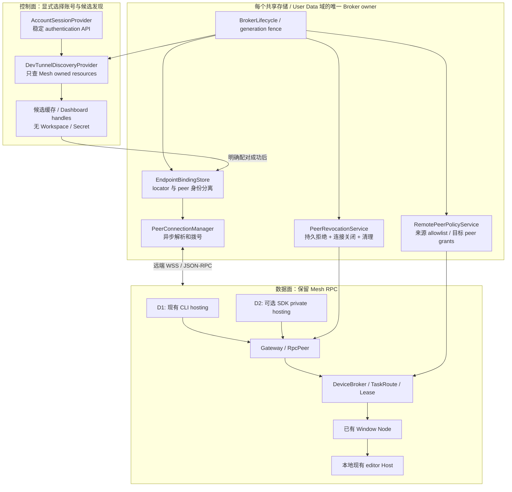

# 跨设备发现与通信实现方案

> 状态：D1/D2 生产代码已实施，默认关闭；已获准通过单机 GitHub 原生账号/只读目录，以及单机 D2 真实私有接入、Mesh 双向认证和 100 次 ping，并确认精确资源清理。前次配对失败记录保留，根因尚未确定。Entra/MSA、跨 Profile、两台物理设备、真实续期/迁移和 Agent/Chat Gate 仍需独立验证，详见[实现与验证记录](./cross-device-connectivity-validation.md)。本文不授权自动创建隧道、登录账号或执行模型任务。<br>
> 日期：2026-09-05。<br>
> 源码基线：`536982f4251a4a841de561cb4220a4d10e107338`，Mesh 0.4.0 Preview，protocol v2。<br>
> 调研依据：[跨设备连接方案调研](./spikes/cross-device-connectivity-options.md)。<br>
> 实施方式：按能力 Gate 推进，不承诺未经验证的发布日期，不预设下一版本号。

本文保留 M0–M5 的设计要求作为验收规范，而不是第二份待批准计划。当前实现同时包含 D1 和 D2；“可选”仅指用户运行时选择 CLI 或 SDK 后端。已固定 contracts/management/connections `1.3.56`、SSH `3.12.42`，并按生产 `RpcPeer`/`PairingService` 收敛 hello/authenticate/commit 与数值 ping 的共享声明。实现入口、离线证据和未获准真实 Gate 的复现条件以验证记录为准。

## 1. 实施决策

**先完善现有 Dev Tunnels 路线，不更换 Broker、任务协议或 Agent 执行架构。**

将“同账号发现”“连接地址解析”“Mesh 配对”“远端 Workspace 执行授权”拆开实现。发现使用独立 Dev Tunnels 的公开 management SDK；不依赖 Remote - Tunnels 内部命令、Proposed API、私有凭据库或 native AHP tunnel gateway。

分成两个可独立验收的交付：

| 交付 | 范围 | 完成后可以承诺 | 不能承诺 |
| --- | --- | --- | --- |
| D1：发现与授权增强 | 保留现有精确版本 CLI hosting 和 WSS；增加 SDK 发现、locator、双端策略、目标端撤销和真实两设备验收 | 用户不再维护隧道地址；首次一次性配对后可自动解析已绑定资源；显式路由到已打开的目标 Window Node | 零配置、零配对、CLI 自动继承 VS Code 登录、无人值守执行、生产 SLA |
| D2：私有接入增强 | 在独立 Gate 通过后，增加 SDK hosting 和 private port capability；仍使用 Dev Tunnels 服务和现有 Mesh RPC | 新接入可统一使用获准的账号上下文，不依赖另一份 CLI hosting 登录；外层连接也受服务认证约束 | 换 SDK 就成为 GA 服务，或 WSS web-forwarding 对 relay 端到端加密 |

D1 的新增 SDK 主要负责管理查询；不同时改写 CLI hosting 生命周期。D2 是可选后端，不删除 CLI 实现，不以伪造 CLI build/access-index 字段的方式强行实现旧接口。

D1 发现使用 management/contracts；本次明确要求同时交付 D2，因此 connections 及其 SSH 依赖也已锁定并接入默认关闭、延迟加载的私有 hosting 路径。真实 Gate 未获准不等于省略 D2 实现，也不等于可以宣称它已完成真实两设备验收。以 VS Code `1.136.1` 作为首个真实验收版本；不因 manifest 声明最低版本就宣称所有旧版已经通过。

Dev Tunnels 仍是开发测试用途、Public Preview、无 SLA。若产品要求长期常驻、商业可用性承诺或 relay 无权读取任务内容，应启动独立的 WSS 中继/加密通道方案，不靠继续叠加 CLI/SDK 适配解决。

### 1.1 本期明确不做

- 不自动连接或操纵 Remote - Tunnels 扩展，不启动另一套 VS Code Server/Remote Extension Host。
- 不升级 AHP 子模块，不改变 provider-scoped Session、`folder` isolation、原生 Snapshot 身份处理。
- 不扩大 Windows、Linux、macOS x64 Worker 支持，不实现无窗口常驻 Worker。
- 不实现 WebRTC、LAN/mDNS、Tailscale/SSH 的正式后端；只保留可插拔接入位置。
- 不开发自动上传邀请密钥的配对服务，不把低熵短码当作现有 256-bit secret 的替代。
- 不改变任务幂等、单 writer Lease、取消权威终态、节点丢失不可恢复时明确失败等语义。

## 2. 产品行为与验收边界

### 2.1 首次使用

1. B 用户在 Mesh Dashboard 明确启用“跨设备发现”，选择 provider/account，并单独确认允许发布本设备的 Mesh 接入信息。
2. B 启动 Listener。D1 仍要求用户提供已验证的 CLI，并完成该 CLI 自己的登录；扩展不安装、升级或注入 VS Code token。
3. A 用户启用发现并选择同一服务身份，看到 B 的**候选设备**。此时没有 Workspace 列表，也不能执行任务。
4. B 用户主动创建一次性邀请；A 选择候选并通过原生输入框导入邀请，核对候选、邀请和实际认证出的设备身份。
5. 两端明确启用“跨设备委派”并接受严格策略的迁移提示。B 为这个已配对设备选择允许接收任务的 Workspace，并开启现有 `Accept Incoming`；A 的当前来源 Workspace 将该远端 Workspace 加入自己的单向 allowlist。
6. A 的 `mesh_list_workers` 才返回可执行目标；后续任务继续指定 Device → Node → Workspace。

首次仍有一次邀请转移。这里的“无需管理地址”是**不用编辑、保存、追踪或更新隧道 URL**，不是无需配对。邀请通过用户控制的可信通道转移；扩展本身不上传邀请。复制/导入使用现有原生命令和显式用户操作，不将邀请或二维码放入禁止承载 Secret 的 Dashboard Webview。

发现前只展示经过脱敏的短候选标记，供用户与 B 对照；配对后再使用已认证的设备显示名。名称和短标记都不作为授权依据。

### 2.2 正常委派

```text
A Chat
  -> A Window Node 的认证 IPC
  -> A Broker 验证本地来源身份、来源 allowlist、原有 delegation principal
  -> 已绑定 peer 的 endpoint 解析与 WSS/Mesh 认证
  -> B Broker 验证 peer、目标 Workspace 接收权限、实时 node/claim
  -> 取得 Lease并持久化原任务身份
  -> B WindowNodeTaskExecutor
  -> B 当前 editor Host / 现有 Workspace
  -> 权威事件、结果、输入或取消原路返回 A
```

默认保留 B 的**远端逐任务确认**，不因为账号相同、设备已配对或 allowlist 已配置就删除确认。
后续用户明确批准的设备树版本增加一个默认关闭的例外：B 可对**指定已配对来源设备 →
B 当前 Workspace**单独启用自动接受。它只跳过任务启动提示，不扩大任务内敏感操作权限，
也不替代来源 allowlist、目标 grant/receive、claim、Lease 或 editor-only 要求。
具体交互与内部批准绑定见 [0.4.0 设计的后续授权修订](0.4.0-peer-delegation-design.md#后续-ux--跨设备授权修订)。

新严格跨设备模式要求目标使用 `editor` source；选择器或endpoint失效时明确失败，不能静默回退standalone。通过内部、受信任的任务启动选项传递这一要求，不允许wire自行声明；原本地/legacy任务的fallback行为不变，不升级AHP或改变Session配置策略。

目标普通 Chat Sessions 可见性必须独立观察；不能用 Host catalog、Incoming Task 记录或 transport 成功替代。

## 3. 架构和所有权



CLI 和 SDK 两个 hosting 方框表示**互斥后端选择**，不是同时启动两个 host。当前生产组合使用 `ProductionConnectivity`、`SelectedExposureProvider` 与对应的发现、binding、policy、revocation 模块实现这些职责；图中的名称属于职责示意，实际类型见验证记录。

所有权规则：

| 资源 | 所有者与生命周期 |
| --- | --- |
| 账号绑定、发现查询、远端 endpoint 缓存 | 当前 Broker owner；非 owner 窗口只发送有身份的本地 IPC 意图 |
| OAuth token / port capability | 需要它的账号/传输 adapter 内存；不进入 Webview、持久 public DTO、本地 IPC或日志 |
| Mesh peer root | 现有 SecretStorage；与发现账号、URL和 tunnel resource 分离 |
| Gateway / active hosting backend | 一个 Broker，一个 Gateway，一个 active host；沿用精确 owned-resource 清理 |
| Task/Delegation/Lease/AHP handle | 继续由现有 Broker 与目标 Window Node 分工，不交给发现服务 |

旧 owner 的 async 操作即使稍后完成，也不能写 bindings/policy 或发布新状态。Cloud API 无法接受本地 Broker generation fence，因此还必须取消请求、关闭连接，并在每次外部副作用之后重新检查所有权；无法确认旧 host 退出时，新 owner 不启动竞争 host。

## 4. 模块与接口划分

### 4.1 新增模块建议

| 路径 | 职责 | 不承担 |
| --- | --- | --- |
| `src/connectivity/AccountSessionProvider.ts` | 指定账号/scopes、交互与 silent 获取、账号变化事件、暂停状态 | AHP 认证、CLI 私有 token 读取、账号自动切换 |
| `src/connectivity/DevTunnelDiscoveryProvider.ts` | SDK caller-owned 列举、静态 label过滤、脱敏候选、超时/限流 | 连接/配对、Worker 判断、任务信息同步 |
| `src/connectivity/DiscoveryService.ts` | owner-only调度、候选 handle、缓存失效、publish意图 | 让每个窗口各自轮询服务 |
| `src/connectivity/EndpointBindingStore.ts` | 已证明 peer 与 locator 的 generation-fenced旁表 | 改写 peer root、保存 bearer token |
| `src/connectivity/DevTunnelEndpointResolver.ts` | 按确切 resource/port获取当前 URI，验证域/path/状态 | 按显示名猜测 endpoint |
| `src/peer/PeerSocketConnector.ts` | 给现有 WebSocket transport提供可取消的异步拨号接口；服务凭据在 adapter 内消费 | 另造 JSON-RPC、任务协议或 AHP transport |
| `src/broker/RemotePeerPolicyStore.ts` / `RemotePeerPolicyService.ts` | A 的来源 allowlist、B 的目标 peer grants、filtered目录、路由重检查 | 把远端来源冒充本地注册 Node |
| `src/gateway/PeerRevocationService.ts` | target-side peer撤销、持久化拒绝、会话和密钥清理 | 仅删除 A 的 outbound profile就宣布远端撤销 |

使用现有 Zod、UUID/Workspace identity schema、`AtomicFileStore`、owner fencing、结构化日志及 Dashboard action handle模式。不要复制一份近似的幂等、取消、URI校验或多根 Workspace hash 算法。

### 4.2 两种数据对象必须分开

以下为建议内部数据形状；实际类型由 Zod schema推导，字段上限复用现有协议限制。

```ts
interface DiscoveredPeerCandidate {
  readonly candidateHandle: string;
  readonly locator: {
    readonly provider: 'dev-tunnels';
    readonly clusterId: string;
    readonly tunnelId: string;
    readonly portNumber: number;
    readonly advertisementId: string;
  };
  readonly hostHint: 'online' | 'offline' | 'unknown';
  readonly observedAt: string;
}

interface PeerEndpointBinding {
  readonly profileId: string;
  readonly profileGeneration: string;
  readonly expectedWorkerDeviceId: string;
  readonly accountRef: string;
  readonly locator: DiscoveredPeerCandidate['locator'];
  readonly admission: 'legacy-mesh-auth' | 'private-port-token';
  readonly verifiedOrigin: string;
  readonly verifiedAt: string;
}
```

`candidateHandle` 仅是本次 Broker/UI 会话的受限操作句柄；`accountRef` 仅引用本地账号绑定，不向云端发布。两者都不是网络 peer身份。`verifiedOrigin` 是通过 Mesh 证明后记录的非秘密地址，不代替 locator，也不包含 query/fragment/userinfo。

新 bindings 使用**独立旁表**，不先向 `PeerProfile` 随意加字段：当前 enrollment completion/cleanup 会重建对象，cleanup schema还限制允许字段。旁表按 `profileId + generation` 绑定，可避免改变密钥清理契约。旧 profile缺 generation时，只能在用户明确绑定、profile稳定且 CAS成功后补足现有 generation字段，不能默认为另一份新身份。

## 5. 发现控制面

### 5.1 登录与账号绑定

账号绑定使用 provider和实际 `AuthenticationSession.account.id`，不使用邮箱/显示名作为身份，不把不同 provider 的相同邮箱合并。

首次获取必须由用户明确操作触发；后台只做指定账号的 silent查询。固定 scopes 集合要先通过 M0，不能为绕过失败无限扩权。监听 `vscode.authentication.onDidChangeSessions` 后重查绑定；session消失、account不匹配或scope不可用均暂停云操作。

M0以调研中的GitHub `user:email/read:org`先例作为兼容性参考，而非已证明的最小权限；不得申请repo权限。Microsoft使用Dev Tunnels服务受众 `46da2f7e-b5ef-422a-88d4-2a7f9de6a0b2/.default`，分别验证Entra/MSA及consent。SDK callback使用服务认可的完整Authorization值，不能把任意Copilot/Graph token交给Tunnel service，也不复用第一方OAuth client ID。

两个登录需要如实呈现：

| 模式 | 身份来源 | 行为 |
| --- | --- | --- |
| D1 discovery | 经用户批准的 VS Code authentication session | SDK仅访问对应服务认可的 management API |
| D1 hosting | 用户独立配置/登录的精确 CLI | 确认本机确切resource出现在所选VS Code身份的caller-owned列表中，再核对metadata；仅能GET共享资源不算owner一致；失败不注入token修复 |
| D2 hosting/connect | 同一获准的 SDK账号上下文与限权capability | 不需要读取CLI登录状态；SSO仍以M0实证为前提 |

所有权接管后，新 owner必须在自己的扩展上下文中重新取得**同一绑定账号**。如果另一个 Profile没有该session，进入 `AUTH_REQUIRED`，不能借用前owner token或悄悄选另一个账号。不同Profile的行为单独验收；不把一台物理机上的所有Profile合并授权。

`experimental.authenticationProviders` 是现有 standalone AHP设置，不复用它作为 discovery配置，避免混淆不同受众/scopes。

真实Gate使用实际VS Code Extension Host的Node与获准的代理路径；浏览器能登录不等于SDK/WSS能联网。代理或CA不兼容时明确失败，不关闭TLS校验，不修改用户网络设置来取得成功结果。

### 5.2 发布与列举

新资源保留当前ownership label，并增加固定应用/版本marker，例如：

```text
copilot-agent-mesh
mesh-discovery-v1
mesh-protocol-v2
<随机且非秘密的 advertisement marker>
```

所有label先验证服务长度/数量限制。只发布opaque marker和协议，不发布Workspace、窗口名、路径、账号、任务或secret。已有 `cam...` alias和device-id截断label不用于反推身份。

为旧资源加marker只能在用户明确启用发布后，操作本机持久metadata指向的**确切owned resource**；保持其非Mesh字段，不扫描并接管native/其他扩展资源。D1的CLI decoder/fixture必须覆盖新增label并继续验证原ownership标记，不能为兼容而放宽整个JSON结构。

SDK列举使用 `listTunnels(undefined, undefined, options, cancellation)`，包含 `labels`、`requireAllLabels: true`、`includePorts: true` 和有界 `limit`。发现不请求 `tokenScopes`，选择并授权以后才取port capability。完全没有候选时不自动创建资源。

### 5.3 状态与调度

```text
Disabled
  -> AuthRequired
  -> Discovering
  -> Candidate / Stale / DiscoveryError
  -> ExplicitPairing
  -> MeshAuthenticated
  -> EligibleWindowTarget
```

这是产品状态，不是把它们全部塞入现有 `PeerConnectionState`。Dashboard新增独立 `ConnectivitySnapshot`；Tool目录仍只返回通过权限检查的在线目标。

建议首版预算：

| 操作 | 初始上限 |
| --- | --- |
| discovery结果 | 每次最多10个资源；超限显式truncated，不按被截断列表清理旧绑定 |
| 请求与解析 | management请求10秒；同owner同时最多2个外部操作 |
| 轮询 | 仅显式启用且需要目录时每60秒、加抖动；手动刷新10秒内合并 |
| 失效 | 候选观测超过2分钟标Stale；仍保留已配对身份，不自动remove |
| 错误处理 | 遵守有界Retry-After；持续失败退避/暂停，不反复弹登录 |
| 网关拨号 | 8秒WSS握手；保留现有RPC timeout、heartbeat和重连预算 |

以上是建议工程上限，不是服务性能保证。Host count缺失为Unknown；host在线最多证明隧道hosting，不证明Broker/Node/Worker就绪。Broker generation、Window心跳和执行能力通过Mesh连接内验证，不靠高频写cloud labels模拟presence。

同设备调用在任何账号查询之前就选择本地IPC路径；发现关闭时，本地任务依旧正常。

## 6. 配对、解析与重连

### 6.1 D1保持现有配对密码学

保留10分钟邀请、32-byte secret、nonce mutual HMAC、HKDF peer root、enrollment commit及丢ack恢复。邀请仍不进日志、Webview、云目录或持久public DTO。

流程必须区分“候选地址”与“已认证peer地址”：

1. 用户选择候选，导入邀请。
2. 验证邀请中的目标、协议、endpoint形状与候选资源匹配；不把目录里的device label当真。
3. 完成现有Mesh enrollment/reconnect证明。
4. 再用已认证 `device.getInfo` 及profile中的expected device交叉验证。
5. 只有连接仍存活、owner/profile generation仍有效，才能CAS写入endpoint binding。

配对失败不能留下可用binding；连接在“证明成功→持久化”之间关闭时也不能返回online。沿用现有pending-enrollment和cleanup恢复语义。

### 6.2 新解析链

```text
PeerConnectionManager
  -> 读取 profile + 对应 generation 的 binding
  -> EndpointResolver查询确切 tunnel/port
  -> provider-specific URI校验
  -> PeerSocketConnector取得必要外层凭据并建立WS
  -> WebSocketPeerTransport完成Mesh证明
  -> CAS提交新verifiedOrigin
  -> 先对账已存在Task，再接受新任务
```

URI只来自所选服务资源返回值。Dev Tunnels adapter验证HTTPS/WSS、服务域、port、固定RPC path、无userinfo/secret query/fragment和系统CA；WSS禁止redirect。Management的合法cluster跳转单独按官方service域限制，不能将用户传入任意URL作为带token请求目的地。

Connector消费token，不向上返回通用“可打印headers对象”。错误归一化也不得输出SDK原始request/response config。现有同步 `webSocketFactory` 测试接缝通过adapter保留；production改为可取消async dial，不另造一层PeerSession/RPC。

### 6.3 endpoint迁移

同一locator的URI刷新可重新证明原peer后更新；以下情况要求明确重新绑定或配对，不能猜测：

- tunnel/port删除重建，或advertisement改变；
- 返回的workerDeviceId与原profile不符；
- 原peer root证明失败；
- profile被删除、generation改变或账号不再匹配；
- 所需外层security mode无法满足。

Endpoint变化不改变taskId、delegationRequestId或原request hash。丢失ack时继续原任务对账；不能生成新任务、同时走两个adapter或把“重连成功”解释为“任务已重启”。

## 7. 远端授权：保留v2，采用两端独立裁决

### 7.1 信任粒度

**本期B授权的是“已配对A设备 → B Workspace”，不是“独立认证过的A普通窗口”。** A Broker负责依据认证本地IPC、当前claimed Workspaces和现有delegation principal，约束它的来源窗口。

授权关系：

```text
A 本地来源Workspace
  -> 允许的 (已绑定B peer generation, B workspaceIdentity)

B 目标Workspace
  -> 允许的 incoming peerId集合
  + 现有 Accept Incoming开关
```

A的规则有方向；多根来源须由每个当前claimed Workspace都允许目标，复用现有canonical scope计算。B的peer grant绑定真实配对记录，不仅是 `coordinatorDeviceId`、显示名或账号；重新配对产生的新peer不继承旧grant。

B不依赖A自称运行了新版本来保护自己。即使A是其他客户端，B也必须独立执行目标peer grant、接收开关、claim、Lease和自己的任务启动确认策略（默认逐任务，仅对明确勾选的设备/Workspace自动接受）。来源allowlist是A侧约束，不能宣传为B已独立验证远端来源窗口。

如果以后需要B按A的具体Workspace/Window制定规则、跨Broker传递可验证来源声明，应另设计协议版本；不在本期v2中偷偷扩展 `sourceNodeId` 的含义。

### 7.2 具体落点

| 调用点 | 修改 |
| --- | --- |
| A `DeviceBroker` 的 `remoteList` | 使用已认证session binding取得来源；在返回Tool目录前按来源allowlist过滤 |
| A `ProductionRemoteTaskAdapter` | 保存认证后的内部远端目录，包括workspaceIdentity/实际接收状态；提供受限target lookup供Broker策略检查，再投影Tool/界面DTO；不能在投影时丢掉策略所需字段 |
| A `remoteTaskStart` | 重算/核对来源scope；发送前再次核验对应peer generation和远端目标；不信任caller自填的scope |
| B `GatewayRouter.node.list` | 从RpcPeer取得authenticated peer；调用新增 `listNodesForPeer(peerId)`，不再直接返回raw registry |
| B `BrokerTaskService.prevalidateRemote` / 新任务Route | 使用服务端确定的peer principal验证policy；不得只在列表阶段检查 |
| B `NodeRegistry` route authorizer | 复用当前lease前检查点；组合本地 `PeerPolicyService` 与远端策略，不继续对缺sourceNode的远端请求无条件放行 |
| B `WindowNodeTaskExecutor` / Host source选择 | 默认远端逐任务确认；仅接受Broker签发并绑定peer/task/Workspace的内部自动接受裁决；保留真实runtime取消；严格远端任务在真实start前要求editor source，失败不回退standalone；本地/legacy默认不变 |

`TaskRouteRequest.ownerId` 当前可由服务端传入authenticated peer ID，但“没有sourceNode就是remote”不能成为任意内部调用的隐式授权规则。由Gateway/Broker创建不可由wire指定的principal分支，确认它对应active pairing后才进入远端策略。

当前 `PeerPolicyService` 的策略编辑受本地peer功能开关约束。新增远端接收设置入口应只允许已启用远端功能、且拥有该claim的目标Node修改同一 `acceptsIncoming` 字段；不能要求它顺带启用同设备委派，也不能批量改本地名称/allowlist。本地路由继续独立检查原 `experimental.peerDelegation`，UI说明接收总开关的共享含义。

目录过滤后重新计算total/truncated；不能通过未过滤计数泄漏隐藏Workspace。返回的 `acceptsIncoming` 来自实际策略，不沿用raw registry里的占位false。

### 7.3 不改wire版本的范围

继续使用v2的 `node.list {}`、明确target的 `task.start/get/cancel/answer`、现有认证格式与严格未知字段拒绝。网络请求仍禁止自称本地 `sourceNodeId`；`sourceWorkspaceIdentity` 不作为B侧授权凭证。

在已有 `node.capabilities: string[]` 中由B Broker投影一个版本化能力标记，例如 `mesh.remote-policy.v1`。只有B的完整远端策略/撤销实现启用时才广告；不能由Window任意自报替代服务端实现。A的新流程要求该标记及实际接收状态，缺失时显示“需升级/启用目标策略”，不把legacy target当新功能已支持。

能力标记用于兼容性提示，不是认证。它不进入 `device.getInfo` 的strict schema、不改hello transcript，也不允许客户端绕过B的实际策略。优先使用已有 `AUTH_FAILED`、`PEER_NOT_ALLOWED`、`PEER_NOT_ACCEPTING` 等wire错误；新增本地discovery诊断码不混成未知wire字段。

### 7.4 权限变化与既有任务

| 操作 | 新任务 | 既有任务 |
| --- | --- | --- |
| A移除来源allowlist | 拒绝 | 仍可按原ownership get/cancel；不暗中重启或取消 |
| B关闭Accept Incoming / 移除Workspace peer grant | 拒绝 | 保留现有任务，用户可在目标端明确取消 |
| 相同幂等请求重试 | 不再次启动 | peer仍active且身份/语义一致时可以对账原任务，不为读取已接受任务重新取得Lease |
| B撤销整个peer | 拒绝所有peer访问 | B主动精确取消该peer所属活动任务；终态和失败按现有取消机制处理 |
| Node/claim丢失 | 拒绝陈旧target | 沿用 `TASK_RECOVERY_UNAVAILABLE`，不再执行 |

“关闭接收”与“撤销peer”故意具有不同语义，UI必须写清楚，避免用户以为关闭列表就杀掉了所有任务。

## 8. 目标端peer撤销与持久化

### 8.1 新增持久数据

| 文件 | 内容 | 边界 |
| --- | --- | --- |
| `connectivity/settings.json` | schema版本、显式账号绑定引用、发现/发布意图、strict策略激活状态 | 本机专用，不同步token/邀请；账号标识不进日志 |
| `connectivity/endpoints.json` | 仅已配对profile generation对应的locator与verified origin | 候选目录只缓存于内存；不持久整个SDK对象 |
| `peers/remote-policy.json` | 来源Workspace→远端target、目标Workspace→incoming peer grants | 不修改现有本地 `peers/policy.json` allowlist含义 |
| `peers/revocations.json` | peer撤销及密钥清理进度/tombstone | 不复用enrollment的 `cleanupPending` 字段表示revocation |

使用 `AtomicFileStore` 的原子写入与generation fence。每份document均有strict schema、revision、数量/字节上限；policy优先复用现有256 entries、每来源32 targets等上限。超限显式拒绝，不静默丢弃grant或撤销记录。

账号清除、profile删除、owner takeover和pending enrollment恢复必须维护旁表引用完整性。只清理能证明属于已删除profile generation的entry，不按设备显示名或URL前缀扫库。

### 8.2 撤销顺序

1. Broker先持久化该peer的拒绝状态/revision。持久化未成功不能返回“已撤销”。
2. 在认证、reconnect、commit和每个受保护RPC分发前检查状态；撤销优先于旧握手继续。新enrollment仍走invitation/pending规则，不要求尚未commit的peer已active；普通业务RPC才要求active peer。不能只删除SecretStorage key。
3. 阻止该peer的新任务和数据通知，关闭其全部RpcPeer连接。
4. 由B调用原Broker取消路径处理该peer活动任务，不接受“socket已关所以任务已取消”的推论。
5. 删除该peer root等确切密钥，并记录cleanup完成。部分失败保留拒绝状态和可恢复清理进度。

Store和SecretStorage没有跨资源事务，必须采用“先持久拒绝、后删除密钥”的恢复流程。Broker重启后先加载拒绝状态，再允许Listener接受连接；cleanup失败不得恢复访问。

A看到断开/AUTH_FAILED时保留taskId并说明远端状态不可确认；不能把B的取消请求伪造成已收到 `cancelled`。B本地Incoming视图负责继续呈现其权威终态。

## 9. D2：可选SDK私有hosting

### 9.1 为什么不能只加一个header

当前 `DevTunnelCliProvider.createAccess` 会创建匿名ACE，并负责续期；给客户端加port token不会移除匿名入口。旧 `HostedTunnel/TunnelMetadata` 又强制包含CLI build、decoder、access index/expiration等字段。

因此D2明确增加provider-neutral暴露接口，例如 `RemoteExposureProvider`，由以下两个adapter实现：

| Adapter | 实现 |
| --- | --- |
| `CliDevTunnelExposureAdapter` | 包装现有 `DevTunnelProvider`，旧metadata保留原样；返回中明确标记legacy admission |
| `SdkDevTunnelExposureProvider` | 新增独立SDK状态与owned resource生命周期；不创建匿名ACE；使用Host capability和明确cleanup |

`ListenerService` 依赖新的薄暴露接口；Gateway/PeerTransport/Task协议不变。只抽出共同的start/status/stop与endpoint描述，不将重试、配对或任务状态搬入provider。

### 9.2 权限与生命周期

- Host使用单个owned tunnel的Host能力；A在用户批准peer之后才获取确切port的Connect能力，不下发Manage权限。
- capability仅用于预定服务的认证header；保持Mesh mutual proof；服务token不代替Mesh peer身份。
- SDK host与management client都归当前Broker；disconnect、cancel、timeout和dispose必须真正中止底层操作，不只是race一个Promise。
- 续期失败停止新拨号/新任务并给出明确状态；现有连接按实际事件和Mesh预算处理，不假设token过期立即切断stream。
- SDK转发到`localhost`与现有IPv4-only Gateway的兼容要在真实Extension Host验证，不能为解决它把Gateway绑定到全接口。
- 保持macOS arm64 Worker gate；Node可加载SDK不等于其他OS已支持Worker。

### 9.3 从CLI切换

在B显式确认后，先drain或取消活动任务、停止旧host并确认退出；再创建一个确切owned private资源。已有peer root保持不变，A经新locator完成原peer证明后提交binding。

切换失败不能自动重启匿名旧入口；需要用户选择保持停止或明确回退。旧资源的保留/删除由用户选择并用exact ID处理，不靠labels批量删除。

D2最初只服务已经通过同账号测试矩阵的组合。存在不同账号或不支持private admission的legacy peers时，切换前必须提示兼容影响；不能给它们偷偷发管理/连接凭据，也不能声称升级不影响连接。

## 10. 功能开关、启动与回退

### 10.1 开关建议

| 设置/状态 | 默认 | 含义 |
| --- | --- | --- |
| `experimental.crossDeviceDiscovery` | false | 允许显式配置账号和发现；打开不等于自动启动Listener或发布 |
| `experimental.crossDeviceDelegation` | false | 启用新的严格远端策略与Tool路径；需要既有Agent功能与Workspace权限 |
| `experimental.devTunnelSdkHosting` | false | D2候选backend；改变只进入迁移流程，不立即替换正在运行的host |
| `publishEnabled`、account binding | 无默认授权 | Broker持久用户意图，不使用Workspace配置保存Secret |

以上设置名均是计划，实施时同步manifest、runtime、Dashboard文案和测试。原有 `experimental.peerDelegation` 保持同设备含义；不让启用新网络功能自动打开本地或远端Agent执行。

### 10.2 启动顺序

```text
取得Broker owner与generation
  -> 初始化原有本地IPC/Node运行能力
  -> 独立远端初始化状态机读取/验证settings、bindings、policy、revocations
     （失败明确标记remote blocked，不阻塞本地路径）
  -> 按用户意图恢复账号上下文和发现
  -> 恢复已配对连接并对账原任务
  -> 在显式Listener意图和平台gate允许时启动唯一host
```

Cloud不可用不能阻塞同设备IPC；新增存储损坏时停止相应远端功能并显示错误，不静默重置，也不因此禁用无关的本地任务。

发现关闭只停止新目录查询/发布操作，不删除Mesh peer或偷偷取消任务；账号退出暂停使用该账号的新resolve/dial/hosting控制操作，不等于Mesh revoke。SDK hosting无法维持获准身份时显式停机；已有任务能否继续以实际连接与Worker预算为准，不伪造“已取消”。

### 10.3 legacy兼容与降级

| 情况 | 行为 |
| --- | --- |
| 升级安装但未启用新功能 | 保留当前v2手工邀请行为，不改已有CLI/隧道/账号 |
| 用户首次启用严格远端策略 | 展示已有peers和影响；不自动生成Workspace grants；未批准目标不可进入新Tool目录 |
| A新、B未提供policy能力标记 | 候选/配对状态可显示，但新委派路径拒绝；不能宣称新授权模式可用 |
| A旧、B已启用严格策略 | B照样独立执行目标权限和本地任务启动确认策略；不信任旧A有来源allowlist；双方新体验不标为完成 |
| 关闭新delegation开关 | 停止新严格远端任务；仍允许active peer对已接受且归属匹配的任务get/cancel/answer；已经激活的保护不得回落到旧的无远端策略分支 |
| 仅关闭discovery | 已有身份不被删除；locator不可安全解析时明确offline/auth-required，不跨账号或跨安全模式猜地址 |
| 回退二进制到旧版本 | 先停Listener、断连接、drain/cancel任务，撤销/清理新增严格模式peer密钥，再回退；不能假设旧代码会读取新revocation/policy文件 |

需要持久化“已激活strict policy”的状态，防止简单关闭feature flag绕过保护。恢复legacy应是独立、显式且带安全影响说明的流程，必要时重新配对；软件回退与普通开关回退不是一回事。

## 11. 分阶段工作包

每阶段作为可独立review的改动批次；本文不自动创建分支、commit或PR。

| 阶段 | 工作与主要文件 | Gate | 依赖/退出策略 |
| --- | --- | --- | --- |
| M0：固定契约与账号可行性 | 锁定SDK发布三包；专用test/spike harness；真实生产hello/ping fixture；GitHub、Entra、MSA分别验证 | 获准账号可只读列owned资源；两物理设备synthetic ping；请求/清理有界；按账号组合记录Pass/Blocked | 未通过SSO的组合保留手工邀请，不包装native内部API。private SDK试验可单独Blocked，不伪称已支持 |
| M1：owner-only发现 | 新Account/Discovery服务，候选UI，静态labels，受限本地IPC；CLI fixture扩展 | 仅显式启用才出网；候选没有任务/Workspace/Secret；非owner零发布；账号切换立即失效 | 依赖M0相关账号gate；无公网授权仍可完成offline adapter测试 |
| M2：绑定和解析 | EndpointBindingStore、Resolver、async Connector；集成PeerConnectionManager | 原peer证明后才提交endpoint；断线/换owner/换profile无残留；旧手工profile可保留 | 依赖M1；错误保留原身份/Task，不自动re-pair |
| M3：远端授权和撤销 | RemotePolicyStore/Service、Gateway filtered目录、Broker检查点、PeerRevocationService、local IPC/schema parity | 四类权限组合、篡改ID、TOCTOU、逐任务确认、正在握手/已连接peer撤销全部有明确结果 | 依赖M2；未通过只提供候选和ping，不能放开Agent任务 |
| M4：可选private hosting | exposure薄接口、CLI wrapper、SDK provider、token lifecycle、迁移UX | 无匿名ACE；wrong/missing/wrong-port token拒绝；唯一host；renew/cleanup失败安全可恢复 | 可在M2/M3之后独立推进；失败不阻止明确标注legacy admission的D1 |
| M5：真实两设备与Preview | 真实Window/Broker/AHP/Chat evidence harness、文档、受限VSIX | 两物理设备明确拓扑，任务幂等/取消，目标原Workspace和editor，源Chat与目标UI分项证据 | D1要求M0–M3及其M5；D2另要求M4及private模式M5；模型/公网/长时试验另获批准 |

### 11.1 M0的特殊注意

当前生产 `RpcPeer` / `PairingService` 的hello、authenticate、ping处理与 `shared/protocol/methods.ts` 中部分声明并不完全一致，例如生产ping接收数值 `sentAt` 并返回数值时间，而该文件有timestamp-string形状。因此：

1. PoC复用生产transport和handler，不按旧声明另写一套“看起来像Mesh”的握手。
2. 固定实际wire fixture与schema parity测试；本次直接涉及的声明差异按真实契约收敛，不借机重做整个协议。
3. 禁止为了通过PoC而放宽未知字段、关闭Mesh认证、生成假的Agent结果或把本机双进程标成两物理设备。

M0涉及公网时最多两测试设备、一个owned hosting资源、一个port、5分钟和1 MiB应用测试流量。Tunnel的一小时inactivity expiration只是兜底，不是硬停止；使用watchdog、取消、exact resource ID和finally清理。没有第二设备或授权时，记录Blocked并继续离线工作。

## 12. 测试与证据矩阵

复用现有Node test runner、`ws`、Zod、测试fixtures及VS Code harness，不引入新的测试平台。测试双端runtime double只能存在于测试目录，不能作为production失败回退。

| 层次 | 必须覆盖 |
| --- | --- |
| Unit：账号/发现 | wrong account、缺scope、silent无session、限流/超时、未知host count、非法labels/URI、发现零tokenScopes、错误脱敏 |
| Unit：存储 | 新schema版本、CAS、profile generation变化、损坏与上限、旁表孤儿、旧profile不被覆盖、revocation先持久拒绝 |
| Component：拨号 | 配对失败不绑定；socket在auth/持久化之间关闭；endpoint变更错device；redirect拒绝；token不出现在DTO/error/log |
| Component：政策 | A allow/B receive/B peer-grant各组合；多根来源；伪造scope/sourceNode；隐藏目标计数；列出后撤销；实际lease前重查；接收设置不偷开本地功能 |
| Component：撤销 | revoke与hello/auth/commit/new-start并发；已建立socket继续发RPC；密钥删除失败；Broker重启；旧profile/root不能恢复访问 |
| Component：任务 | 丢ack/重复幂等请求、语义冲突、断线恢复、transport切换不得重复start；cancel/answer/inputId/afterEventSeq保持原语义 |
| Multi-window | 同设备零discovery/resolve/relay请求；非owner不得取外部token或启动host；takeover释放旧connector/订阅/定时器 |
| 两物理设备无模型 | 100次小ping、明确不同物理主机；host关闭/网络失联、未知/错误认证、清理精确资源；可行时分别验证不同NAT和企业代理 |
| 两物理设备真实任务 | 获准模型额度后运行；B当前已打开Window与Workspace、editor非standalone；editor失效时严格模式不fallback；权威结果/取消；UI可见性独立观察 |
| D2专属 | 不存在匿名ACE；private token最小权限和续期；localhost IPv4；旧host未停新host不得启动；迁移/回退不能静默降级 |

测试选择先跑被改模块的unit/component，再升级到已存在的multi-window和显式E2E。源码/build变更时执行现有type-check、lint、VSIX验证；仅本文档编写不运行模型或真实隧道E2E。

建议新增测试文件按现有结构放入 `src/unitTest/`、`src/componentTest/`；双物理设备harness与现有 `scripts/e2e/two-instance/` 分开命名，避免继续混淆拓扑。

## 13. 可观测性与完成条件

### 13.1 观测数据

复用现有 `StructuredLogger`，新增有限事件类别/字段：

```text
discovery.requested / completed / paused
endpoint.resolved / rejected / rebound
peer.enrollment / reconnected / revoked
remote.policy.rejected
exposure.started / stopped / cleanupFailed
```

只记录run-local correlation、provider类别、阶段、稳定reason code、时延、计数和owner-generation关联；账号、resource完整ID、endpoint、Secret、路径、prompt/output和原始HTTP错误不进入报告。用于清理的完整resource ID只保存在本机受限owned-resource ledger中。

不要继续把所有远端异常统称为 `incompatible`：新Connectivity视图区分AuthRequired、Offline、DiscoveryUnavailable、PolicyDenied、ProtocolIncompatible和CleanupFailed。与现有Tool目录schema分开投影，不通过success-shaped空数组隐藏错误。

### 13.2 D1验收

| 编号 | 可观察完成条件 |
| --- | --- |
| AC-1 | 未启用/未批准时零外部发现、注册和登录请求；同设备任务在开启新功能后仍零远程路径调用 |
| AC-2 | 支持矩阵内同账号设备能发现Mesh自有候选；不把native tunnels、未知host count或未开Window显示为可执行Worker |
| AC-3 | 用户首次一次性配对后无需编辑/保存URL；binding只在原peer身份证明后建立和更新 |
| AC-4 | A来源allowlist、B目标receive与peer grant缺一则新任务在Lease/Agent之前被拒绝；陈旧nodeInstance/claim也拒绝 |
| AC-5 | B撤销peer对现有socket与后续reconnect都有效，重启后仍有效；清理失败可见且不恢复访问 |
| AC-6 | 丢ack、重复请求、owner接管、断线和endpoint刷新不会造成重复执行；取消由权威状态确认 |
| AC-7 | 两台物理macOS arm64设备跑通已批准的真实任务；B使用原Window/Workspace和editor Host，而不是另起remote环境 |
| AC-8 | A同轮Chat结果、B目标UI可见性分别有证据；未观察到的项保留Unverified，不用catalog代替 |
| AC-9 | 所有harness-owned连接/进程/资源可追踪清理；不删除其他tunnel、用户Profile或已有Workspace |
| AC-10 | 新功能default-off；旧未迁移用法保留；严格策略关闭/版本回退不能成为授权绕过 |

D2在上述条件外，还要求private admission、token生命周期和SDK hosting全部通过专属Gate。即使D1/D2全部通过，也只升级已验收的macOS arm64 Preview能力，不自动升级跨平台、服务SLA或生产用途声明。

## 14. 实施前置条件

可以立即开展不出网的类型、存储、policy和mocked-adapter开发；以下条件必须在对应真实Gate前满足：

| 条件 | 当前状态/处理 |
| --- | --- |
| SDK发布三包的精确版本与兼容性 | 调研时未完成registry核实；先确认并固定，不使用main源码版本冒充release |
| GitHub / Entra / consumer MSA的实际SSO | 均需独立实验记录；不以第一方实现代替第三方成功证据 |
| D1精确CLI binary | 用户提供macOS arm64 `1.0.2030+fc9273aa0f`并通过现有SHA-256校验；当前PATH旧build不满足，不自动升级 |
| 两台真实设备及登录/公网授权 | 需要操作者明确提供；现有two-instance脚本不能代替 |
| 真实模型额度与长时运行 | 与无模型连接试验分开授权；此前只做synthetic handler |
| 内容保密与服务用途接受 | 当前web-forwarding信任Microsoft ingress；如不满足组织策略，停止该数据面并转入加密/WSS备选设计 |

最小实施起点是 **M0的契约与账号Gate，以及M1的离线接口/owner生命周期**。在这些结果出现前，不扩大重构范围、不删除CLI回退、不宣布同账号自动互联或完整跨设备Agent协作已经支持。

## 参考与当前源码入口

- [调研报告：证据、官方接口和候选比较](./spikes/cross-device-connectivity-options.md)
- [0.4.0 Peer Delegation设计](./0.4.0-peer-delegation-design.md)
- [兼容性与平台Gate](./compatibility-matrix.md)
- [现有E2E证据口径](./mvp/e2e.md)
- [PeerProfile及cleanup字段约束](../src/peer/PeerProfile.ts)
- [现有Peer连接管理](../src/peer/PeerConnectionManager.ts)
- [实际Mesh RPC分发](../src/gateway/RpcPeer.ts)
- [现有配对生命周期](../src/gateway/PairingService.ts)
- [远端Gateway路由](../src/gateway/GatewayRouter.ts)
- [Broker内部remoteList/remoteTaskStart入口](../src/broker/DeviceBroker.ts)
- [lease前Route检查](../src/broker/NodeRegistry.ts)
- [当前任务幂等与Route获取](../src/broker/BrokerTaskService.ts)
- [远端目录与任务adapter](../src/composition/ProductionRemoteTaskAdapter.ts)
- [当前v2目标与目录schema](../shared/protocol/nodes.ts)
- [需与实际wire核对的方法schema](../shared/protocol/methods.ts)
- [CLI Provider和特有metadata契约](../src/tunnel/DevTunnelProvider.ts)
- [CLI匿名ACE及hosting实现](../src/tunnel/DevTunnelCliProvider.ts)
- [Listener生命周期](../src/application/ListenerService.ts)
- [VS Code存储adapters](../src/storage/VscodeStorageAdapters.ts)
