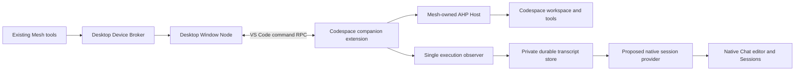

# Desktop Codespaces execution

## Scope and user contract

Support a trusted GitHub Codespace opened in **desktop VS Code**. Preserve the
six existing Mesh tools, target handles, `wait`/`submit`, task ownership,
idempotency, input/answer, cancellation, and `continueFromTaskId`. Local desktop
workspaces keep their existing editor-first execution path.

Starting with **0.5.5 Preview**, an explicitly enabled POC projects these
Mesh-owned tasks into the target window's **native Chat editor and Sessions**.
It preserves real execution, tool progress, input state and retained history;
it does not replace the working execution route or invoke another model.

This feature still does not borrow the Codespace window's native Agent Host. It does not create,
start, or keep a Codespace alive, support browser clients, or automatically resume
execution after a Host/extension-instance replacement. A lost execution
generation is not permission to submit the same work again.

## Architecture

The main extension remains a UI extension. A separately identified workspace
extension runs inside the Codespace. They share source code in this repository
but have independent entry points and VSIX packages. An `extensionKind` array
does not run one extension in both hosts.

The desktop retains the single Broker, authenticated local IPC, device secrets,
policy stores, task/event stores, and existing cross-device Tunnel. A Codespace
is an execution environment behind an attached Window Node, not a second Mesh
device or a second public listener. Other devices continue to use the desktop
Broker's existing Mesh transport.

## Why an owned Host

In upstream VS Code 1.136.2 (`88e44fa0e00b08f7758b4f6d05632e4fd5e4df6f`),
the remote `code` wrapper rejects the `agent` command. The Server's Node Agent
Host has a configured socket but does not publish the editor endpoint registry
used by Mesh. The native workbench reaches it through internal services, not a
public extension API.

The companion therefore uses a real native Linux VS Code CLI and the supported
`code agent host` entry point. It never scrapes another process's environment,
extracts native Host credentials, patches VS Code Server, changes the terminal's
`code` command, or exposes an unauthenticated forwarded port.

References:

- [Remote CLI](https://github.com/microsoft/vscode/blob/88e44fa0e00b08f7758b4f6d05632e4fd5e4df6f/src/vs/server/node/server.cli.ts#L93-L103)
- [Server Host publication](https://github.com/microsoft/vscode/blob/88e44fa0e00b08f7758b4f6d05632e4fd5e4df6f/src/vs/platform/agentHost/node/agentHostMain.ts#L235-L341)
- [Public cross-extension commands](https://code.visualstudio.com/api/advanced-topics/remote-extensions#communicating-between-extensions-using-commands)
- [Standalone Agent Host](https://code.visualstudio.com/docs/agents/concepts/agent-host)

## Execution bridge

Use public `vscode.commands.executeCommand` routing between the UI extension and
the companion in that same VS Code window. Do not access cross-host extension
exports or send callbacks, object capabilities, AbortSignals, or async iterators.

The bridge has its own version, independent of Mesh's network protocol. Its
handshake binds a random client capability to the desktop node ID, node-instance
ID, exact remote authority, expected workspace folders, and a fresh helper
generation. A new handshake cannot silently attach to old execution state.
Command names alone are not authentication. Installed extensions already share
the VS Code user's trust boundary; the bridge is not a sandbox against a hostile
extension running with that user's privileges.

Only bounded, schema-validated operations are supported:

| Operation | Contract |
| --- | --- |
| connect | Establish one generation-bound client and confirm protocol compatibility and current workspace roots. |
| describe/resolve | Return only the attached window's workspaces and canonical remote file identities. |
| probe | Report actual execution availability without starting an Agent task or prompting for authentication. |
| start | Accept an exact Broker-authorized task and its bound workspace; identical retries reuse its result. |
| events | Return ordered bounded batches; acknowledge only after the desktop event sink accepts them. |
| answer | Answer the exact task/input/answer identity. |
| cancel/disposeTask | Address only the exact task owned by this generation. |
| heartbeat/disconnect | Maintain a bounded execution lease and close the exact owned generation. |

Errors cross this boundary as typed, sanitized envelopes, not arbitrary exception
objects. Queues, response sizes, in-flight requests, long polls, and retained
request results are bounded. Event backpressure must not silently discard a
terminal or input event. A dedicated heartbeat/cancel path must not wait behind
an outstanding event read.

The desktop's `RemoteWindowNodeExecutor` implements the existing
`WindowNodeExecutor` interface. The actual `WindowNodeTaskExecutor` runs in the
companion, keeping file-write approval and canonical-path checks beside the
filesystem they protect.

## Workspaces and authorization

Only desktop Codespaces with trusted, filesystem-backed folders are admitted.
SSH, WSL, arbitrary remote authorities, mixed authorities, virtual workspaces,
browser clients, and untrusted workspaces remain outside this feature.

The UI validates one remote authority. The companion independently validates its
execution environment and its own workspace folders. It resolves `realpath` and
filesystem identity remotely. The identity input is namespaced by the Codespace
authority before the existing opaque workspace hash is computed. Identical
paths/inodes in different Codespaces must not collide. The UI never calls local
filesystem APIs on a Codespace path.

Each task binds the Broker workspace ID to that remote canonical identity.
The companion re-resolves the current workspace before executing or approving a
write; neither an arbitrary supplied path nor a same-named folder is sufficient.

Existing source allowlists, target receive switches, paired-device grants,
task-start approval, leases, deadlines, and sensitive-operation prompts remain in
force. In-memory approval capabilities are reissued inside the target process
only after validation of the serialized, request-bound delegation grant.

Execution backend selection belongs to the target Broker. Ordinary targets keep
their existing editor-only policy for strict remote tasks. A Codespace target
advertises and accepts an explicit `codespace-owned` backend bound to its
authenticated Window Node. A tool caller cannot pick a fallback backend.
Local IPC schema changes must fail explicitly on incompatible participants.
The six tool input schemas and public network task identities stay unchanged.

## Owned runtime and retained sessions

An owned runtime is a separate source, `codespace-owned`, never an editor-shaped
fallback. Reuse the existing AHP SDK, event mapping, task executor, and process
ownership code.

The companion lazily starts one owned Host for its execution generation. Each
task holds a lease on that Host. Releasing a completed task detaches its AHP
client but does not kill the Host or delete its retained Session.

New tasks create new Sessions. Continuations create a new task/turn in the
previous task's exact Session/Chat, and require:

1. The same authenticated task owner and source workspace scope.
2. The same device/node/node-instance/workspace target.
3. A completed previous task and a retained, idle Session.
4. The same live owned Host generation and current workspace identity.

Host replacement invalidates retained identities. Never reopen an unrelated
session, replay an uncertain start, or substitute a new Session for continuation.

## Native Chat and Sessions POC

### Decision and compatibility

The owned Host is retained because Codespaces execution already works through
the six Mesh tools. UI parity is an additional presentation adapter, not a
migration to an undocumented Server socket. The workspace companion contributes
the distinct `agent-mesh-codespaces` session type and a Mesh participant; it never
impersonates the built-in Copilot provider or writes to Copilot's private database.

The POC targets desktop **VS Code 1.137+**, with its API contract pinned to
`645f29cc3176500b4b5762ba887cf2a7f0ffdf2c` (1.137.0):

- [`chatSessionsProvider`](https://github.com/microsoft/vscode/blob/645f29cc3176500b4b5762ba887cf2a7f0ffdf2c/src/vscode-dts/vscode.proposed.chatSessionsProvider.d.ts)
  provides the native item provider, content provider, commit event and active response.
- [`chatParticipantPrivate`](https://github.com/microsoft/vscode/blob/645f29cc3176500b4b5762ba887cf2a7f0ffdf2c/src/vscode-dts/vscode.proposed.chatParticipantPrivate.d.ts)
  provides constructible request/response history turns.
- The pinned native workbench `openSessionInEditorGroup` action opens the Chat
  editor without submitting a prompt. This action and the proposed interfaces
  are experimental dependencies, not a stable Marketplace API contract.

This is a **private VSIX POC**. Do not publish the proposed-API companion as a
normal Marketplace extension. Later VS Code builds require renewed UI checks.
Ordinary local windows retain their existing editor-backed path and do not
require these proposed APIs.

The live UI check found that updating a modern item controller does **not**
refresh a completed Chat model when a source tool starts another turn. The POC
therefore uses the proposal's older item-provider/commit event: each turn has an
opaque view-revision URI, and VS Code replaces the exact old editor with the new
projection in place. Only one latest item is listed; the durable conversation,
workspace binding and AHP Session/Chat remain the same. Older view URIs identify
their historical prefixes, not separate model sessions. This deprecated API is
an explicit POC dependency; native archive/pin state belongs to VS Code and the
view revision exposes the preceding resource for state migration.

### Automatic first-run enablement

Install the matching 0.5.13 packages and run the normal Codespaces runtime setup.
On first companion activation, the desktop extension automatically saves the
companion's permission, then asks the user to **fully quit all VS Code windows
and reopen once**. Reconnect normally. No launch flags or manual JSON edits are
required, including on a new device. Existing command-line grants are also
persisted so later normal launches do not depend on them.

The workspace companion never edits desktop paths remotely. It invokes the
version-checked `enableNativeChat` command in the desktop UI extension. That
extension opens VS Code's own **Configure Runtime Arguments** editor and merges
only `weivea.copilot-agent-mesh-codespaces` into the `enable-proposed-api` array
in the user `argv.json`. Stable, Insiders and portable locations are validated;
an unrelated workspace file named `argv.json` is never modified. JSONC comments,
formatting, other settings and existing IDs are retained. No wildcard, extra
extension grant or VS Code installation-file modification is used.

The write uses a version-checked native editor edit, native save/conflict handling,
and a read-back check. Dirty, invalid, oversized or concurrently changed files
stop automatic setup with an actionable error rather than overwriting user
work. A saved permission is idempotent and does not reopen the config editor
on every activation. **Enable Native Codespaces Chat** retries an unsuccessful
save; **Native Codespaces Chat Setup (POC)** reports the current state.

VS Code reads this permission at desktop process startup. Window reload alone
is insufficient, and the extension reports `restartRequired`, not `enabled`,
when actual native API registration still requires permission. It never restarts the
application without user action. API availability, workspace authorization,
runtime download/license consent and Copilot authentication remain separate.

In 0.5.7 an additional startup check incorrectly treated absence of an internal
workbench menu command as proof that permission was denied, then disposed the
already-registered provider. 0.5.8 removes that check: menu enumeration is not a
provider-capability contract. Actual API registration failures still report
permission or compatibility problems. Automatic permission persistence never
unregisters an accepted provider.

`copilotAgentMesh.codespaces.nativeChat.enabled` defaults to `true` but only
operates when VS Code grants the proposed APIs; set it to `false` and reload to
opt out, including from automatic permission setup. Existing saved permissions
are not automatically removed. `codespaces.nativeChat.autoOpen` defaults to `true`; set it to `false`
to keep incoming tasks in Sessions without stealing focus. **Open Codespaces
Session** also opens retained history. Missing permissions leave the existing
Mesh execution route available and report native UI as unavailable. Once the
history store is initialized, recording is independent of presentation:
incoming tasks while waiting for a full restart still save transcripts and show
an explicit warning. They can be opened after the native UI becomes available.
Earlier tasks that ran without an observer are not automatically reconstructed
or replayed. The companion logs native presentation state and whether execution
recording is attached, without prompt text or credentials.

### Execution, controls and persistence

The adapter observes the actual authorized runtime start and the executor's
single event consumer. It preserves local Markdown/paths in text output rather
than reusing the flattened, bounded cross-device result summary. Tool/terminal
progress and pending questions come from the existing task event channel.
Completion/cancellation status is recorded only after its event is acknowledged
by the Broker. Opening or reopening a view reads the transcript; it never starts
or replays a task.

Each first task creates one durable session record. A valid tool continuation
appends a new turn to the same record, bound to the same workspace, live helper
generation and exact AHP Session/Chat. The native conversation input is
**read-only in this POC**: use `continueFromTaskId` in the original source window
to continue. This avoids bypassing ownership, grants and workspace leases with
an independent Chat-triggered execution.

The target's **Cancel Mesh task** button addresses the existing executor and
revalidates the current task/generation after confirmation. Pending questions
are displayed in Chat but answered through **#meshAnswerTask in the source
window**: directly answering at the target would bypass the Broker's
source-owned input-state transition. The executor observes accepted source
answers before releasing subsequent output/queued questions, so the saved
transcript stays ordered. Native Chat's
active-response cancellation token is also cancelled when VS Code releases the
view, so it **only detaches observation**; it must never cancel the underlying
task. Use the explicit Mesh button to stop execution.

History lives in the companion's private `chat-history` directory under its
global storage, separate from temporary Host user-data. Files use an atomic
per-session format, owner-only permissions where supported, validated IDs and
schema/size checks. The initial limits are 100 sessions, 2 MiB per session,
100 turns per session and 4096 entries per turn. Output truncation is visible;
session/turn capacity errors are explicit rather than silently deleting history.
Native archive state persists in VS Code without cancelling work.

An ownership-validated exclusive root lock covers read/mutate/atomic publication,
including session-count admission across extension-host processes. Contention
is bounded at five seconds. Locks are never stolen or removed on an assumption
that their writer died: an abandoned lock leaves existing history readable but
subsequent writes fail explicitly with `STORAGE_LOCKED`. Storage repair requires
confirming that no writer is active; normal activation does not delete lock data.

Registered secrets and credential-bearing text are redacted before storage.
Output is buffered across line/chunk boundaries to avoid persisting split
credentials; oversized individual text is explicitly omitted. Input answers
are represented by a generic acknowledgement, not stored credential values.
Session/task labels contain no capabilities or authentication objects.

Reload/restart can restore readable history while the Codespace and its private
storage still exist. A stopped/replaced Host is not automatically resumable:
detached history is labelled as such, and clean generation shutdown marks
unfinished turns interrupted, never successfully completed. Deleting/rebuilding
the Codespace may remove this local archive; cross-Codespace/cloud backup is
not included. UI/storage failures are explicitly reported and do not rewrite
the authoritative result of a Mesh task already acknowledged by the Broker.

The POC does not reproduce every built-in Copilot surface: free-form target
follow-ups, model picking, native edit-review cards/checkpoints and built-in
Stop semantics are not claimed. The first parity target is the real running
conversation and retained native Sessions, not a custom Webview.

Folder isolation and authoritative provider/workspace snapshot checks apply to
both borrowed editor and retained owned Sessions. Resolve configuration from the
actual provider schema and fail if `folder` cannot be honored. Negotiate only
implemented AHP versions (`1.0.0` and the explicit `0.9.0` compatibility path);
do not infer wire compatibility from the extension or npm package version.

## Authentication and runtime provisioning

The companion obtains protected-resource credentials through native VS Code
Authentication and exact provider/scope mappings. Existing account sessions may
be reused after the user grants the companion access. No PAT setting, shell
login, copied `GITHUB_TOKEN`, or native editor-token extraction is required.
Only the owned Host receives these credentials.

These identities are independent: GitHub Codespaces owns the remote-connection
account, Mesh connectivity owns its explicitly selected Dev Tunnel account,
and the companion requests the Copilot account for task execution. They do not
need to match. Same-account Mesh discovery compares the Tunnel accounts of
participating Mesh devices, not the account used to open a Codespace.
Runtime installation does not request any of these authentication sessions.

The native CLI lives in the companion's private runtime cache or an explicitly
configured absolute executable path. Provisioning is an explicit user action
with download and license information; it is not a side effect of activation,
listing targets, or rendering the Dashboard. Use official HTTPS release
metadata, a pinned release/architecture, and integrity verification. Keep
download/extraction limits and cancellation, reject unsafe archive paths, and
install atomically. Missing or incompatible prerequisites surface an actionable
error rather than selecting the remote CLI wrapper.

System libc is checked using bounded, read-only `/usr/bin/getconf
GNU_LIBC_VERSION`, not a missing field in the extension host's Node diagnostic
report. Unknown libc produces `ENVIRONMENT_CHECK_FAILED`; a confirmed version
below 2.28 remains unsupported. This check does not change or upgrade the
container's system libraries. Setup reports the failed stage and a whitelisted
error code across extension hosts without forwarding paths or credentials.

If setup fails, inspect **Output: Copilot Agent Mesh** on the desktop and
**Output: Copilot Agent Mesh - Codespaces** for remote preparation. In the
Codespace terminal, `uname -m` and `getconf GNU_LIBC_VERSION` provide the relevant
platform evidence. A Dev Tunnel shown as Online does not prove that the
Codespaces companion or its Agent runtime is ready. Missing workspace claims
after a failed initial handshake are not evidence of an account mismatch;
reload after successful companion/runtime preparation.

Native CLI version discovery accepts the official one-line banner
`code <version> (commit <sha>)` (including supported product names), separately
from the desktop wrapper's version/commit/architecture triple. A native banner
does not supply architecture; the installer verifies the downloaded ELF instead
of the parser guessing it. An available Window Node and a successful outbound
delegation do not prove that the Codespace's inbound Agent runtime is ready.
Companion Output records safe source/error/stage changes so discovery failure
can be distinguished from later Host authentication or session startup.

The native CLI supervisor in 1.137.0 publishes the fixed registry
`protocolVersion: "0.1.0"` independently of the backend's negotiated AHP
version. For an already ownership-validated `codespace-owned` Host only, Mesh
treats this known marker as requiring negotiation with its exact implemented
offer `["1.0.0", "0.9.0"]`. The selected version must still belong to that offer;
AHP `0.1.0` and unknown versions remain unsupported. Borrowed editor registry
validation is unchanged. See the upstream
[registry constant](https://github.com/microsoft/vscode/blob/645f29cc3176500b4b5762ba887cf2a7f0ffdf2c/cli/src/tunnels/agent_host_registry.rs)
and [supervisor publication](https://github.com/microsoft/vscode/blob/645f29cc3176500b4b5762ba887cf2a7f0ffdf2c/cli/src/tunnels/agent_host.rs).

On 2026-09-11, isolated Ubuntu 24.04/Linux x64 with glibc 2.39 and Node 24.13.0
reproduced the old pre-handshake rejection using native CLI 1.137.0 commit
`645f29cc3176500b4b5762ba887cf2a7f0ffdf2c`. With the correction, the production
installer/launcher/connection factory reached AHP `initialize`, selected
`0.9.0`, returned one root snapshot, and removed its exact owned resources.
No account was authenticated and no Session or model task was started. This
does not claim live cloud Codespaces task qualification.

The CLI may fetch Agent Host server components on first authorized use. Its
metadata, logs, and reusable server cache stay in the companion's private
`agent-host/cli-cache`, not the user's default CLI directory. The cold-start
allowance is bounded at 120 seconds and remains within the task's Broker
deadline. Per-Host user-data and session directories remain separately owned
and are removed at generation cleanup; the explicitly reusable CLI cache stays.
The VS Code-provided storage base is canonicalized read-only before appending
private child directories, so container-mounted VS Code data aliases work
without allowing archive or manifest paths to follow arbitrary symlinks.

## Failure and lifecycle semantics

### Stream delivery and output limits

The 0.5.6 fix addresses two independent truncation paths. The runtime queue
previously treated every tiny model delta as a separate item, so a short Chinese
response could exhaust 256 items while far below the 512 KiB byte budget.
Consecutive output deltas now concatenate losslessly into at most 8 KiB batches,
without crossing progress, tool, input or terminal boundaries. The existing
queue limits and nondroppable control-event behavior are unchanged. This reduces
per-token bridge acknowledgements and native history writes without introducing
an unbounded backlog or another model invocation.

Normal summaries and event text in source `wait`/`getTask` results use the
existing 16 KiB task-text budget, not the unrelated 2 KiB error-message budget.
The overall Tool byte/token budgets still apply, and read-result contraction
retains its truncation metadata. Delta-boundary whitespace is retained when
forming the source completion summary. True queue-overflow clipping does not
split Unicode surrogate pairs.

`Agent output was truncated while the consumer was catching up` still reports
actual bounded-queue loss under sustained overload; it is not suppressed.
The native archive's 2 MiB/session limit and source summary limits are distinct.
Previously dropped deltas are not recoverable by rereading the old Mesh task:
the update prevents new loss but never replays an old task to fabricate history.

The Broker remains the durable task authority. A start receipt is not proof of
execution or completion. Event acknowledgements follow Broker acceptance.

### Bounded shared-host pauses

The desktop Broker currently shares VS Code's Extension Host with other
extensions. A CPU-heavy Copilot initialization or repository scan can therefore
pause its responses without the Codespace companion or Agent actually failing.
The 0.5.9 transport budgets distinguish ordinary companion RPC latency from
waiting for this desktop Broker:

| Boundary | Production bound |
| --- | --- |
| Window Node / Broker ordinary IPC | 60 seconds |
| Node heartbeat freshness at Broker | 90 seconds; actual socket closure still removes the node immediately |
| Ordinary Codespaces command RPC | 15 seconds, unchanged |
| Desktop delivery of a companion event to Broker | 65 seconds |
| Companion wait for event acknowledgement | 90 seconds |
| Companion heartbeat / execution lease | 5 / 30 seconds, unchanged |
| Agent task startup | At most 180 seconds and the existing absolute task deadline, unchanged |

An event awaiting Broker acceptance does not block the independent companion
heartbeat/control lanes. Queues, pending calls and tasks keep their existing
bounds. Actual socket loss, invalid capability/generation, unconfirmed cleanup
and an exceeded delivery deadline still fail explicitly. A longer liveness
grace is not permission to replay the task or extend its worker deadline.
Failure diagnostics include the operation, configured budget and elapsed time,
not prompt text, credentials or arbitrary request payloads.

Regression coverage includes a real 31-second delayed Broker acknowledgement
through the actual local IPC, Broker, Window Nodes and Codespaces bridge: the
first task completes once and both nodes remain registered. Separately, an
over-budget acknowledgement still retires its exact generation and a real
transport close remains immediate. This mitigates stalls; full process
isolation from unrelated extension CPU work is not claimed.

### Dashboard refresh and reconnection

Each Webview retains its last successfully validated display and action
bindings while an ordinary background read is pending. Refresh-in-progress is
not proof of lost authority. It neither disables controls nor publishes an
intermediate refreshing model. A confirmed unavailable read or invalid model
revokes actions; a read that has not returned for ten seconds also enters a
read-only reconnecting state. Without any previous valid snapshot,
`DASHBOARD_CONNECTING` claims neither live rows nor a saved connection preference.

Readonly queries no longer clear action registries at entry. Desktop, Broker
candidate, connectivity, policy and management producers collect asynchronous
data first, then synchronously mint/publish a bounded next registry. Exact
unchanged, unconsumed JSON-data bindings reuse their opaque handles. Removed or
changed bindings are pruned, and a handle consumed during a read cannot be
resurrected by that read. Per-view aliases likewise reuse only currently live
exact bindings, never aliases from a read-only display cache.

This is not cached authorization: native actions still validate caller/session,
Broker generation, Workspace identity/claims, policy revision, device/target
state and any post-confirmation conditions before effects. Handles remain
one-use and cannot cross actions or windows. A change in authority is distinct
from a refresh of unchanged data.

Local navigation and explicit Refresh remain usable. Displayed saved
enable/disable preferences are retained instead of translating an unread
Broker setting into "connections off". The native title-bar Enable/Disable
action uses the last authoritative saved `enabled` preference, not an `online`
health indicator. Pending, reconnecting or invalid reads do not switch it.
Context updates are deduplicated and serialized so a late update cannot race a
newer preference. The body and reconnect notice separately report liveness.
Host-side action checks and disabled frontend
controls both enforce read-only state. A fresh validated snapshot restores
controls and clears the notice; genuine data-validation and configuration
faults are not converted into success.

The display cache exists only for that Webview instance, until recovery,
invalidation or disposal. One owned stalled-read timer never starts extra reads
or resets on every outage refresh. Existing revision coalescing suppresses late
results. Aliases invalidated by confirmed loss, stalling or invalid data are not
resurrected after recovery. Opening **Delegate in Chat** still rechecks the exact
target and only prepares a partial prompt; it does not start or retry an Agent.

0.5.10 corrects the 0.5.9 toolbar regression: publishing a temporary refresh
notice previously set the `connectionsOnline` context to false and a completed
refresh set it back to true. That context selected Enable versus Disable, so
the toolbar could alternate indefinitely even while the saved preference and
actual connection stayed unchanged. The action now uses `connectionsEnabled`;
this fix does not change account, network or task state.

0.5.11 corrects the separate refreshing-banner regression. The one-second grace
had only delayed the stronger reconnecting message; the earlier Updating message
was still rendered on every healthy read. The renderer now keeps that internal
marker silent while retaining its stale-action checks. English and Chinese
regressions repeat twenty short refresh cycles and assert no banner, unchanged
row DOM identity and recovery of controls after each valid snapshot.

0.5.12 fixes the underlying action-lifetime regression, beyond the earlier
banner-only correction. Normal refreshes keep Delegate and other still-valid
actions continuously usable. Tests actually click Delegate while the production
bindings refresh is blocked, and execute a management action while a backend
snapshot is waiting; both complete without a stale-action error, and consumed
handles remain rejected on replay.

0.5.13 separates pending Chat drafts from global operation feedback. Clicking
**Delegate in Chat** no longer briefly inserts the progress banner or the
compact disconnect button. The draft action keeps its duplicate-click lock,
target checks and visible failures; concurrent connection and task operations
still show their normal feedback.

On transient transport loss, stop admission and reconcile the exact existing
request/task IDs. On a changed helper generation, retire the old execution
generation and invalidate its routes and continuation references. Do not
automatically resubmit tasks whose outcome is uncertain.

The companion enforces execution deadlines even if the desktop is unreachable.
Loss of its bounded client lease stops admission and initiates cancellation and
owned cleanup. Cancellation is authoritative only after the Host confirms it;
otherwise surface the existing unconfirmed-cancellation/recovery error.
Startup cancellation has its own task-scoped runtime operation: it interrupts
pending configuration/authentication/Host startup without disposing another
task. A pre-dispatch cancellation fences future dispatch, and a target publishes
confirmed startup cancellation before returning its rejected start response.
Workspace bindings are revalidated for tool inputs and pending answers, with
answer idempotency reserved before that asynchronous revalidation.

Disconnect/dispose cleans only this companion's owned resources. It never
terminates the native Codespace Agent Host or VS Code Server. Desktop window
closure is not an unattended execution feature.

## Implementation map

| Surface | Responsibility |
| --- | --- |
| `src/codespaces/` | Versioned bridge, remote client/server, workspace binding, runtime provisioning, and companion entry point. |
| `src/composition/createApplication.ts` | Select local or Codespaces execution adapters without relocating the Broker. |
| `src/application/LocalDesktopWorkspaceGuard.ts` | Explicit desktop Codespaces control-plane admission. |
| `src/node/WindowNodeClient.ts` | Remote executor lifecycle and workspace adapter integration. |
| `src/broker/`, `shared/protocol/nodes.ts` | Target-selected backend policy and existing authorization boundaries. |
| `src/agentHost/` | Retained owned Host leases, continuation, folder policy, and protocol negotiation. |
| `src/codespaces/nativeChat/` | Proposed native Sessions provider, actual-execution observation, safe controls and durable target-local transcript catalog. |
| `src/ui/`, `media/` | Honest remote runtime status and setup actions. |
| `companion/`, build/package scripts | A workspace-only companion VSIX alongside the UI extension. |

## Acceptance and release evidence

Automated coverage must exercise the production bridge and executor composition,
not only stub a successful tool result. Cover bidirectional local/remote routing,
all six tools' unchanged contracts, one-to-many submit/wait, continuation,
idempotency conflicts, wrong capabilities/generations/workspaces, policy denial,
input/answer, cancellation, bounded event delivery, lease expiry, shutdown, and
packaged entry points. Existing local editor behavior must remain intact.

`npm run test:native-chat` isolates both the desktop user home and profile (the
runtime permission file is not scoped by `--user-data-dir`). A first run checks
that the workbench contribution is unavailable, saves permission via the native
editor, and confirms a restart is still required. Later runs pass no proposed-API
launch flag, open the actual native Chat editor, and check
rendered streamed content through the local renderer, closes/reopens the view,
and restarts VS Code against the same transcript store. This harness uses
synthetic task events and does not authenticate or run a model. It is separate
from an actual Codespace deployment test; its evidence must not be relabelled as
a cloud/model acceptance result.
Native cancellation dispatch tests inject only the confirmation decision because
VS Code's Extension Host test mode deliberately refuses modal prompts; the
production service still uses the native modal confirmation.

The 0.5.8 native harness also runs the **production NativeChatService and
WindowNodeTaskExecutor** with only the Codespaces environment tag and a
filtered/empty command list simulated. Actual provider registration, live native
rendering, Sessions enumeration and reopening after a process restart are
checked. Directly constructing `NativeChatProvider` alone does not cover the
service's activation/eligibility logic and was insufficient for the 0.5.7
regression. The synthetic runtime does not make this a real cloud/model test.

Real Codespaces qualification additionally records the exact desktop/server/CLI
versions, Linux architecture, native account authorization, a real remote task
and continuation, authoritative cancellation, and owned-resource cleanup.
Offline coverage is not evidence of a live Codespace or model turn. Keep these
evidence scopes separate in the compatibility matrix and release notes.
