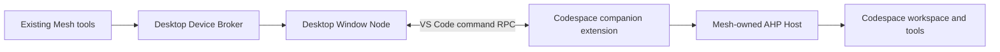

# Desktop Codespaces execution

## Scope and user contract

Support a trusted GitHub Codespace opened in **desktop VS Code**. Preserve the
six existing Mesh tools, target handles, `wait`/`submit`, task ownership,
idempotency, input/answer, cancellation, and `continueFromTaskId`. Local desktop
workspaces keep their existing editor-first execution path.

This feature does not borrow the Codespace window's native Agent Host or promise
that Mesh sessions appear in its native Chat Sessions list. It does not create,
start, or keep a Codespace alive, support browser clients, or automatically resume
execution after a Host/extension-instance replacement. A lost execution
generation is not permission to submit the same work again.

## Architecture

The main extension remains a UI extension. A separately identified workspace
extension runs inside the Codespace. They share source code in this repository
but have independent entry points and VSIX packages. An `extensionKind` array
does not run one extension in both hosts.

The desktop retains the single Broker, authenticated local IPC, device secrets,
policy stores, task/event stores, and existing cross-device Tunnel. A Codespace
is an execution environment behind an attached Window Node, not a second Mesh
device or a second public listener. Other devices continue to use the desktop
Broker's existing Mesh transport.

## Why an owned Host

In upstream VS Code 1.136.2 (`88e44fa0e00b08f7758b4f6d05632e4fd5e4df6f`),
the remote `code` wrapper rejects the `agent` command. The Server's Node Agent
Host has a configured socket but does not publish the editor endpoint registry
used by Mesh. The native workbench reaches it through internal services, not a
public extension API.

The companion therefore uses a real native Linux VS Code CLI and the supported
`code agent host` entry point. It never scrapes another process's environment,
extracts native Host credentials, patches VS Code Server, changes the terminal's
`code` command, or exposes an unauthenticated forwarded port.

References:

- [Remote CLI](https://github.com/microsoft/vscode/blob/88e44fa0e00b08f7758b4f6d05632e4fd5e4df6f/src/vs/server/node/server.cli.ts#L93-L103)
- [Server Host publication](https://github.com/microsoft/vscode/blob/88e44fa0e00b08f7758b4f6d05632e4fd5e4df6f/src/vs/platform/agentHost/node/agentHostMain.ts#L235-L341)
- [Public cross-extension commands](https://code.visualstudio.com/api/advanced-topics/remote-extensions#communicating-between-extensions-using-commands)
- [Standalone Agent Host](https://code.visualstudio.com/docs/agents/concepts/agent-host)

## Execution bridge

Use public `vscode.commands.executeCommand` routing between the UI extension and
the companion in that same VS Code window. Do not access cross-host extension
exports or send callbacks, object capabilities, AbortSignals, or async iterators.

The bridge has its own version, independent of Mesh's network protocol. Its
handshake binds a random client capability to the desktop node ID, node-instance
ID, exact remote authority, expected workspace folders, and a fresh helper
generation. A new handshake cannot silently attach to old execution state.
Command names alone are not authentication. Installed extensions already share
the VS Code user's trust boundary; the bridge is not a sandbox against a hostile
extension running with that user's privileges.

Only bounded, schema-validated operations are supported:

| Operation | Contract |
| --- | --- |
| connect | Establish one generation-bound client and confirm protocol compatibility and current workspace roots. |
| describe/resolve | Return only the attached window's workspaces and canonical remote file identities. |
| probe | Report actual execution availability without starting an Agent task or prompting for authentication. |
| start | Accept an exact Broker-authorized task and its bound workspace; identical retries reuse its result. |
| events | Return ordered bounded batches; acknowledge only after the desktop event sink accepts them. |
| answer | Answer the exact task/input/answer identity. |
| cancel/disposeTask | Address only the exact task owned by this generation. |
| heartbeat/disconnect | Maintain a bounded execution lease and close the exact owned generation. |

Errors cross this boundary as typed, sanitized envelopes, not arbitrary exception
objects. Queues, response sizes, in-flight requests, long polls, and retained
request results are bounded. Event backpressure must not silently discard a
terminal or input event. A dedicated heartbeat/cancel path must not wait behind
an outstanding event read.

The desktop's `RemoteWindowNodeExecutor` implements the existing
`WindowNodeExecutor` interface. The actual `WindowNodeTaskExecutor` runs in the
companion, keeping file-write approval and canonical-path checks beside the
filesystem they protect.

## Workspaces and authorization

Only desktop Codespaces with trusted, filesystem-backed folders are admitted.
SSH, WSL, arbitrary remote authorities, mixed authorities, virtual workspaces,
browser clients, and untrusted workspaces remain outside this feature.

The UI validates one remote authority. The companion independently validates its
execution environment and its own workspace folders. It resolves `realpath` and
filesystem identity remotely. The identity input is namespaced by the Codespace
authority before the existing opaque workspace hash is computed. Identical
paths/inodes in different Codespaces must not collide. The UI never calls local
filesystem APIs on a Codespace path.

Each task binds the Broker workspace ID to that remote canonical identity.
The companion re-resolves the current workspace before executing or approving a
write; neither an arbitrary supplied path nor a same-named folder is sufficient.

Existing source allowlists, target receive switches, paired-device grants,
task-start approval, leases, deadlines, and sensitive-operation prompts remain in
force. In-memory approval capabilities are reissued inside the target process
only after validation of the serialized, request-bound delegation grant.

Execution backend selection belongs to the target Broker. Ordinary targets keep
their existing editor-only policy for strict remote tasks. A Codespace target
advertises and accepts an explicit `codespace-owned` backend bound to its
authenticated Window Node. A tool caller cannot pick a fallback backend.
Local IPC schema changes must fail explicitly on incompatible participants.
The six tool input schemas and public network task identities stay unchanged.

## Owned runtime and retained sessions

An owned runtime is a separate source, `codespace-owned`, never an editor-shaped
fallback. Reuse the existing AHP SDK, event mapping, task executor, and process
ownership code.

The companion lazily starts one owned Host for its execution generation. Each
task holds a lease on that Host. Releasing a completed task detaches its AHP
client but does not kill the Host or delete its retained Session.

New tasks create new Sessions. Continuations create a new task/turn in the
previous task's exact Session/Chat, and require:

1. The same authenticated task owner and source workspace scope.
2. The same device/node/node-instance/workspace target.
3. A completed previous task and a retained, idle Session.
4. The same live owned Host generation and current workspace identity.

Host replacement invalidates retained identities. Never reopen an unrelated
session, replay an uncertain start, or substitute a new Session for continuation.

Folder isolation and authoritative provider/workspace snapshot checks apply to
both borrowed editor and retained owned Sessions. Resolve configuration from the
actual provider schema and fail if `folder` cannot be honored. Negotiate only
implemented AHP versions (`1.0.0` and the explicit `0.9.0` compatibility path);
do not infer wire compatibility from the extension or npm package version.

## Authentication and runtime provisioning

The companion obtains protected-resource credentials through native VS Code
Authentication and exact provider/scope mappings. Existing account sessions may
be reused after the user grants the companion access. No PAT setting, shell
login, copied `GITHUB_TOKEN`, or native editor-token extraction is required.
Only the owned Host receives these credentials.

These identities are independent: GitHub Codespaces owns the remote-connection
account, Mesh connectivity owns its explicitly selected Dev Tunnel account,
and the companion requests the Copilot account for task execution. They do not
need to match. Same-account Mesh discovery compares the Tunnel accounts of
participating Mesh devices, not the account used to open a Codespace.
Runtime installation does not request any of these authentication sessions.

The native CLI lives in the companion's private runtime cache or an explicitly
configured absolute executable path. Provisioning is an explicit user action
with download and license information; it is not a side effect of activation,
listing targets, or rendering the Dashboard. Use official HTTPS release
metadata, a pinned release/architecture, and integrity verification. Keep
download/extraction limits and cancellation, reject unsafe archive paths, and
install atomically. Missing or incompatible prerequisites surface an actionable
error rather than selecting the remote CLI wrapper.

System libc is checked using bounded, read-only `/usr/bin/getconf
GNU_LIBC_VERSION`, not a missing field in the extension host's Node diagnostic
report. Unknown libc produces `ENVIRONMENT_CHECK_FAILED`; a confirmed version
below 2.28 remains unsupported. This check does not change or upgrade the
container's system libraries. Setup reports the failed stage and a whitelisted
error code across extension hosts without forwarding paths or credentials.

If setup fails, inspect **Output: Copilot Agent Mesh** on the desktop and
**Output: Copilot Agent Mesh - Codespaces** for remote preparation. In the
Codespace terminal, `uname -m` and `getconf GNU_LIBC_VERSION` provide the relevant
platform evidence. A Dev Tunnel shown as Online does not prove that the
Codespaces companion or its Agent runtime is ready. Missing workspace claims
after a failed initial handshake are not evidence of an account mismatch;
reload after successful companion/runtime preparation.

Native CLI version discovery accepts the official one-line banner
`code <version> (commit <sha>)` (including supported product names), separately
from the desktop wrapper's version/commit/architecture triple. A native banner
does not supply architecture; the installer verifies the downloaded ELF instead
of the parser guessing it. An available Window Node and a successful outbound
delegation do not prove that the Codespace's inbound Agent runtime is ready.
Companion Output records safe source/error/stage changes so discovery failure
can be distinguished from later Host authentication or session startup.

The native CLI supervisor in 1.137.0 publishes the fixed registry
`protocolVersion: "0.1.0"` independently of the backend's negotiated AHP
version. For an already ownership-validated `codespace-owned` Host only, Mesh
treats this known marker as requiring negotiation with its exact implemented
offer `["1.0.0", "0.9.0"]`. The selected version must still belong to that offer;
AHP `0.1.0` and unknown versions remain unsupported. Borrowed editor registry
validation is unchanged. See the upstream
[registry constant](https://github.com/microsoft/vscode/blob/645f29cc3176500b4b5762ba887cf2a7f0ffdf2c/cli/src/tunnels/agent_host_registry.rs)
and [supervisor publication](https://github.com/microsoft/vscode/blob/645f29cc3176500b4b5762ba887cf2a7f0ffdf2c/cli/src/tunnels/agent_host.rs).

On 2026-09-11, isolated Ubuntu 24.04/Linux x64 with glibc 2.39 and Node 24.13.0
reproduced the old pre-handshake rejection using native CLI 1.137.0 commit
`645f29cc3176500b4b5762ba887cf2a7f0ffdf2c`. With the correction, the production
installer/launcher/connection factory reached AHP `initialize`, selected
`0.9.0`, returned one root snapshot, and removed its exact owned resources.
No account was authenticated and no Session or model task was started. This
does not claim live cloud Codespaces task qualification.

The CLI may fetch Agent Host server components on first authorized use. Its
metadata, logs, and reusable server cache stay in the companion's private
`agent-host/cli-cache`, not the user's default CLI directory. The cold-start
allowance is bounded at 120 seconds and remains within the task's Broker
deadline. Per-Host user-data and session directories remain separately owned
and are removed at generation cleanup; the explicitly reusable CLI cache stays.
The VS Code-provided storage base is canonicalized read-only before appending
private child directories, so container-mounted VS Code data aliases work
without allowing archive or manifest paths to follow arbitrary symlinks.

## Failure and lifecycle semantics

The Broker remains the durable task authority. A start receipt is not proof of
execution or completion. Event acknowledgements follow Broker acceptance.

On transient transport loss, stop admission and reconcile the exact existing
request/task IDs. On a changed helper generation, retire the old execution
generation and invalidate its routes and continuation references. Do not
automatically resubmit tasks whose outcome is uncertain.

The companion enforces execution deadlines even if the desktop is unreachable.
Loss of its bounded client lease stops admission and initiates cancellation and
owned cleanup. Cancellation is authoritative only after the Host confirms it;
otherwise surface the existing unconfirmed-cancellation/recovery error.
Startup cancellation has its own task-scoped runtime operation: it interrupts
pending configuration/authentication/Host startup without disposing another
task. A pre-dispatch cancellation fences future dispatch, and a target publishes
confirmed startup cancellation before returning its rejected start response.
Workspace bindings are revalidated for tool inputs and pending answers, with
answer idempotency reserved before that asynchronous revalidation.

Disconnect/dispose cleans only this companion's owned resources. It never
terminates the native Codespace Agent Host or VS Code Server. Desktop window
closure is not an unattended execution feature.

## Implementation map

| Surface | Responsibility |
| --- | --- |
| `src/codespaces/` | Versioned bridge, remote client/server, workspace binding, runtime provisioning, and companion entry point. |
| `src/composition/createApplication.ts` | Select local or Codespaces execution adapters without relocating the Broker. |
| `src/application/LocalDesktopWorkspaceGuard.ts` | Explicit desktop Codespaces control-plane admission. |
| `src/node/WindowNodeClient.ts` | Remote executor lifecycle and workspace adapter integration. |
| `src/broker/`, `shared/protocol/nodes.ts` | Target-selected backend policy and existing authorization boundaries. |
| `src/agentHost/` | Retained owned Host leases, continuation, folder policy, and protocol negotiation. |
| `src/ui/`, `media/` | Honest remote runtime status and setup actions. |
| `companion/`, build/package scripts | A workspace-only companion VSIX alongside the UI extension. |

## Acceptance and release evidence

Automated coverage must exercise the production bridge and executor composition,
not only stub a successful tool result. Cover bidirectional local/remote routing,
all six tools' unchanged contracts, one-to-many submit/wait, continuation,
idempotency conflicts, wrong capabilities/generations/workspaces, policy denial,
input/answer, cancellation, bounded event delivery, lease expiry, shutdown, and
packaged entry points. Existing local editor behavior must remain intact.

Real Codespaces qualification additionally records the exact desktop/server/CLI
versions, Linux architecture, native account authorization, a real remote task
and continuation, authoritative cancellation, and owned-resource cleanup.
Offline coverage is not evidence of a live Codespace or model turn. Keep these
evidence scopes separate in the compatibility matrix and release notes.
