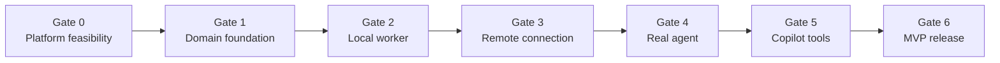

# Copilot Agent Mesh 实施计划

> 状态：Draft<br>
> 日期：2026-08-24<br>
> 依据：[PRD v0.3](../copilot-agent-mesh-prd.md) 与 [技术实施方案](./technical-implementation.md)<br>
> 计划方式：按技术 Gate 推进，不以未经验证的日历日期承诺

## 1. 目标

本计划将 MVP 拆成可独立验证的纵向阶段。每个阶段必须完成代码、自动化测试、错误处理、日志脱敏和文档，达到 Gate 后才能进入依赖该能力的阶段。

首版交付结果：

- 一个可安装在 Windows、macOS、Linux 桌面版 VS Code 的 VSIX。
- Worker 可注册本机 Workspace、启动本地 Gateway 和 Dev Tunnel。
- Coordinator 可配对 Worker、查看 Workspace、创建/查询/取消任务。
- Worker 通过 Agent Host/AHP 启动独立内置 Copilot Agent Session。
- Dashboard 可查看连接、任务、输入请求和错误。
- 所有远程执行均受 Workspace 白名单、Peer 认证和本机首次授权保护。
- 插件不检查、管理或提示任何 Git/分支/worktree 行为。

## 2. 当前基线

已完成：

- TypeScript VS Code Extension Scaffold。
- npm、esbuild、TypeScript、ESLint 和 Extension Host Test。
- Activity Bar Webview View 骨架。
- 设备名设置。
- 初始协议常量。
- PRD 已明确 Git 操作完全由远端 Agent 决定。

尚未实现：

- Runtime Schema 和领域状态机。
- Device/Workspace 持久化。
- Gateway、认证、Peer、Dev Tunnel。
- Agent Host/AHP。
- Language Model Tools。
- 交互 Dashboard。
- 分层测试、CI、VSIX 打包。

## 3. 决策 Gate



| Gate | 必须证明 |
| --- | --- |
| G0 | 当前 VS Code/AHP/Dev Tunnel/Tool API 组合可行，并锁定兼容版本 |
| G1 | Task、RPC、存储、认证核心可在无 VS Code/网络/模型环境下完整测试 |
| G2 | Worker 本地 Gateway + Fake Agent 可安全、持久地执行任务 |
| G3 | 两个 Extension Instance 可经 Dev Tunnel 配对、重连和恢复任务 |
| G4 | Worker 可通过 AHP 创建真实 Copilot Session、取消并处理输入 |
| G5 | 内置 Copilot Agent 可调用 Mesh Tools 完成异步委派闭环 |
| G6 | 三平台测试、恢复、安全、诊断和 VSIX 均达到 Preview 发布标准 |

## 4. 工作量标记

计划使用相对工作量，不给出缺少团队容量依据的日期：

| 标记 | 含义 |
| --- | --- |
| S | 单模块、已知 API、测试边界清晰 |
| M | 跨 2–3 个模块或含持久化/错误处理 |
| L | 外部 Preview API、跨进程或需要真实环境验证 |
| XL | 跨设备 E2E 或高不确定性集成 |

## 5. Phase 0：技术可行性与版本锁定

Phase 0 是阻塞项，不允许用 Mock 成功替代真实验证。

### P0.1 Language Model Tool Spike — M

**实现**

- 在 Manifest 临时贡献 `mesh_spike_echo`。
- 使用 `vscode.lm.registerTool` 注册实现。
- 验证 `prepareInvocation`、确认 UI、CancellationToken 和结构化 Text Result。
- 返回 `pending + taskId + pollTool`，观察内置 Copilot Agent 是否会继续调用查询 Tool。
- 测量 Tool Ack 在 5、15、30 秒延迟下的行为。
- 用 Mesh 自有 Timer 与 CancellationToken 竞争，不假设 VS Code 提供 Tool Deadline。
- 模拟 Worker 已接受但 Ack 丢失：Coordinator 使用相同 `delegationRequestId` 对账，重试不得启动第二个任务。

**验收**

- Tool 可由内置 Agent 自动选择或显式引用。
- `prepareInvocation` 不产生副作用。
- Cancel 可中止等待。
- 证明不能依赖稳定 Progress API 或旧 Turn 的主动回写。
- Manifest Tool Name 与 Runtime Registration 完全一致，并可从 Cold Extension Host 隐式激活。
- 将最终 Tool UX 写成固定 Contract Test。

### P0.2 Agent Host/AHP Spike — XL

**实现**

- 通过 `code agent host` 启动独立 Host。
- 启动前后分别读取 `code agent endpoints`，按新 Instance、Standalone 类型、Owned PID 和 Token 唯一选择 Endpoint；零个或多个匹配都失败。
- 使用精确版本 AHP TypeScript Client 初始化。
- 验证实际 Host Protocol 与 SDK `SUPPORTED_PROTOCOL_VERSIONS` 有交集；不假定 0.8.0 可连接当前 Host。
- 验证目标 Extension Host 是否提供 `globalThis.WebSocket`；缺失时验证基于 `ws` 的 `AhpTransport`。
- 动态发现 Agent Provider。
- 验证受保护资源、`vscode.authentication` 与 AHP `authenticate`。
- 以 `workingDirectories` 在隔离的非敏感临时本机 Workspace 创建 Session；验证 Session Config Resolution。
- 订阅 Session Channel 并应用 Snapshot，等待 Ready 后读取/订阅 Default Chat。
- 发送无破坏性的 Prompt，接收 Delta、Tool、Terminal、Input、Completion。
- 验证 Tool Approval 标识/回复、Input Request/Answer、MCP Auth Required、独立 Terminal Channel。
- 验证 Cancel Rejection/Deadline、Replay、Snapshot Fallback、Missing Subscription、WebSocket 重连和 Host Crash。

**验收**

- 不解析 Readiness 文本。
- 不硬编码 Copilot Provider ID。
- Connection Token 不进入日志、Webview 或 Mesh 数据。
- Session 可在 macOS 当前环境完成一次 Turn。
- Windows 和 Linux 至少完成 Host 启动、Endpoint 发现和 AHP 初始化。
- 记录最低 VS Code 版本、CLI 参数、AHP Package/Protocol 版本。
- 明确哪些恢复场景可用，哪些必须返回 `TASK_RECOVERY_UNAVAILABLE`。
- 真实测试只能人工 Opt-in，明确消耗 Copilot 配额，使用结束后删除的 Disposable Workspace；普通 CI 只运行 Fake Host/InMemory Transport。

### P0.3 Dev Tunnel Spike — L

**实现**

- 检测 CLI 版本和登录状态。
- 创建带唯一 Tag 的 Persistent Tunnel。
- 创建固定 HTTP Port 和有限期 Anonymous Port Access。
- 保存 `show --json` 脱敏 Fixture。
- 发现 HTTPS Forwarding URI。
- 验证 `/healthz`、WSS、Ping、Host Kill/Restart、URL 稳定性。
- 验证 Port Collision 的完整用户确认迁移：撤销 Access、删除旧 Port、创建新 Port/Access、重新发现 URI、旧 URL/Credential 失效和重新配对。
- 验证 Anonymous ACE Expiry、提前续期、Reset/Recreate 和续期失败。
- 验证 Tunnel 被手动删除、Port 缺失/Wrong Protocol、未知 JSON、登录过期和 Missing CLI。
- 验证 HTTPS 证书、禁止 Redirect、Anti-phishing 页面处理和精确 `204`。
- 验证同一 Tunnel/Port 只有一个 Owned Host、Stop-during-backoff、Permanent Failure Circuit Breaker。
- 验证 Pairing Incomplete Handshake、两阶段 Commit Ack 丢失、Nonce Replay 和离线 Peer 撤销。

**验收**

- Gateway 只绑定 `127.0.0.1`。
- 不解析普通 stdout。
- 精确记录允许的 CLI Build String、OS/Arch、Decoder Revision、Fixture Hash 和命令行为；不使用宽泛版本范围。
- Decoder 验证 Tunnel ID、Port、HTTP Protocol、唯一 HTTPS URI、无 Userinfo 和允许 Host Suffix。
- 确认目标 CLI 版本在 macOS、Windows、Linux 的安装与架构支持。
- 重启后 Persistent Port 和公开 URI 保持或产生明确迁移事件。
- 测试资源在 `finally` 中只清理自己的 Tunnel。
- 不依赖 `devtunnel list --json`。

### P0.4 兼容矩阵与 Go/No-Go — S

输出：

```text
VS Code minimum:
VS Code tested:
AHP package:
AHP negotiated protocols:
devtunnel CLI versions:
devtunnel exact build / OS / arch:
decoder revision / fixture hash:
Supported OS/arch:
Known unsupported:
```

首个候选测试 Build 是调研时可见的 `1.0.2030+fc9273aa0f`，不在 P0.3 完成前声明支持。

**Gate G0**

- P0.1、P0.2、P0.3 均通过。
- 若 AHP Auth 或真实 Copilot Session 不可用，停止构建完整 MVP；只保留 Fake Agent Demo，不把它声明为可交付产品。
- 更新 `engines.vscode`，将 `@types/vscode` 精确锁定到同一最低 API 版本，锁定 AHP/CLI 兼容版本。
- 把 Manifest `extensionKind` 改为 `ui`，记录本机桌面 Workspace Feature Guard 和 Feature Flag 默认值。

## 6. Phase 1：工程与领域基础

### P1.1 重构目录与 Composition Root — M

**文件**

- `src/composition/createApplication.ts`
- `src/domain/*`
- `src/application/*`
- `shared/protocol/*`

**实现**

- `extension.ts` 只负责创建依赖、注册 Contribution、Dispose。
- Domain 不导入 VS Code、Node Process、WebSocket 或 AHP。
- 定义 Clock、IdGenerator、RandomSource、FileStore 等测试接口。
- 将 Manifest `extensionKind` 改为 `ui`；Central Guard 仍在 Runtime 入口执行。

### P1.2 Zod Schema 和协议模型 — M

**实现**

- 添加并锁定 Zod Runtime Dependency。
- JSON-RPC Request/Response/Notification。
- Hello/Auth、Device、Workspace、Task Methods。
- Task Notifications、Error Codes。
- `delegationRequestId`、Task Ownership 和 Event Gap Truncation。
- Persisted Record Version Schema。
- Webview Message Schema。
- UTF-8 Byte Length Helper 和字段上限。
- 原子更新现有 `shared/protocol.ts` 状态常量及对应测试，避免 Router/Runner 混用旧状态模型。

**测试**

- 正常 Fixture。
- 缺字段、Unknown Method、Wrong Type、Oversize、Batch、Prototype Pollution Shape。
- Forward-compatible Field 只在明确位置允许。

### P1.3 Task Reducer 与 Workspace Lease — L

**实现**

- 完整状态枚举：`accepted`、`startingAgent`、`running`、`needsInput`、`recovering`、`cancelling`、Terminal。
- 单一纯 Reducer。
- `(peerId, delegationRequestId)` Idempotency 和 Peer-scoped `taskId`。
- 对精确任务语义做 Canonical Request Hash，不规范化 Prompt 文本。
- 每 Workspace 单 Lease。
- 所有 Active State 可进入真实 `failed` / `timedOut`；Cancellation 有 Deadline。
- Get/Cancel/Answer 强制 Task Owner。

**测试**

- 状态转换表全部覆盖。
- Terminal Immutable。
- Duplicate Start/Cancel/Answer。
- Cancel、Answer、Completion Race。
- Cancellation 无法确认时进入失败并释放 Lease。
- 另一已认证 Peer 只能得到非泄漏式 `TASK_NOT_FOUND`。
- 重启后 Lease 恢复。

### P1.4 Storage 和原子文件 — M

**实现**

- `DeviceProfileStore`
- `WorkspaceRegistry`
- `PeerProfileStore`
- `SecretStore`
- `FileTaskStore`
- Schema Migration、Retention、Atomic Replace。
- Task File 是 Lease/状态恢复权威；Index 和内存 Lease 只做派生 Cache。
- Event Journal 是 1 MiB Ring，暴露 `earliestAvailableEventSeq/eventsTruncated`。
- 禁止任何 Mesh Key 使用 `globalState.setKeysForSync`。

**测试**

- 模拟写入中断、损坏 JSON、旧 Schema、磁盘错误。
- 模拟终态写入与内存 Lease 释放之间崩溃，并从 Task File 正确重建。
- Secret 不进入普通 State。
- Prompt/原始 Output 默认不持久化。

### P1.5 Logger 和 Redactor — M

**实现**

- Log Category/Level。
- URL Fragment、`tkn`、Authorization、Tunnel Token、HMAC、Local Path Redaction。
- Safe Error 序列化。
- Bounded Diagnostic Export。

**测试**

- 每类 Secret Fixture 均不会出现在 Output。
- Error Cause/Stack 不越过远端边界。

### P1.6 Test Scripts 与 CI Scaffold — M

**实现**

- 分离 `test:unit`、`test:component`、`test:extension`。
- 建立 GitHub Actions 三平台骨架；先运行当前已有 Test Layer。
- Linux Xvfb。
- npm Cache、Artifact 保存、并发取消。
- `npm audit` 和 Lockfile 检查。

### P1.7 Git 非干预 Enforcement — M

**实现**

- Static Import/Dependency Guard：禁止 Git Library 和 VS Code Git API。
- Process Spawn Allowlist：只允许版本化的 `code` 与 `devtunnel` Adapter。
- Fake Workspace 包含 `.git`，监控 File Access 并断言 Mesh 不读取。
- Prompt Snapshot 断言 Mesh 不追加 Git/Branch/Worktree/Commit/Push/PR 指令。

该 Issue 在 G1 前完成，后续所有阶段沿用。

**Gate G1**

- Domain 测试不启动 VS Code、不联网、不调用 Copilot。
- 协议和 Task 核心达到高分支覆盖。
- 所有 Secret Fixture 通过 Redaction Test。
- P1.7 Git 非干预测试存在并通过。

## 7. Phase 2：本地 Worker

### P2.1 Device Identity — S

**实现**

- 首次启动生成稳定 UUID。
- 采集 OS、Arch、VS Code、Extension Version。
- 修改 Device Name 不改变 ID。
- 中央 `LocalDesktopWorkspaceGuard`。

**验收**

- Reload 后 ID 不变。
- `remoteName`、Untrusted、无 Folder、非 `file:` 或 Mixed Workspace 分别被拒绝。
- 任何直接 Command/Tool 调用都不能绕过 Guard 启动 Gateway、Child Process、注册 Workspace 或创建 Task。

### P2.2 Workspace Registry — M

**实现**

- 注册当前本机 `file:` Workspace Folder。
- 保存 Worker-local URI、显示名、Capability Tags、Enabled。
- Coordinator 只看到 opaque `workspaceId`。
- 删除/禁用时处理 Active Lease。

**验收**

- 不要求 Git 仓库。
- 不读取 `.git`。
- 任意外部 Path 输入不能绕过 Registry。

### P2.3 InMemory/Fake Agent Runtime — M

**实现**

- 可脚本化事件：Progress、Output、InputRequired、Complete、Fail、Delay、Ignore Cancel、Unrecoverable。
- Fake Runtime 不读取 Workspace、不运行进程。
- 可注入 Task Runner。

### P2.4 RemoteTaskRunner — L

**实现**

- 校验授权和 Workspace。
- 获取 Lease、持久 `accepted`。
- 调用 Agent Runtime。
- 映射事件、Answer、Cancel 和 Recovery。
- 先持久化后通知。
- 所有 Task Operation 强制 Peer Ownership。

### P2.5 Local Gateway Server — L

**实现**

- 添加并锁定 `ws` Runtime Dependency。
- HTTP `/healthz`。
- `noServer` WebSocket Upgrade。
- Frame/Route 限制。
- `RpcPeer` Dispatcher。
- 认证前 64 KiB/Socket/Rate/Handshake 限制。
- 按序列化 Byte 计数的优先级 Outbox、`bufferedAmount` 阈值、Heartbeat。
- Graceful Drain。

### P2.6 Pairing Service — L

**实现**

- 一次性 Secret。
- HMAC 双向认证。
- 每次 Copy 生成独立 Invitation、TTL 和撤销。
- Transcript-bound HKDF、方向 Label 和 SecretStorage。
- Pending Enrollment + Coordinator Commit 的两阶段提交。
- Replay/TTL/Rate Limit/Revocation。
- 首次远程写本机授权状态。

**Gate G2**

- 真实 Loopback WebSocket + Fake Agent 完成 Start/Get/Cancel/Answer。
- 未认证连接无法读取任何 Inventory。
- 任意 Enrollment Crash/Ack 丢失不会产生无法恢复的单边 Credential。
- Worker 撤销 Peer 会关闭 Active Socket，旧 Secret 离线后也不能重连。
- Duplicate Start 只调用一次 Fake Agent。
- 同 Workspace 并发只有一个成功。
- Worker 重启后可查询 Snapshot。

## 8. Phase 3：Dev Tunnel 与远程 Peer

### P3.1 ChildProcessRunner — M

**实现**

- 参数数组、`shell: false`、Timeout、Abort、stdout/stderr 上限。
- Owned Process Tracking。
- 跨平台 Graceful Stop 和 Force Stop。
- 可执行路径校验。
- Permanent/Transient Failure 分类、Circuit Breaker、Pending Restart Cancel。

**测试**

- Shell Metacharacter 不被解释。
- Timeout 后只终止 Owned PID。
- stdout/stderr 不导致无界内存。

### P3.2 DevTunnelCliProvider — L

**实现**

- Probe/Version Gate/Login Status。
- 精确 Build Allowlist + Decoder Revision/Fixture Hash。
- Ensure Persistent Tunnel/Port/Access。
- 版本化 JSON Decoder。
- Host Supervision。
- Health + WSS Ready Probe。
- Tunnel/ACE Expiration Reconciliation。
- 用户确认的 Port Collision Migration 和 Peer Re-pair。

### P3.3 Connection URL — M

**实现**

- 生成 URL Fragment Secret。
- 每次 Copy 创建独立 Invitation ID、Secret、TTL。
- 解析和严格校验 Scheme、Host、Path、Version、Device ID、Invitation ID、Secret。
- Paste 后立即从普通 State 清除 Secret。
- Copy/Reveal 只在 Extension Host 中执行。

### P3.4 Peer Profile 与 Connection Manager — L

**实现**

- 添加、删除、连接、断开、撤销。
- Full-jitter Backoff。
- Heartbeat/Latency。
- `task.get(afterEventSeq)` 恢复。
- Profile 与 Secret 分离存储。
- Worker Revocation 是权威，Coordinator Cleanup 为 Best-effort。
- Endpoint 迁移不自动猜测新 URI；旧 Profile 进入 `rePairRequired`。

### P3.5 双实例 Integration Harness — L

**实现**

- 同一机器启动 Worker/Coordinator 两个 Extension Instance。
- 可选真实 Dev Tunnel，Fake Agent。
- 自动验证 URL 配对、重连、任务恢复。

**Gate G3**

- Coordinator 经真实 Dev Tunnel 与 Worker 完成认证。
- Host Process 重启后 30 秒内恢复或显示明确 Offline。
- Pairing Secret/Peer Secret 不出现在日志和 State。
- URL 轮换使旧 Credential 失效。
- ACE 续期失败、Tunnel 被删除、Login 过期和 Port 冲突不会进入无限重试。
- Fake Agent Task 可跨 Tunnel 完成并查询。

## 9. Phase 4：真实 Agent Host/AHP

### P4.1 AgentHostLauncher — L

**实现**

- Code CLI Discovery 与 Version Probe。
- Dedicated User Data / Endpoint Ownership。
- Token File。
- 启动前后 Endpoint Diff、唯一 Ownership Match 和 Decoder。
- Token File 仅在目标 Build 验证安全时点后删除。
- Process Supervision 和 Shutdown。

### P4.2 AhpClient Session — XL

**实现**

- 添加与目标 Host Protocol 有交集的精确 AHP Runtime Dependency。
- WebSocket Transport、Initialize、Protocol Negotiation。
- 目标 Extension Host `globalThis.WebSocket` Probe；必要时用 `ws` 实现 `AhpTransport`。
- Root Snapshot、Provider Discovery、Capability Detection。
- Session Config Resolution、`workingDirectories`、Create Session。
- Session Subscribe/Snapshot、Ready/Failure、Default Chat。
- Default Chat Subscribe。

### P4.3 AuthBroker — XL

**实现**

- 读取 Provider Protected Resources。
- Silent-first `vscode.authentication.getSession`。
- 明确交互登录。
- 动态 Resource Metadata、AuthRequired Re-discovery、AHP Authenticate/Retry。
- Account Change 和 Token Invalid 处理。

### P4.4 Event Mapper — L

**实现**

- Chat Delta/Response/Reasoning。
- Tool Call 和 Approval 的 `chatUri/turnId/toolCallId`。
- Input Request/Answer 的 AHP `requestId` 与 Required Validation。
- MCP Tool Auth Required 进入 AuthBroker。
- 独立 Terminal Channel Subscribe/Summary。
- Optional Changeset Channel Subscribe。
- Completion/Cancel/Error。
- Changeset 仅可选展示。

### P4.5 Cancel 与 Recovery — L

**实现**

- Chat Turn Cancel。
- Server-authoritative Cancel、Rejection、Deadline。
- Reconnect + Sequence Replay/Snapshot/Missing Subscription。
- Re-list Session/Provider/Auth Ephemeral State。
- Host Crash。
- Truthful Recovery Failure。

**Gate G4**

- macOS、Windows、Linux 各完成至少一次真实 Session。
- Prompt 只包含原始任务、验收条件和允许的上下文。
- 无 Mesh 注入 Git 指令。
- Cancellation 到达终态。
- Tool Approval、Input Request 和 MCP Auth 可正确路由与回答。
- Host Crash 不产生伪成功或伪恢复。
- Token 不离开 Worker。

## 10. Phase 5：Language Model Tools

### P5.1 Tool Manifest — S

贡献：

- `mesh_list_workers`
- `mesh_delegate_task`
- `mesh_get_task`
- `mesh_cancel_task`

输入 Schema 设置 `additionalProperties: false`。每个 Tool 提供明确的 `modelDescription`、`userDescription`、`toolReferenceName`。

Contract Test 断言 Manifest 与 Runtime Registration Name 完全一致，并从 Cold Host 通过隐式 Activation 启动。

### P5.2 ListWorkersTool — S

返回：

- 在线 Peer。
- Device Capability。
- Workspace opaque ID/name/tags/busy。
- 不返回路径或 Secret。

### P5.3 DelegateTaskTool — M

**实现**

- `prepareInvocation` 显示目标和摘要。
- 校验 Peer/Workspace/Trust/Input Size。
- 在网络发送前持久化 Delegation Intent。
- 使用 `delegationRequestId + taskId` 创建 Task。
- 在 Ack Deadline 内返回 `pending + taskId`。
- 不等待完整 Coding Task。
- Ack 丢失时用同一 Delegation ID 恢复，不启动重复 Agent。

### P5.4 GetTaskTool — M

**实现**

- 返回当前 Snapshot。
- Terminal 时返回 Bounded Summary、Validation、Opaque Artifact。
- 尊重 Token Budget。
- 不返回 Raw Transcript。

### P5.5 CancelTaskTool — M

**实现**

- Confirmation。
- Idempotent Cancel。
- 区分 `cancelling`、`cancelled` 和已终态。

### P5.6 AnswerTaskTool — M

输入/审批通道稳定后增加：

- 指定 `taskId`、`inputId`、`answerId`。
- Confirmation。
- 过期/重复/不匹配处理。

### P5.7 Tool Behavior E2E — L

验证内置 Copilot Agent：

- 先 List 再 Delegate。
- 收到 Pending 后使用 Get。
- 可取消。
- 不把 Mesh Tool 误认为 Git 管理 Tool。

**Gate G5**

- Tool 在干净 Extension Host 自动激活。
- Delegate 在 20 秒内返回 Ack。
- 长任务不占用 Tool Invocation。
- Deadline 是 Mesh Timer；Tool Promise 结束不影响已接受 Task。
- “Worker accepted / Ack lost / Tool cancelled / retry”只产生一个任务。
- 所有 Side Effect Tool 有确认。
- Tool Cancellation 不丢失已接受 Task ID。

## 11. Phase 6：Dashboard 与用户流程

### P6.1 UI Bundle 和 Message Bus — M

- 原生 TypeScript Bundle。
- CSP、Nonce、`localResourceRoots`。
- Zod Message Schema。
- Presenter + ViewModel。
- Repeated Resolve/Dispose Lifecycle。
- Outbound ViewModel/`postMessage` Secret 与 Path Guard。

### P6.2 This Device / Listener — M

- Device Name/Platform。
- Gateway/Tunnel/AHP 分层状态。
- Start/Stop/Restart。
- Copy Pairing URL。
- Install/Login/Version Guidance。

### P6.3 Workspace Management — M

- Add Current Workspace。
- Name/Tags/Enabled。
- Remove/Disable。
- Busy/Active Task。

### P6.4 Remote Devices — M

- Add URL。
- Connecting/Online/Busy/Offline/AuthFailed/Incompatible。
- Latency/Last Seen。
- Disconnect/Reconnect/Revoke。

### P6.5 Task Dashboard — L

- Status、Phase、Bounded Output。
- Input/Approval。
- Cancel。
- Error Code 和建议动作。
- 打开 Agent Session 或安全 URL。

### P6.6 本机首次授权 — M

- 新 Peer 第一次远程写弹出本机确认。
- Once / Always for this paired peer。
- Revocation。

## 12. Phase 7：恢复、安全与可观察性

### P7.1 Startup Reconciliation — L

- 清理过期 Task/Journal。
- 恢复 Lease。
- 检查 Owned Child Process。
- 恢复 Tunnel Host。
- 重连 Peer。
- 查询 Active Task。
- 尝试 AHP Session Recovery。

### P7.2 Shutdown/Drain — M

- 拒绝新任务。
- 发 `connection.draining`。
- 持久状态在每次 Transition 已落盘；Shutdown Flush 只是 Best-effort。
- 关闭 Socket/Timer。
- 停止 Owned Child Process。
- 不删除 Persistent Tunnel。
- `deactivate()` 不依赖长异步清理完成；所有 Cleanup 幂等，下一次 Activation 负责 Reconcile。

### P7.3 Security Test Suite — L

- Replay、Wrong Secret、Expired Nonce。
- Flood、Oversize、Slow Consumer。
- Malicious JSON/Webview Message。
- Local Path/Secret Exfiltration。
- Revoked Peer。
- Untrusted/Virtual/Remote Workspace。

### P7.4 Diagnostics — M

- Redacted Export。
- Version/Capability Matrix。
- 最近错误和建议操作。
- 禁止导出完整 Prompt/Output。

## 13. Phase 8：发布工程

### P8.1 VSIX Packaging — M

- 添加 `@vscode/vsce`。
- 添加 `LICENSE`。
- `package.json.files` Allowlist。
- `package` 保持确定性 Build；新增完整 `verify` Script。
- 生产 Bundle。
- 检查 VSIX Contents。
- 干净 VS Code 安装 Smoke Test。

### P8.2 三平台 CI — L

- Windows、macOS、Ubuntu。
- Unit、Component、Extension、Package。
- CI 先运行 `verify`，再创建 VSIX；不在 `package` 隐式执行网络测试。
- Linux Xvfb。
- 上传 Test Report 和 VSIX。

### P8.3 真实平台验证 — XL

- macOS arm64。
- Windows x64。
- Linux x64。
- 两设备真实 Tunnel。
- 真实 Copilot Task。
- Suspend/Resume、Network Loss、VS Code Reload。

### P8.4 Preview Release Checklist — M

- Compatibility Matrix。
- Install/Setup/Pair/Revoke 文档。
- Dev Tunnel Preview 风险说明。
- Data Retention 和 Security 说明。
- Known Issues。
- Changelog。

**Gate G6**

- [技术实施方案 Release Gate](./technical-implementation.md#21-release-gate) 全部通过。
- 未通过的外部 Preview 能力不得用静默降级伪装成功。
- Preview 标签和最低版本准确。

## 14. Issue 拆分建议

以下每项应成为独立 Issue；括号内是依赖：

1. `spike: validate Language Model Tool async workflow`（无）
2. `spike: launch and discover Agent Host endpoint`（无）
3. `spike: authenticate and run an AHP Copilot session`（2）
4. `spike: validate persistent Dev Tunnel JSON and WSS`（无）
5. `docs: publish compatibility matrix and Phase-0 decision`（1, 3, 4）
6. `core: introduce domain/application composition root`（5）
7. `protocol: implement Zod wire schemas and error model`（6）
8. `tasks: implement reducer, idempotency, and workspace leases`（6）
9. `storage: add atomic task and profile stores`（7, 8）
10. `security: add structured logger and redaction`（6）
11. `guard: enforce Git non-interference invariant`（6, 10）
12. `identity: persist device identity and local-desktop guards`（9）
13. `workspaces: implement opaque workspace registry`（9, 12）
14. `testing: implement FakeAgentRuntime`（8）
15. `tasks: implement RemoteTaskRunner using AgentRuntime`（9, 13, 14）
16. `gateway: implement loopback HTTP and WebSocket transport`（7, 10）
17. `security: implement two-phase pairing and peer credentials`（9, 16）
18. `gateway: implement authenticated RPC routes`（12, 13, 15, 16, 17）
19. `tunnel: implement safe ChildProcessRunner`（10）
20. `tunnel: implement versioned Dev Tunnel CLI adapter`（4, 19）
21. `peer: implement invitation URL parser and profile store`（9, 17）
22. `peer: implement reconnect, heartbeat, and task resync`（18, 21）
23. `agent-host: implement process launcher and endpoint discovery`（2, 19）
24. `agent-host: implement AHP session adapter`（3, 23）
25. `agent-host: implement authentication broker`（3, 24）
26. `agent-host: map approvals, input, events, cancellation, and recovery`（15, 24, 25）
27. `tools: contribute and register four core LM tools`（1, 15, 22）
28. `tools: implement task answer flow`（26, 27）
29. `ui: implement secure dashboard message architecture`（7, 10）
30. `ui: implement listener and workspace management`（13, 20, 29）
31. `ui: implement peer and task management`（22, 26, 29）
32. `security: implement first-write worker authorization`（15, 31）
33. `recovery: reconcile tasks, peers, tunnel, and Agent Host`（20, 22, 26）
34. `diagnostics: export bounded redacted support bundle`（10, 33）
35. `ci: scaffold three-platform workflows`（6）
36. `ci: enforce complete unit/component/extension matrix`（7–18, 20–34, 35）
37. `release: package and inspect universal VSIX`（27, 31–36）
38. `e2e: validate two-device Preview release`（32, 33, 37）

## 15. 需求追踪

| PRD | 主要交付阶段 |
| --- | --- |
| FR-1 Device | P2.1 |
| FR-2 Workspace | P2.2 |
| FR-3 Gateway | P2.5 |
| FR-4 Dev Tunnel | P3.1–P3.2 |
| FR-5 Connection URL | P3.3 |
| FR-6 Connection Management | P3.4、P6.4 |
| FR-7 Tools | P5.1–P5.7 |
| FR-8 Worker Execution | P4.1–P4.5 |
| FR-9 Task State | P1.3、P2.4、P7.1 |
| FR-10 Task Result | P1.2、P4.4、P5.4 |
| FR-11 Multi-workspace | P2.2、P3.4 |
| FR-12 Dashboard | P6.1–P6.6 |
| Security | P1.7、P2.6、P7.3 |
| Reliability/Observability | P7.1–P7.4 |
| Packaging/E2E | P8.1–P8.4 |

## 16. 风险与应对

| 风险 | 触发条件 | 应对 |
| --- | --- | --- |
| AHP Auth 无法从扩展完成 | P0.2 不能获得有效 Token | No-Go；不伪造自定义 Agent Loop |
| Agent Provider/事件变更 | Capability 或 Schema 不匹配 | Feature Flag、版本门控、Adapter 隔离 |
| Dev Tunnel JSON 变化 | Decoder Reject | 明确 `CLI_UNSUPPORTED`，提示支持版本 |
| Tunnel/ACE 过期或端口冲突 | Endpoint 失效 | 提前提示、Circuit Breaker、用户确认迁移和重新配对 |
| Tool 无法自动 Poll | P0.1 模型不调用 Get | Dashboard + 用户继续会话；文档化限制 |
| Delegate Ack 丢失 | Worker 已运行但 Tool 未拿到 ID | 持久 Delegation ID、同 ID 对账、Dashboard 恢复 |
| Relay 不稳定 | Host/Service 中断 | Task 持久化、Reconnect、Get Snapshot |
| Secret 泄漏 | URL/日志/状态出现 Secret | One-time Secret、Redactor、Snapshot Test |
| Pairing Commit 中断 | 单边保存 Credential | Pending Enrollment、两阶段 Commit、可恢复 Ack |
| Extension Host 重载 | Active Task 内存丢失 | 持久 Snapshot、AHP Best-effort Recovery |
| 跨平台 Process 差异 | CLI Path/Signal 不同 | Process Adapter、三平台测试 |
| 输出过大 | Agent/Terminal 高频输出 | Bounded Journal/Outbox、摘要、Truncation |
| 误碰 Git 边界 | 新功能读取仓库状态 | Static Guard、Spawn Allowlist、Fake `.git` Test |

## 17. Definition of Done

每个 Issue 只有满足以下条件才算完成：

- 行为符合 PRD 和技术实施方案。
- 正常、失败、取消、超时路径均有测试。
- 所有外部输入经过 Runtime Schema。
- 错误使用稳定 Code，并提供用户可执行的建议。
- 不吞掉异常，不返回伪成功。
- Secret、Path 和敏感任务内容不出现在日志。
- Dispose/Abort/Process Ownership 明确。
- Task API 验证 Peer Ownership，Task File 是恢复权威。
- 不调用 `globalState.setKeysForSync`。
- 不增加 Git 检查、管理或 Prompt 注入。
- 文档和 Compatibility Matrix 同步更新。
- 最小目标测试、Type Check 和 Lint 通过。

## 18. 推荐的首个开发批次

在正式功能开发前，先完成以下顺序：

1. P0.1 Language Model Tool Spike。
2. P0.2 Agent Host/AHP Spike。
3. P0.3 Dev Tunnel Spike。
4. P0.4 Compatibility Matrix 和 Go/No-Go。
5. P1.1–P1.6 工程与领域基础。

原因：AHP Auth、Tool 异步模型和 Dev Tunnel JSON 是三个最大外部风险。先解决它们，可以避免在不可交付的假设上完成大量 UI 和业务代码。
