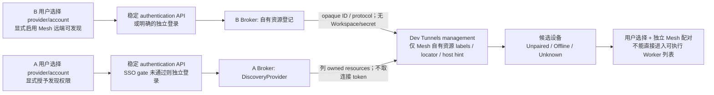
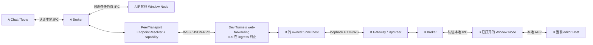
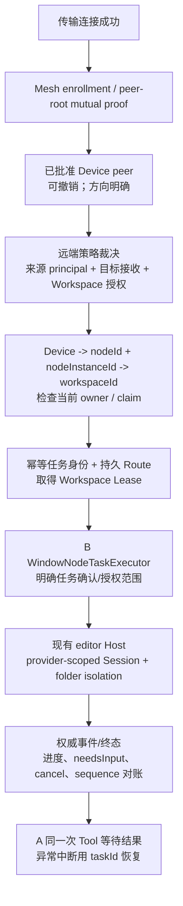

# 跨设备 Agent Mesh：发现与通信路线调研

> 调研日期：2026-09-05，Asia/Shanghai。<br>
> 源码基线：当前 checkout `536982f4251a4a841de561cb4220a4d10e107338`，Mesh 0.4.0 Preview / protocol v2。本轮没有切换或重置分支。<br>
> 范围：文档、公开源码、只读 CLI help、本机 loopback 组件实验。没有登录账号、创建公网资源、启动 Agent Host 或调用模型。<br>
> 结论适用于下列明确版本；公开源码里的能力不自动等于 Stable 扩展 API、已发布 SDK 或完整跨设备实测。

## 1. 执行摘要

**当前不建议为替换而替换 Dev Tunnels。** 对项目现有的开发测试 Preview，最小风险主方案是保留 Broker、Gateway、PeerTransport 和 Dev Tunnel 数据路径，增加独立的**账号发现与 endpoint 解析控制面**。优先验证直接使用公开 Dev Tunnels management SDK、只查询 Mesh 自有资源的方案；不借用 Remote - Tunnels 内部命令、凭据库或原生隧道。SDK 发现可以先与现有固定版本 CLI hosting 共存，不必一次替换两层。

**“两台 VS Code 登录同一账号就能发现并通信”不能原样承诺。** 原生 Remote Tunnels 在用户额外启用 hosting 后，确实提供同账号机器/隧道列表；但不是普通窗口目录。在本次检查的 Stable 1.136.1 中，没有找到允许普通第三方扩展稳定完成“枚举账号远端 → 选择任意 Broker 端口 → 取得双向连接”的公开 VS Code API/CLI 组合。直接用 Dev Tunnels SDK 是另一种可行候选接入方式，仍需扩展授权、正确的 provider/account/scopes、设备登记、Mesh 配对和目标执行授权。其复用 VS Code 登录 session 的端到端效果**尚未验证**。

**原生方案也不能简单淘汰为“只能另起 Server”。** Classic Remote Tunnels/Remote-SSH 确实连接独立 VS Code Server；但当前 Stable 的 native remote Agent Host 源码已经有经 SSH 或 tunnel gateway 选择现有 `editor` endpoint 的路径。问题是它属于实例级、内部/实验性编排，不是 Mesh 的 Device → Window Node → Workspace 契约，更不能证明目标普通 Chat 可见。[N-tunnels], [N-ssh-editor], [N-select]

**长期产品化另设决策门。** Dev Tunnels 官方仍明确定位为临时开发测试、Public Preview、无 SLA、不推荐生产负载。因此，“保留”是当前 Preview 的建议，不是批准长期生产依赖。若需求转为常驻、多用户或有可用性承诺的服务，应推进“独立账号目录 + 双端主动连接的 WSS 中继”；Azure Web PubSub、Azure Relay 或自建 WSS 是备选，不应把换成 Dev Tunnels SDK 当成解决服务成熟度问题。[D-overview]

| 优先级 | 建议 | 原因与前提 |
| --- | --- | --- |
| 主方案，当前 Preview | Dev Tunnels 数据面 + Mesh 自有资源发现/解析 | 最大程度保留已有路由、认证、重连和任务语义；先验证 SDK 登录复用，不依赖 native 内部接口 |
| 可选后端 | 已有 Tailscale 的用户使用 tailnet；已有 SSH 的用户使用受控转发 | 无需再建云中继，但有独立组网/SSH 身份和运维前提，不宜强制所有用户安装 |
| 生产化备选 | 账号目录 + outbound WSS relay | 更可控的设备授权、生命周期和服务条款；代价是后端、安全、可观测性和费用责任 |
| 暂缓 | WebRTC；跨网段 mDNS；包装 native 内部命令 | 分别是复杂度过高、发现范围不符、API/分发契约不成立 |

## 2. 证据口径与版本

### 2.1 证据等级

| 标记 | 含义 | 不能外推为 |
| --- | --- | --- |
| D：文档声明 | 官方文档、协议、许可或产品配额 | 指定环境实际可用 |
| S：源码确认 | 固定 commit 的类型、实现、测试或发行 manifest | 稳定 API、已发布 package、测试已实际运行 |
| L：本轮本机运行 | 下文记录的 help / loopback 实验 | TLS、互联网、两台物理设备或 Agent 执行 |
| H：仓库历史证据 | 当前仓库保存的说明；本轮未重新执行 | 本轮复现，或覆盖新提交后的所有行为 |
| U：尚未验证 | 缺设备、登录、授权、发布版本或运行证据 | 已成功或必然失败 |
| R：建议 | 基于上述证据的架构与验收设计 | 当前已经实现 |

### 2.2 版本锚点

| 对象 | 本轮记录 | 状态 |
| --- | --- | --- |
| Mesh | `536982f4251a4a841de561cb4220a4d10e107338`，package `0.4.0`，protocol v2 | L/S；起始 working tree 干净 |
| 本机 VS Code | `1.136.1` / `a44adf7f53e00964ab890f9f8758a334f1fc15bc` / arm64 | L：`code --version` |
| 官方 Stable | 同为 `1.136.1`、上述 commit；release `2026-09-03T15:25:32Z`，非 prerelease | D：release 与 macOS arm64 update API [N-release], [N-update] |
| 既往 VS Code | `1.135.0` / `08d4889f9ec4a1685d257b9b95de036c8e1ce1e5` | H；同设备真实 AHP 证据的主要版本 |
| VS Code main 对照 | `fc0a9e94576224c89cc08d390b38ab760a261f1f`，源码 package `1.138.0` | S；不作为 Stable 能力依据 [N-main] |
| 官方 VS Code docs | `193d3e4f5876ac11416c3975ef86b2440fc76c4c` | D/S；本文文档永久链接锚点 |
| AHP 子模块 | `f19dd8b3942d029744a3bdd31d830f9428e8ea47`，TypeScript client `0.9.0` | S；未升级；本仓库依据 editor registry 协商 `1.0.0` / `0.9.0` |
| 本机 Node / npm / 项目 ws | `v24.12.0` / `11.6.2` / `8.21.3` | L/S；不是所有 VS Code Extension Host 的 Node 版本承诺 |
| PATH 中 Dev Tunnel CLI | `1.0.2006+dd9fe5139f` | L；**不是当前生产 provider 接受的 build** |
| CLI version 返回的服务信息 | `1.0.2046.15843`，`3de3e3bcdd`，构建时间 `2026-08-25 22:04:06Z` | L；只是服务元数据，不是 hosting 实验 |
| 项目接受的 Dev Tunnel CLI | macOS arm64 `1.0.2030+fc9273aa0f`；SHA-256 `004f3cc8ebcce61223bacac80d31937eb2e92eaee9a05600a1cb62fb5f775afe` | S/H；本轮未安装、下载或执行该 binary [C-decoder] |
| 独立 Dev Tunnels SDK 源码 | `16d8ed6e3c0131a25362d537e12fe3293e96c80f`，2026-09-04；management API `2023-09-27-preview` | S；不是 npm release pin [D-client] |
| Dev Tunnels npm 包 | 官方 sample lockfile 的 contracts/management/connections 均为 `1.3.6`；另一提交提到已发布 `1.3.55` | S；本轮 registry 请求失败，**未确认当前 latest 或可配套发布的三包版本** [D-package], [D-publish-note] |
| VS Code 使用的 Dev Tunnels Rust 依赖 | `64048c1409ff56cb958b879de7ea069ec71edc8b` | S；不能与上面的 SDK HEAD 混为同版本 [N-cargo] |

其他候选只作官方文档和固定源码评估，没有安装或实测。相关 commit 在文末源码链接中；例如 Tailscale `5201273a...`、Headscale `5f955cb4...`、Web PubSub protocol `508a8010...`。[T-discovery], [T-headscale-source], [W-reliable]。`hyco-ws 1.0.7`、`@azure/web-pubsub-client 1.1.1` 在本文是所查源码 package 声明，不声称已验证对应发布包。

## 3. 当前实现：已有地基与真实缺口

### 3.1 当前跨设备路线

```text
Source Chat / Mesh Tools
  -> A 的认证本地 IPC
  -> A Device Broker / ProductionRemoteTaskAdapter / PeerConnectionManager
  -> WebSocketPeerTransport
  -> B 的 Dev Tunnels web-forwarding WSS
  -> B 的 devtunnel host
  -> B 的 127.0.0.1 Gateway / RpcPeer
  -> B Device Broker / NodeRegistry / Workspace Lease
  -> 精确 B Window Node / WindowNodeTaskExecutor
  -> B 本地现有 editor Agent Host
  -> 权威任务快照/事件原路返回
```

同设备任务直接通过 Broker 和本地认证 IPC，不经过上述远程链路。Broker 由普通窗口中的 owner Extension Host 承载，不是已经实现的常驻 OS Worker 服务；所有窗口关闭后，不能仅靠隧道存活假定还有执行节点。

| 当前模块 | 已有能力 | 新路线必须保留/面对的约束 |
| --- | --- | --- |
| `DevTunnelProvider` / `DevTunnelCliProvider` | probe、ensureHosted、renewAccess、stop/dispose、状态；精确 binary/JSON decoder；有界重启和清理 | 是 hosting 生命周期抽象，**不是账号发现抽象**；metadata 仍含 Dev Tunnel build、port、access index 等特有字段 [C-tunnel] |
| `ListenerService` | 先 probe，再 loopback Gateway，再 Tunnel health/WSS probe；持久 preferred port | 当前直接依赖 `DevTunnelProvider` 和 forwarding origin；不能只配置一个 VPN IP 就跳过此路径 [C-listener] |
| `GatewayServer` / `RpcPeer` | 仅监听 `127.0.0.1`；`GET /healthz` 返回 204；`/agent-mesh/rpc`；1 MiB frame、认证前限制、心跳 | loopback HTTP 不是对外 TLS server；认证前不能调用设备/任务方法 [C-gateway], [C-rpc] |
| `PeerTransport` / `PeerSession` | connect、request、notification、close；默认请求 30s、应用心跳 10s | 接口定义在 `WebSocketPeerTransport.ts`；可替换传输，但还需处理 endpoint/凭据/生命周期耦合 [C-transport] |
| `PeerConnectionManager` / `PeerProfile` | 邀请 URL 加入、持久恢复、抖动重连；默认 backoff 1–30s | profile 保存固定 `rpcEndpoint`；没有按账号发现和重新解析 locator 的能力 [C-peer] |
| `DeviceBroker` / `BrokerTaskService` / `NodeRegistry` | generation fencing、显式 node instance、claim、单 writer lease、任务幂等、任务所有权、取消/事件对账 | 网络重连不能重发为新任务；节点消失且 AHP 不可恢复时明确失败，不重跑 [C-broker], [C-runtime] |
| `WindowNodeTaskExecutor` | 目标本地解析已注册 Workspace，持有实际 runtime/handle，执行预算和取消 | 不接受来源端绝对路径；网络层不能替代目标窗口和 Host 生命周期 [C-executor] |

### 3.2 身份、配对与传输认证并不相同

当前邀请有效期默认 10 分钟，包含 32-byte 随机 secret，放在 URL fragment；客户端清除 query/fragment 后访问 RPC endpoint。双方以 nonce、设备 ID、session 等 transcript 做 mutual HMAC，HKDF 派生 peer root，经过 enrollment commit 后持久化于 SecretStorage，并删除临时邀请材料；重连用 peer root 双向证明。它不是“知道隧道地址就能执行”。[C-pairing], [C-crypto], [C-url]

当前 CLI provider **明确创建 port-scoped anonymous ACE**，默认 access duration 为 1 天；这表示外层 web-forwarding 不要求访问者登录，不表示 Mesh RPC 匿名。Mesh 应用认证是当前的执行入口防线。隧道默认 expiration 配置 30 天，与邀请和 peer root 生命周期是不同概念。[C-access], [C-listener]

HMAC 握手不等于任务帧端到端加密。当前 HTTPS/WSS web-forwarding 在 Microsoft ingress 终止 TLS；因此 relay 位于任务内容的保密边界内。新增 private port token 只增强入口控制，不能把现有协议宣传为对 relay 不可见的 E2EE。[D-security]

配对关系也有方向：A 的 outbound profile 与 B 保存的 incoming peer record 不同。一个 WebSocket 上的请求、结果和通知可以双向流动，**不等于 B 自动获得反向发起任务的权限**。

### 3.3 不能把同设备 0.4.0 策略当成远端已经完成

源码确认以下区别，而不是根据功能名称推断：

1. 本地 `node.list` 使用 `PeerPolicyService.listAuthorized`；远端 Gateway 的 `node.list` 使用 `broker.listNodes()`，后者直接读 registry。[C-broker], [C-router]
2. `PeerPolicyService.assertRouteAllowed` 在没有 `sourceNodeId` 时直接返回；远端入口又明确禁止伪称本地 `sourceNodeId`。因此目前远端没有完整复用“来源 Workspace 单向 allowlist + 目标 Accept Incoming”这套门。[C-policy], [C-router]
3. 远端任务并非无确认执行：`WindowNodeTaskExecutor` 在 `sourceNodeId` 缺失时调用目标端 `confirmationHost.confirm`，非 `once` 就拒绝。[C-executor]
4. `PeerConnectionManager.remove` 删除本机 outbound profile/密钥并断开；`PairingService` 有撤销邀请的方法，但当前接口未提供对等的 target-side 单 peer 撤销操作。不能把“本机删除连接”或“传输服务登出”当作已经完成目标端 peer 撤销。[C-peer-remove], [C-pairing]

所以，下一阶段除了网络 UX，还必须明确远端目录投影、配对设备到来源 principal 的绑定、Workspace 授权和撤销。**不能直接让新增账号目录里的候选进入 `mesh_list_workers`，也不能为了复用本地策略而放开远端伪造 `sourceNodeId`。** 本轮只记录缺口，不修改行为。

### 3.4 已经跑通的证据要重新分类

| 现有材料 | 本轮采用的准确分类 |
| --- | --- |
| 普通同 User Data 多窗口真实 AHP、cancel、takeover/claim | H：macOS arm64 / VS Code 1.135.0 的同设备执行证据；不是跨设备 |
| 文档称 “two-device v2” 的公网 Tunnel run | H/S：对应 `scripts/e2e/two-instance/run.mjs` 在**同一主机**创建 Worker/Coordinator 两组临时 user-data，并用本地 `runTests` 启动两实例；是真实公网中继、两个逻辑 Device 的路由证据，**不是两台物理设备** [C-two-instance], [C-two-instance-launch] |
| 上述 run 的任务 | H：durable acceptance 后遇到 `AGENT_AUTH_REQUIRED`，不能称为完整 Agent 协作 |
| `536982f` 的 Session 修复 | S：provider-scoped URI、Host 支持的 `folder` isolation、原生 Snapshot 身份处理；旧会话不迁移 |
| 目标普通 Chat Sessions 可见性、完整 Copilot 同轮 UI、60 分钟稳定性 | U；早期 Editor Spike 的预期不能覆盖当前 compatibility/e2e 文档中的 Unverified [C-compat], [C-e2e] |
| 两台物理设备、不同 NAT/代理环境的 Mesh 全链路 | U；本轮没有可授权的第二设备，也未找到足以独立建立此结论的物理拓扑证据 |

`docs/spikes/dev-tunnel.md` 记录旧 CLI 的 No-Go；较新的 compatibility matrix 和 decoder 记录选定 build 的后续进展。应按时间与具体能力读它们，既不能用旧 Spike 否定后续证据，也不能拿后续表格证明本轮 PATH 中的旧 CLI 可用。

### 3.5 Worker 与平台边界

当前真实 Worker/Listener hosting 仍限定 **macOS arm64**。Windows、Linux、macOS x64 的网络产品支持，不会改变 `WorkerPlatformSupport`。`extensionKind: ["ui"]` 也不等于支持 remote workspace：`LocalDesktopWorkspaceGuard` 拒绝 `remoteName !== undefined`、不受信任和非 `file:`/mixed workspace。因此 Remote-SSH、WSL、Containers、Codespaces、vscode.dev 的 Worker 仍不支持。[C-platform], [C-guard]

目标端继续由它自己的 Window Node 连接现有 editor Host，复用该 editor profile 身份，不从来源端注入 OAuth token；standalone 是显式降级，不能在要求“现有用户实例/Workspace”的验收里悄悄计为成功。

## 4. 优先核实 VS Code 原生能力

### 4.1 同账号发现：GitHub、Microsoft 和发现对象

Classic Remote Tunnels 的公开流程是：B 运行 `code tunnel` 或启用 **Turn on Remote Tunnel Access**，认证并接受 Server 条款；A 使用官方 Remote - Tunnels 的 **Remote Tunnels: Connect to Tunnel** / Remote Explorer。文档要求两端使用同一 GitHub 或 Microsoft 账号。Server 独立于 B 已安装的普通 VS Code，单独安装 CLI 也可以 hosting。[N-tunnels]

云端对象实质是 Dev Tunnels `Tunnel`：native labels 包括机器显示名、`vscode-server-launcher`、`protocolv6` 等；本机 Ports forwarding 另用 `vscode-port-forward` 和独立持久记录。名称不是硬件身份，同一物理机的不同配置可以产生不同登记。`hostConnectionCount` 表示 tunnel host 连接，不表示 Broker、窗口、Workspace 或模型已就绪。[N-native-tunnels], [N-directory]

| 入口 | GitHub | Microsoft | 限制 |
| --- | --- | --- | --- |
| Classic Remote Tunnels | 文档支持 | 文档支持 | 需额外启用、授权；并非仅登录 Settings Sync |
| `code tunnel user login --provider …` | 本机 help 确认 `github` | 本机 help 确认 `microsoft` | CLI 有自己的凭据生命周期；不是无条件继承当前窗口 session |
| 本机 Ports forwarding | Stable 内建扩展使用 GitHub，scopes 为 `user:email`、`read:org` | 不能从 Classic 文档外推此实现完整支持 | GitHub 使用证据来自源码，不是第三方 SSO 实测 [N-ports-source] |
| native remote-AHP “Connect via Dev Tunnel” | 所查 Stable 入口使用 GitHub | 入口仍硬编码 GitHub；hosting 另有 Microsoft 配置门 | 官方 remote-agent 文档较宽泛，报告以此差异保留 Microsoft-only U [N-ahp-account] |

相同邮箱或 GitHub/Microsoft 关联账号不能跨 provider 合并为同一授权主体。Microsoft CLI 源码使用 `organizations` authority；consumer MSA、Entra 租户及管理员 consent 的实际组合要分别验证，不能把其他入口的 MSA 支持自动套入该 CLI 流程。[N-auth-source]

### 4.2 第三方接口的可用性分级

| 接口/命令 | 在所查版本中的级别 | 对 Mesh 的真实用途 |
| --- | --- | --- |
| `vscode.authentication.getSession(providerId, scopes, options)` | 稳定扩展 API；需用户授权将 session 分享给扩展 | 可作为独立 discovery adapter 的身份入口；不保证 token audience/scopes 被 Tunnel service 接受 [N-auth-api] |
| `vscode.env.asExternalUri(target)` | 稳定 API | 当前 extension 在本地 client 时 HTTP(S) 通常是 no-op；在 remote 环境时解析/转发**当前**远程资源；不是账号设备目录 [N-external-uri] |
| `vscode.commands.executeCommand` / `getCommands` | 调用/列出命令的机制稳定 | 不使被调用的内部命令参数、结果或许可变稳定 |
| `vscode.workspace.openTunnel(TunnelOptions)`、`workspace.tunnels`、`onDidChangeTunnels` | **Proposed** | 当前 remote/resolver 的端口转发；`tunnels` 还排除 environment tunnels，不是云端设备清单 [N-proposed-tunnels] |
| `workspace.registerTunnelProvider(provider, information)` | **Proposed** | 提供端口转发实现，不是已有账号目录 API [N-proposed-factory] |
| `workspace.registerRemoteAuthorityResolver(prefix, resolver)` | **Proposed** | 实现 remote authority；会进入另一套远程运行环境设计 [N-proposed-resolver] |
| `remote-tunnels.internal.getTunnelsList`、`internal.connectToRemote` 等 | 发行 manifest 能确认存在的**内部命令** | 未找到面向第三方的稳定参数/返回契约；本轮不调用、不猜签名 [N-remote-manifest] |
| `code tunnel status` | 公开 CLI | 读本机 singleton 状态，不枚举账号远端 [N-status] |
| `code agent endpoints [--user-data-dir <dir>]` | 公开、machine-readable CLI | 枚举指定本机 user-data 的 live editor/standalone endpoints；**包含连接 token**，只适合受信任通道 [N-endpoints] |
| `code agent ps --tunnel <name> --json` | help/源码确认的 CLI | 已知 tunnel 的 AHP Session 查询，不是 tunnel/node 列表，也不是 Mesh RPC [N-agent-cli] |
| `code tunnel forward-internal`、`code agent relay <instance-id>` | 隐藏/internal CLI | 第一方桥接实现，不作为生产扩展集成契约 [N-cli-args] |

本机 `code tunnel --help` 的子命令是 `prune/kill/restart/status/rename/unregister/user/service/help`；**没有公开的 `code tunnel list`、`code tunnel connect` 或 `code tunnel forward`**。不要与独立 `devtunnel list/connect` 混淆。`prune` 是未运行 Server 的清理，不是安全的只读目录查询。[N-cli-args]

`asExternalUri` 返回 URI 不应缓存，用户关闭对应 forwarding 后它会失效。对本项目两个普通本地窗口，它不会自动发布 A/B Broker，也不会提供远端目录。将 extension 改跑 Remote EH 来“获得转发”会触及当前明确拒绝的 Worker 环境，不能视为无代价复用。

### 4.3 分发与许可是另一道门

第一方扩展在 Stable 使用 Proposed API，有产品 allowlist 等专门机制；普通扩展不能据此获得同等权限。官方要求 Proposed API 仅实验使用，不应发布 Marketplace；实验 VSIX 还需要显式启用相关 API。[N-proposed-policy]

Remote - Tunnels manifest `1.6.2026072909` 声明 `resolvers` proposal 和 `@vscode-internal` 依赖。未找到公开的扩展 `exports` 契约；“manifest 没写 exports”本身也不能证明运行时 exports 为空。官方 FAQ 说明 Remote Development 扩展未开源，并限制以其他扩展 extend/manipulate 它们，以及基于相关组件提供公开/商业服务。[N-remote-manifest], [N-license]

所以不建议把 `internal.getTunnelsList` 包装为 Mesh 生产发现层。这不仅是破坏性更新风险，还涉及许可边界。MIT Code-OSS 源码、branded VS Code Server、Remote Development 扩展和独立 Dev Tunnels SDK 的条款必须分开审查。

### 4.4 能否承载自定义双向通信

**底层可以，已核实的第三方稳定接入面不完整。** Native CLI 固定依赖 Microsoft Dev Tunnels；其 relay 使用 WebSocket/SSH 多路复用，支持双向 port stream。原生 Remote Tunnels、Ports 与当前 Microsoft Dev Tunnels 基线是**同一类底层服务的不同接入方式**，不能在比较表中当成独立网络运营商。[N-cargo], [N-relay]

原生默认发布 control port `31545` 和 Agent Host port `31546`。control 实现还支持内部 `forward` / `net_connect`，因此也不能说 native 只能转发固定 Server port；但它有自己的 MsgPack 协议与认证，不接受直接发送 Mesh JSON-RPC。[N-native-ports], [N-control], [N-control-rpc]

本机 Ports UI 可以发布正在运行的 web service，默认 Private；内建扩展通过隐藏 `forward-internal` 和 Proposed tunnel provider 实现。人工将测试 Gateway 加入 Ports 有研究价值，但 private URL 的机器客户端 WSS 认证、生命周期、导出 API 尚未实测。不能通过改为 Public 绕过这个缺口。[N-ports-doc], [N-ports-source]

任务进度和取消可以成为双向通道中的消息；网络可用并不赋予“权威取消”“任务只执行一次”语义。它们仍属于 Mesh Broker/任务协议。

### 4.5 原生 AHP：可以选择 editor，但不是选择 Window Node

Stable 的源码链有两个值得保留的正面结果：

```text
native AHP over SSH:
已认证 SSH -> 远端 code agent endpoints -> 选择 editor/standalone
-> TCP forwardOut 或隐藏 agent relay -> WebSocket/AHP

native AHP over Dev Tunnel:
protocol-v6 gateway /agent-host/select -> endpoint inventory
-> { instanceId } 或 { newDedicated: true } -> 选中 endpoint 的 AHP
```

SSH 实现将复用 endpoint 视为 external 生命周期；也存在 editor 缺失时 fallback 到 dedicated 的分支。Tunnel gateway 能重新读取 registry、校验所选实例仍 live，再注入本地 token 并代理 WebSocket。所查 Stable 已有这些能力；1.135.0 也已有对应 gateway，而不是仅 main 的新功能。[N-ssh-editor], [N-select], [N-select-baseline]

但必须保留以下区别：

- `editor` registry key 是 user-data 下的实例身份，没有 Mesh `nodeId/workspaceId`。原生 `delegate_to_editor` 的实现可能在多个 live editor 中选择 newest-first 条目，并非按普通窗口 ID 路由。[N-editor-delegate]
- Stable 的 **Allow Remote Connections** 由内部 `sessions.tunnelHost.toggleSharing`、隐藏 `--agent-host-only/--delegate-to-editor/--parent-process-id` 等参数编排；不推荐第三方调用它们。[N-sharing-action], [N-sharing]
- `code agent host --tunnel` 自身选择/启动的是 standalone supervisor；后续 v6 gateway 可以再选 editor，不等于该命令“只暴露原有窗口”。[N-host]
- `code agent ps --tunnel` 请求 `listSessions`，使用 legacy root route；某些 native tunnel 可因此懒启动 standalone，editor-delegated root 则可能返回 503 upgrade required。**不能当作无副作用 ping**，本轮只运行其 help。[N-agent-client], [N-legacy-host], [N-legacy-reject]
- AHP Session catalog、Agents Window、普通目标 Chat 的可见性互不等价。Agents Window 仍标 Preview；remote host 设置带 experimental/advanced 标签。[N-agents-preview], [N-agents-config]

正确集成方向仍是**先到 B Broker，再由 B Node 连接本地 editor**，而不是 A 借 native AHP 跳过 B Broker 直接控制目标 Host。

### 4.6 登录、后台服务、休眠、Profile 与账号切换

| 状态/操作 | 原生事实及 Mesh 影响 |
| --- | --- |
| 两边仅登录 VS Code | 不够；Settings Sync、Remote Tunnel Access、Mesh 接收开关不是同一功能 |
| 首次使用 | 需启用 hosting、认证/许可；客户端可能需安装官方 Remote - Tunnels；CLI 可单独安装 |
| 仅本次 VS Code 会话 hosting | 依赖 VS Code 生命周期；退出后不能再把原窗口当在线 |
| `code tunnel service install` | 公开但标 Preview，可随用户登录运行；服务在线仍不代表 B 的普通 Window Node 存在 |
| 设备休眠/关机 | 无自动唤醒保证；`code tunnel --no-sleep` 是额外选择，不应由 Mesh 偷改电源策略 |
| 多 Profile | Profile 与 `--user-data-dir` 不同；账号/scopes/扩展启用状态可不同；native endpoint 是实例粒度 |
| 多 user-data / Stable 与 Insiders | 可有多个独立 registry/Broker 域；不要合并成一个“硬件设备授权” |
| 切换/退出账号 | `user logout` 清本地凭据，不等于删除 tunnel、撤销全部已签发能力或关闭现有 Mesh 连接 |
| 删除/停止 | `kill`、`unregister`、service uninstall 和 Mesh peer revoke 各有不同对象与影响，不能互相替代 |

来源：[N-tunnels], [N-cli-args], [N-lifecycle], [N-logout], [N-registry]。账号切换、休眠恢复和已建立连接的撤销时序均为 U；生产实现必须定义并观测，而不能仅凭 UI Online 标签承诺。

## 5. 候选方案比较

### 5.1 发现控制面、身份与授权

| 方案 | 发现/在线状态 | 身份与撤销 | 对同 VS Code 账号 UX 的判断 |
| --- | --- | --- | --- |
| 现有 Dev Tunnel CLI | 保存邀请 endpoint；CLI 可独立列拥有的 tunnels；host 状态不等于 Mesh ready | 独立 CLI 登录 + Mesh invite/root；外层 ACE 和内层 peer 分开撤销 | 目前不是自动同账号发现 |
| Dev Tunnels SDK 增强 | `listTunnels` 可全局列 caller-owned、label-filtered 资源；显式读取 ports/status | VS Code session 复用需 SSO gate；port Connect token + Mesh auth | **最小改动候选**；不需要另建目录服务，但不是 native VS Code discovery API |
| Native Remote Tunnels/Ports/AHP | UI/内部目录能看到已登记 host/实例 | native 身份和权限，不含 Mesh 执行授权 | 不选作稳定自动化依赖；仅用户侧辅助和实验参照 |
| OpenSSH / reverse SSH | 已知 SSH host/config/管理员 inventory；连接后再探 Broker | host key + 用户 key/cert；撤 key不自动终止现有连接 | 无同账号目录；适合已有运维环境 |
| Tailscale / Headscale | tailnet 设备目录、MagicDNS、local status/API；控制在线不是 Worker ready | 独立注册、device approval、ACL/grants、node key；另保留 Mesh auth | 可同身份提供商登录，但仍是**另一次组网授权** |
| 自建/托管 WSS | 自有账号设备注册、心跳 lease 和 route capability | 自有 OAuth/OIDC、设备 key、短期连接票据、Mesh pairing/revoke | 可做最完整 UX，但需要自己运营账号控制面 |
| WebRTC | 需要自建 signaling/presence；ICE 只解决候选网络地址 | signaling 认证、绑定 DTLS 指纹、TURN 短期凭据、Mesh 授权 | 本身没有任何同账号发现 |
| LAN + mDNS/DNS-SD | local-link 服务发现、SRV/TXT/TTL；不跨任意路由/NAT | 广告不可信；仍需已批准身份和 TLS/加密通道 | 只适合“附近设备”候选，不是跨互联网账号目录 |

### 5.2 数据面、成本与适配程度

| 方案 | NAT/代理/防火墙 | 双向、进度、恢复与取消 | 安装/运营/平台 | 改动与回退 |
| --- | --- | --- | --- | --- |
| Dev Tunnels CLI/SDK | 双端 outbound HTTPS/WSS，通常 443；CGNAT 可由 relay 绕过；企业代理仍需验证 | 适合长连接 RPC；重连与任务对账保留 Mesh；web-forwarding 非 relay-blind E2EE | 服务 Preview；CLI 当前项目只验证 macOS arm64；SDK 要新版本/runtime gate | 发现可与现有 hosting 共存；保留邀请 URL 路径 |
| Native 接入 | 同 Dev Tunnels 基础网络条件 | 底层有 duplex；公开稳定任意-port 导出不足 | Server/扩展/服务和条款约束；AHP 编排实验性 | 不能“只换一个 URL”；不引入 internal/proposed 依赖 |
| SSH | 需可达 sshd，或双方可达的 bastion；22 常被企业网限制，换 443 也不等于 HTTPS | TCP 适合 JSON-RPC；keepalive、重连、任务恢复分层 | 多平台 OpenSSH，需 key/host 配置；bastion 有费用和维护 | 新受控 loopback adapter；不改 B Workspace；回退原配对连接 |
| Tailscale | WireGuard direct，困难 NAT/UDP 阻断时 DERP/relay；不能保证所有 TLS-inspection 网关 | 对应用是稳定地址的 IP 网络；重连和执行一致性仍由 Mesh 负责 | macOS/Windows/Linux 客户端、tailnet 注册/策略；Headscale 另需运维 | B Gateway 仅 loopback，需 tailnet-only Serve/proxy 或 SSH；不是直接填 VPN IP |
| outbound WSS relay | 双端 443，无设备公网 ingress；需配置 proxy、idle timeout/allowlist | 很适合当前控制/结果流；需配额、背压、分帧和断线对账；无自动 exactly-once | 无 OS VPN，新增后端/身份/安全/费用；普通 Node 可实现 | transport/acceptor adapter 中等改动；保留 Gateway/任务协议 |
| WebRTC DataChannel | direct 可减少 relay 流量；困难 NAT 仍需 TURN；TURN/TLS 443 不等于 HTTPS | ordered/reliable 可用，但须协商 size、chunk/reassembly、ICE restart；取消仍是应用消息 | Broker Node 无标准 `RTCPeerConnection`；常需 native binding、signaling/STUN/TURN | 最大新增复杂度；仅在大流量或成本数据支持时再做 |
| LAN TLS + DNS-SD | 无 WAN relay；受 VLAN、WLAN isolation、多播/主机防火墙限制 | 本地 WSS/TLS 可复用语义；TTL 只做提示，必须探活 | OS DNS-SD API/daemon或额外库，需逐平台验证 | 新显式受信接口监听/代理；失败回到授权 relay，不能退为明文 |

所有替代方案的网络平台支持均不提升当前 Mesh Worker 支持。没有任何一种方案能在 B 睡眠、Window 关闭或 Editor Host 未认证时自动补出执行能力。

### 5.3 Dev Tunnels：真正可改进的公开接入

独立 CLI 的公开文档列出 `devtunnel user login`（Microsoft）、`devtunnel user login -g`（GitHub）、`devtunnel list`、`list --tags` / `--all-tags`、`connect TUNNELID` 等；这些不是 `code tunnel` 子命令。CLI 登录有独立 keychain 状态。文档没有给出稳定的版本化 JSON schema，当前源码使用的 `--labels/--port-number/--json` 仍须服从选定 binary 的 fixture，不能直接替换成另一文档版本的 flags。本轮未调用 list，也未修改这些契约。[D-cli]

公开 SDK 的关键调用是：[D-client], [D-list], [D-options]

```ts
new TunnelManagementHttpClient(
  userAgents, apiVersion, userTokenCallback?,
  tunnelServiceUri?, httpsAgent?, adapter?
);

listTunnels(clusterId?, domain?, options?, cancellation?);
getTunnelPort(tunnel, portNumber, options?, cancellation?);
```

不指定 cluster 可全局列出 **caller-owned** tunnels；`labels` 默认 ANY match，`requireAllLabels: true` 才是 ALL；`includePorts` 默认 false。目录查询不请求 `tokenScopes`，只投影脱敏 metadata。选择并授权之后才取该 port 的 Connect capability；有权限缺口时 token 可能缺失而整个查询仍成功，必须显式检查。`hostConnectionCount` 可能是 number 或 `{ current }`；缺失宜标 Unknown，而不是伪称 Offline。

SDK callback 返回完整 Authorization header，不负责登录。GitHub scheme 是 `github <user-token>`；Microsoft 使用服务认可的 Bearer token，不能拿 Graph/Copilot token 代替。服务 resource scope 为 `46da2f7e-b5ef-422a-88d4-2a7f9de6a0b2/.default`。这个 ID 是 audience，不是允许 Mesh 冒用的 OAuth client ID。官方 Microsoft 365 Agents Toolkit 展示了独立 SDK + 此 audience，但用自己的 MSAL，不能据此证明第三方复用 VS Code `getSession` 已通过。[D-auth], [D-audience], [D-toolkit], [D-toolkit-login]

因此先验证最小 scopes、指定 account、token/application 被服务接受、Entra tenant consent 和 MSA 差异。不要为发现申请 repo 权限，不复制第一方 OAuth client ID，不读取 VS Code/CLI 私有 credential store。若 gate 不通过，诚实回退为**独立 Dev Tunnel 登录**，而不是声称“已经自动使用 VS Code 账号”。

非交互 web-forwarding 客户端的公开 header 是：[D-security]

```http
X-Tunnel-Authorization: tunnel <port-connect-capability>
X-Tunnel-Skip-AntiPhishing-Page: true
```

仅在内存中注入，经明确批准后使用；禁止写入 URL、日志或发现记录。WSS 禁止跳转，校验系统 CA、返回的服务 URI、path 和 exact peer identity；遇到登录 HTML/401/能力缺失应失败，不能自动启用匿名 ACE。

未来若改 SDK relay stream，公开路径是 `TunnelRelayTunnelClient.connect`、`waitForForwardedPort`、`connectToForwardedPort`，最后返回 Duplex；`acceptLocalConnectionsForForwardedPorts = false` 可避免额外本地 listener。**`enableE2EEncryption = true` 只是请求，不强制每条连接启用**，源码要求检查 forwarded connection 的协商状态。只换 hosting SDK、仍用 web-forwarding URL，不会改变 TLS ingress 终止事实。[D-relay-sdk], [D-e2ee]

### 5.4 服务成熟度、费用与许可快照

| 方案 | 已核实信息 | 选型限制 |
| --- | --- | --- |
| Dev Tunnels | Public Preview，无 SLA，非生产用途；10 tunnels/user、10 ports/tunnel、1,000 active connections/port、1,500 HTTP requests/min/port、5 GB/user 月度配额、最高 20 MB/s/tunnel；web HTTP body 16 MB [D-overview], [D-limits] | HTTP body 上限不是 WS frame 契约；没有核实长期免费保证/正式付费 SLA；SDK MIT 不代替 CLI/service EULA |
| Dev Tunnels expiration | Tunnel inactivity 默认30天、可1小时–30天，活动可延长；匿名 ACE 是固定期限；access token 文档当前24小时 [D-expiry], [D-security] | `expiration 1h` 不是硬性1小时停止 hosting；必须另设 watchdog 和清理 |
| Tailscale | Personal 当前 $0、最多6 users、unlimited user devices，限非商业；Standard/Premium 页面标 $8/$18 每 user/月 [T-price] | 购买/发布时复核具体计费周期、资源配额、地区/条款；不能把个人免费用于商业部署 |
| Headscale | BSD-3-Clause；官方目标是自建 single tailnet、个人/lab/小组织 [T-headscale] | 自己承担 TLS、OIDC、升级、备份和 relay；不是托管 Tailscale 的完整商业替代 |
| OpenSSH | 宽松软件许可、成熟多平台实现 [S-ssh] | 服务器、bastion、密钥管理和流量不是零成本 |
| Azure Web PubSub | GA；Free 20 concurrent connections、20,000 messages/day、无 SLA；Standard/Premium 每 unit 1,000 connections、1M messages/day，列出 99.9%/99.95% SLA [W-price], [W-limits] | 按 unit/时间与超额消息计费；出站消息按2 KB等效单位计数；美元价格动态展示，本轮不报价 |
| Azure Relay Hybrid Connections | 成熟托管服务；每 entity最多25 listeners，namespace配额另限；按 listener/relay 使用量等计费 [R-protocol], [R-faq] | 本轮未确认精确当前美元价格/SLA；不能写成免费无配额 |
| 自建 WSS / WebRTC / LAN | 可选开源实现 | 服务器、TURN egress、证书、值守和依赖许可仍需成本预算；“点对点”不等于不需要中继 |

Dev Tunnels SDK 为 MIT；CLI 是单独的 Public Preview EULA，开发测试用途和分发约束需按最终集成方式核对。维持用户自备 CLI 避免直接打包，并不自动解决所有条款问题。[D-license]

### 5.5 其他候选的具体取舍

**SSH。** 不需要 VS Code Server，能把 A loopback 转发到 B 的现有 loopback Gateway。反向隧道需可达 relay；两段 SSH 经 bastion 的方案是逐跳加密，relay loopback 可见内容，不应称为端到端。`ExitOnForwardFailure` 只保证 forwarding listener 建立，不证明最终 Gateway 正常；需 Mesh ping。服务器的 `GatewayPorts yes` 会强制 wildcard，必须核实 `no`，不能只看客户端写了 `127.0.0.1`。[S-ssh], [S-ssh-config], [S-sshd-config]

**Tailscale/Headscale。** `tailscale status --json` 是可用本地发现素材，但源码警告格式可能变化；public API `GET /api/v2/tailnet/{tailnet}/devices` 需独立权限，优先避免给扩展分发管理凭据。MagicDNS 不是 Mesh 服务目录。初始/default tailnet 常是 allow-all，不能声称安装后即最小权限；device approval、ACL/grants、Mesh approval 仍要分层。auth key 撤销不会使已经注册的 node 退网；node key expiry 和 Mesh root 也不同。[T-discovery], [T-access], [T-keys]

B 的 `127.0.0.1` Gateway 不能通过 tailnet IP 直接访问。可选择明确批准的 tailnet-only Tailscale Serve、仅绑定 tailnet 地址的代理、或 SSH-over-tailnet；**不使用 Funnel，不静默改为全接口监听**。Serve 自动 HTTPS 证书也可能有证书透明度带来的名称披露。Headscale 需要自己的 OIDC；不能把 GitHub end-user OAuth 当成通用 OIDC 已支持。[T-serve], [T-headscale]

**Azure Relay。** listener 和 sender 都建立 outbound WSS；`/$hc/{path}` 协议通过 listen/connect/rendezvous 得到 relayed WebSocket，接近现有 RPC 需求，但不是直接换 Gateway URL。SAS Listen/Send 或 Entra Listener/Sender 权限应分开，RootManageSharedAccessKey 不下发客户端。多个 listeners 可被服务分配连接，因此 entity/路由不能忽略 Device/generation。官方 Node tutorial 使用 `hyco-ws`；所查源码 `1.0.7` 依赖 `ws 5.2.x`、`moment: latest`，需先评估依赖和 token renewal，不能直接引入生产。[R-protocol], [R-auth], [R-node]

Relay 文档的 64 kB 是 HTTP control-channel body 门槛，32 kB 是 HTTP metadata 限制，**不是任意 relayed WebSocket 的统一 frame 上限**。HTTP 的60秒要求也不能直接套成 Mesh WebSocket task timeout。

**Azure Web PubSub。** negotiation backend 可用 `getClientAccessToken` 发 scoped client URL/token；group role 只是传输路由权限。普通简单 WS 不会自动成为 peer relay，需 backend 路由、固定 send-to-group 模式或 reliable subprotocol adapter。服务文档最大 client message/frame 为1 MB，现有 Mesh 1 MiB 加 envelope/E2EE 后不能假定仍可放入，需有界分片重组。[W-protocol], [W-token], [W-internals]

Reliable protocol 的 `ackId/sequenceId` 是有限连接恢复，不是持久任务队列。所查规范有1,000 messages/16 MB buffer上限；Learn 的1分钟恢复指引与固定 client spec 的30秒指引不同，必须测选定版本。token 的 `exp` 也不能代替断开现有连接。现代 JS SDK较合适，但新增 backend、envelope、授权和恢复适配仍明显多于 Dev Tunnels 发现层。[W-reliable], [W-sdk]

**WebRTC。** DataChannel 是 SCTP/DTLS message channel，应选择 ordered、fully reliable；不是天然 TCP byte stream。需要可信 signaling 绑定 DTLS 身份，STUN 不保证穿透，必须预算 TURN。缺少 `max-message-size` 时远端默认65,536 bytes；无 message interleaving 时 RFC 建议更小消息。Node Broker 没有标准浏览器 WebRTC API，native bindings 增加打包、签名、平台/许可和 ICE 生命周期成本；不能为了现成浏览器 API 把连接所有权搬进会被关闭的 Webview。当前小规模任务控制流不足以证明这些成本值得。[P-webrtc], [P-size], [P-turn], [P-node]

**LAN。** mDNS UDP5353、`224.0.0.251` / `FF02::FB`，DNS-SD 用 PTR/SRV/TXT，主要是 local-link。只发布 opaque service ID/protocol，不广播账号、路径、窗口名或邀请；把所有广告视为不可信。TLS pinning/经批准的加密通道仍必需；HMAC + 明文 WS 不提供内容保密。广播发现和 direct connect 都应 opt-in，并能安全回到 relay，而不绕过配对。[L-mdns], [L-dnssd]

## 6. 推荐架构：三层分开

以下是 R，不是宣称已有这些新模块。首先保持一台设备一个 Broker 所有者；这里的设备域遵循当前共享存储/User Data 边界，不发明硬件级全局单例。

### 6.1 账号/发现控制面



目录只解决 locator，不承担 Workspace/task 数据库。对自建 WSS 备选，可将此目录替换为自己运营的账号注册服务；须使用面向该服务的 OAuth/OIDC 流程，不能随意把现有 VS Code token 上传给新 backend。GitHub OAuth 与 Entra/OIDC 的服务端验证分别实现，不按相同邮箱合并账号。

### 6.2 通信数据面



账号发现请求不得出现在同设备路由中。将来替换为 SSH/tailnet/relay adapter，只替换 PT 到 B 入口的部分，不把 Window IPC 或 AHP token 直接暴露上网。

### 6.3 Mesh 授权/任务执行层



远端 POLICY 方框是需要补齐的设计，不是当前 local double gate 的既有跨设备保证。跨设备来源 Workspace 应由配对 Broker 在其已认证本地 claim 上作可信绑定；不能相信网络请求自填的本地节点身份。

### 6.4 关键设计决定

| 决定 | 最小实现原则 |
| --- | --- |
| Locator 与身份分离 | locator 保存 provider/account context、cluster/tunnel/port、opaque resource ID；不把 URL/显示名当 `deviceId` 或授权键 |
| 发现与 ready 分离 | Candidate → Network reachable → Mesh authenticated → 当前 Broker/Node/Workspace eligible；缺字段显示 Unknown，不能用 host count 直接宣告 Worker ready |
| 首次配对 | 继续现有10分钟、256-bit邀请；可用一次性二维码隐藏地址，但不把 secret放到 cloud labels/目录，不截成短口令冒充同等安全 |
| 真正免邀请配对 | 若以后需要，单独评审标准化密钥协商/双端确认与协议版本；不在 discovery adapter 中偷偷增加信任 |
| endpoint 变化 | 仅在新连接证明原 peer identity 后更新 locator；不凭同账号或同名自动 re-pair；迁移失败显示原因并保留旧 profile |
| 断线/回退 | 同一 taskId/delegationRequestId/request semantics 对账；不能两个 transport 同时触发两次执行；确认失败不能返回 success-shaped 空结果 |
| 取消 | 本地发出请求不等于目标 cancelled；等待权威状态，保留 workerDeadline；永久失联按既有不可恢复失败语义处理 |
| 撤销 | 区分账号退出、设备撤销、传输 capability、Mesh peer、Workspace receive；目标端撤销必须关闭/拒绝现有会话，而不是只删 A 的缓存 |
| relay 内容保密 | 当前 web-forwarding 信任 Microsoft ingress；生产中继若不能获准读内容，必须采用经审查且绑定配对身份的 E2EE，不能只加 header |
| Profile/退出 | 重读实际 account、generation和实例身份；关闭最后一个 Node 后停止 Worker-ready 广告；常驻 Broker/无窗口执行不在本次范围 |

## 7. 最小 PoC、已做实验与阻塞

### 7.1 本轮实际做了什么

| 实验 | 结果与证据等级 | 明确未覆盖 |
| --- | --- | --- |
| `code --version`、`devtunnel --version`、Node/npm version | L：版本见 §2；旧 PATH CLI 不符合当前 provider pin；version 查询返回服务元数据 | 没运行 login/list/host，不证明云端可访问某设备 |
| `code tunnel --help`；`code tunnel user login --help` | L：公开子命令与 provider选项；没有 native list/connect/forward | 没调用内部目录，不获取 token |
| `code agent --help`、`ps --help`、`endpoints --help` | L：确认 flags 和 token-bearing endpoints 警告 | 没读取用户 registry、Sessions、Chat 或连接凭据 |
| 既有 pairing/WebSocket fixtures | L：27 passed、0 failed、0 skipped，约1.11秒 | 本机 loopback、内存 stores、测试 factory 将 WSS改为WS；没有 TLS/WAN/真实 Broker窗口/AHP |
| SDK 发布元数据获取 | U：公开 npm registry请求发生 TLS/socket错误；未安装依赖 | 不把 source HEAD 当作发布包 |
| 两台物理设备同账号发现/通信 | U：没有获准第二设备和本轮登录/公网实验授权 | 不能报告通过 NAT、Microsoft SSO、长连接撤销或完整 Agent 任务 |

可复现本机命令，使用仓库已有 `tsx` 和 Node test runner，不生成/升级 AHP：

```sh
node --import tsx --test --test-timeout=15000 --test-reporter=spec \
  src/componentTest/gatewayPairing.test.ts \
  src/unitTest/webSocketPeerTransport.test.ts
```

覆盖真实 loopback socket 上的 enrollment、已认证 `device.getInfo` request/response、错误 secret/replay、丢 commit ack恢复、640 KiB快照、oversize拒绝、heartbeat、Gateway restart重连。fixture使用模拟 Device/Task service，不是完整 v2 Window执行。每项有关闭 socket/server 的清理；测试还断言端口可重绑定和关闭后连接失败。这里的清理结论只针对 harness-owned资源，不声称全机没有其他进程/端口。[C-loopback]

### 7.2 主 PoC：公开 Dev Tunnels 发现 → 授权 → Mesh ping

**状态：S 支撑的实验规格，U；以下示意不是已编译/运行的新增 harness。** 不直接运行当前 `spike:dev-tunnel` / `test:two-instance-real`，它们可能创建公网资源或触发模型。主 PoC应另用独立 synthetic Gateway；只有 ping通后再讨论完整 Agent。

| 阶段 | 精确操作 | 预期证据/阻塞 |
| --- | --- | --- |
| P0：许可/环境 | 用户明确批准两台物理测试设备、测试账号、至多1个B hosting资源、一个随机loopback port、至多5分钟、应用测试流量≤1 MiB；锁定SDK三包和运行时 | 没有第二设备/服务认证授权则停在文档和本机实验，不自动安装CLI/服务 |
| P1：登录复用 | 分别对 GitHub、Entra、consumer MSA取得允许的 session/scopes；用户选择 exact account；先只做 caller-owned metadata list | 记录 provider类别、授权成功布尔值和状态码，不记录token/account/name；SSO失败是明确 blocker，不换大权限静默重试 |
| P2：B自有测试资源 | `createTunnel` 带 `copilot-agent-mesh`、`mesh-poc`、随机非秘密run label，`customExpiration: 3600`、一个HTTP port；不添加anonymous ACE；`TunnelRelayTunnelHost.connect` | 保存本轮返回的 exact clusterId/tunnelId作为本地清理句柄；硬5分钟watchdog，1h inactivity仅兜底 |
| P3：A发现 | `listTunnels(undefined, undefined, { labels, requireAllLabels: true, includePorts: true, limit: 10 })`，不请求tokenScopes | B候选出现；停止B host后host状态变化，但保留登记与在线状态分别显示 |
| P4：明确配对 | 两端人工选择同一测试peer；通过本地显示的一次性邀请/二维码传递既有配对材料，不经过发现目录；核对candidate与邀请Device | 拒绝/过期/secret错误不能发ping；同账号未配对不是成功 |
| P5：私有WSS | `getTunnelPort(ref, port, { tokenScopes: [TunnelAccessScopes.Connect] })`；header注入capability，禁redirect，8s handshake deadline | TLS正常、无登录HTML；错误/缺失/错port token拒绝；SDK `localhost` forwarding对IPv4 loopback的行为也需验证 |
| P6：应用探活 | 复用 `PairingService`、`WebSocketPeerTransport`、内存stores；完成Mesh握手后 `session.request("mesh.ping", { sentAt: Date.now() })` | 返回数值 `sentAt/receivedAt`，关联JSON-RPC id；这是现有RpcPeer方法，不发prompt、不创建AHP Session [C-rpc] |
| P7：断线/清理 | 断开本轮host连接、重连同peer，重复ping；退出时独立关闭WS、host、Gateway并删除本轮exact资源；处理SIGINT/超时 | 相同peer身份、无新任务；资源删除确认、所有owned连接关闭；清理失败保留最小句柄并非success |

控制面核心调用形状：

```ts
// 仅示意。approvedAuthorization 是单独获准的身份适配器，
// 返回目标服务认可的完整 header；不是从 CLI 私有存储取 token。
const management = new TunnelManagementHttpClient(
  { name: "copilot-agent-mesh-poc", version: "0.0.1" },
  ManagementApiVersions.Version20230927preview,
  approvedAuthorization,
);

const candidates = await management.listTunnels(undefined, undefined, {
  labels: ["copilot-agent-mesh", "mesh-poc"],
  requireAllLabels: true,
  includePorts: true,
  limit: 10,
});

// 以下 selected 来自已脱敏候选和人工批准；不是取列表第一项。
const port = await management.getTunnelPort(
  { clusterId: selected.clusterId, tunnelId: selected.tunnelId },
  selected.portNumber,
  { tokenScopes: [TunnelAccessScopes.Connect], followRedirects: false },
);
// 检查 port/token 是否存在；不输出或持久化整个 SDK 对象。
// 校验 service-returned URI，转换 WSS，path 固定 /agent-mesh/rpc。
// 在测试 harness 的 webSocketFactory 中传递私有 header，
// handshakeTimeout: 8000、followRedirects: false、maxPayload: 16384。
// connect/enrollment 成功后：
const pong = await session.request("mesh.ping", { sentAt: Date.now() });
```

Host setup 使用 `createTunnel({ labels, customExpiration: 3600, ports: [{ portNumber, protocol: "http" }] }, { includePorts: true, tokenScopes: [TunnelAccessScopes.Host] })`；host用返回的Host capability，不向远端发Manage权限。销毁先 `host.dispose()`，再由拥有创建权限的一侧 `deleteTunnel(ownedRef)`，并关闭独立Gateway。SDK async调用使用其对应 cancellation 参数，不能只 `Promise.race` 后放任底层连接继续。

首次配对材料、connection capability 和 OAuth token仅在各自必要的认证通道/内存中使用，不进入发现metadata、报告或原始日志。本轮没有执行这些发送；若用户不授权该服务认证，P1即blocked。Create结果不确定时不得按tag广泛删除资源，应报告可能残留并据已知句柄恢复。

### 7.3 先测 native 边界，而不是伪造完整 native PoC

另一次明确批准的两设备实验可以只验证公开 UI：B开启 Remote Tunnel Access，A用同provider/account的 Connect to Tunnel/Remote Explorer观察登记；关闭/休眠B观察presence。不得把“打开远端文件夹”算为目标普通窗口命中。

如果测试现有editor连接，应在非敏感测试环境使用 native AHP UI选择 `editor/external`；禁止意外dedicated fallback，不发prompt。`code agent endpoints` 原始输出只能由受信任内存处理器处理，不进终端记录/报告；不要用 `agent ps --tunnel` 当无副作用探活。凡是必须靠 `internal.*`、hidden CLI或proposal才能取得Mesh stream的步骤，记录为“native稳定第三方接口gate未通过”，而不是继续包装为生产依赖。

### 7.4 最有价值的替代 PoC：已有 SSH

仅在已有可达且获准的 B sshd、预先可信 host key、固定测试Gateway port条件下，A可执行：

```sh
# 未来实验示例；mesh-b.example 和 port 必须替换为批准的测试资源。
# 不加 -f，不接受未知host key；进程由有界harness持有。
ssh -N -T -a -S none \
  -o BatchMode=yes -o StrictHostKeyChecking=yes \
  -o ExitOnForwardFailure=yes -o ConnectTimeout=10 \
  -o ServerAliveInterval=15 -o ServerAliveCountMax=3 \
  -L 127.0.0.1:43121:127.0.0.1:43120 meshuser@mesh-b.example
```

专用adapter只向其自己拥有的 `127.0.0.1:43121` 发送测试WS，继续Mesh配对/ping。**不是把生产 `parseConnectionUrl` 全局放宽成任意 `ws://`。** Server应限制 `AllowTcpForwarding` / `PermitOpen`；没有获准sshd就不安装、不修改配置。

反向场景：B用 `-R 127.0.0.1:43122:127.0.0.1:43120` 连批准的relay，A用 `-L 127.0.0.1:43121:127.0.0.1:43122` 连同relay；管理员需确认 `GatewayPorts no`，分开限制 `PermitListen` 与 `PermitOpen`。两段SSH不提供对relay的内容保密。实验最多5分钟，按本轮PID停止，不清用户SSH配置。

已安装Tailscale的环境可改测tailnet-only代理及direct/DERP两种状态，但启动Serve会改变设备服务暴露，必须另获批准，只撤回本轮entry，不能 `serve reset` 清用户配置。WebRTC、LAN和托管WSS后续按相同“发现→配对→synthetic ping”门执行，不以连上transport代替Agent验收。

## 8. 最小集成范围、迁移与回退

以下均为下一阶段建议；本轮只新增本文。

| 集成位置 | 最小变化 | 不应变化 |
| --- | --- | --- |
| 新 `DiscoveryProvider` / 身份适配器 | Broker-owned、default-off；provider/account显式选择；只返回bounded候选/Unknown状态；账号变化失效缓存 | 不读native私有凭据/内部命令；本地任务不触发云查询 |
| `ProductionBrokerRuntime` / lifecycle | 仅当前generation发布/刷新广告、控制发现和dial；owner丢失时停止旧实例 | 不让每个Window各建tunnel/relay session |
| `DevTunnelProvider` / CLI decoder | 初期保留hosting；新增static Mesh/version标记需配套精确fixture/metadata迁移 | 不放宽binary校验、不靠人类stdout、不自动下载升级 |
| `ListenerService` | 如增加其他backend，显式区分Gateway acceptor与hosting，避免tailnet/SSH仍被强制启动DevTunnel | 继续loopback/private默认、平台和Workspace guard |
| `PeerProfile` / `ConnectionUrl` | 新增versioned locator引用，保留legacy `rpcEndpoint`；首次仍可用邀请URL | 不把name、URL或账号相同当peer identity；不批量re-pair |
| `WebSocketPeerTransport` / `PeerConnectionManager` | 可取消的解析/dial、临时capability刷新、明确401/权限/解析错误；必要时引入独立acceptor/stream adapter | 保留认证、frame/queue上限、backoff、pending enrollment和dispose |
| `GatewayRouter` / Broker policy / pairing store | 增加经过设备认证的远端目录投影、来源绑定、目标Workspace门和target-side peer revoke | 不允许网络请求冒充本机sourceNode；不破坏既有逐任务确认 |
| `ProductionRemoteTaskAdapter` / task route | locator更新后先按原task identity/get sequence对账，观测断线与取消 | 不产生新任务来“恢复”；Lease/幂等/预算/Node loss语义不变 |
| Dashboard / Tools | Candidate与Authorized Worker分区；显示账号类别、连接原因、配对/撤销和Worker平台限制 | 未授权候选不出现在可执行Tool目录；不泄漏tokens/原始路径 |
| `WindowNodeTaskExecutor` / AHP | 通信PoC阶段不改 | 继续目标已开窗口、原Workspace、existing editor、folder/provider/Snapshot身份策略 |

当前ownership label是 `copilot-agent-mesh-<device-id截断片段>`，不是新设计中的通用静态label；`cam...` alias也不能反推出完整device identity。旧资源不能假装已经能按新label发现。迁移应仅对本机已确认owned资源添加版本化标记，或在用户明确绑定旧peer后记录locator；不得接管native或其他扩展的tunnel。[C-listener]

迁移顺序是“新增只读候选发现 → synthetic双机SSO/私有WSS gate → opt-in endpoint解析 → 远端授权和撤销 → 真实任务”。manual invitation保持可用。关闭新adapter后仍用已存在旧连接信息；需要不同安全层级的回退必须明确提示，不能从private/E2EE静默退成anonymous/plaintext。

若endpoint/port重建无法证明旧peer身份，沿用当前显式重新配对，不尝试猜测新URL。schema未知、generation失效、credential refresh失败均明确报错并保留可恢复任务记录。删除新locator缓存不能删除旧任务历史、Workspace claim或其他用户资源。

## 9. 下一阶段与可观察完成条件

| 阶段 | 完成条件 | 未满足时的决定 |
| --- | --- | --- |
| A：身份/发现小Spike | 两台**物理**设备分别验证GitHub、Entra/MSA；授权前零查询/登记；授权后只见自有Mesh候选；拒绝scopes/account mismatch；记录指定SDK发布pin | 不宣传VS Code SSO；保留独立CLI登录/邀请；必要时选自有目录 |
| B：私有数据面 | 两设备无地址手输完成选择/一次配对；100次≤1KiB ping成功，错误secret/错port token/未配对请求全部拒绝；socket断线后重连原peer；≤1MiB总流量、≤5分钟、零owned残留 | 不进入Agent实验；比较现有SSH/tailnet或WSS relay |
| C：远端授权一致性 | 设备未批准、目标不接收、来源不允许、陈旧nodeInstance/claim、target peer被撤销均在获取Lease/启动Agent前明确拒绝；本机route仍零远程请求 | 只提供“候选连接”，不把节点发布为可委派Worker |
| D：任务合约，无模型 | 测试专用executor发progress/needsInput；丢ack、重复request、重连/切换transport均至多一次启动；取消到权威终态；旧generation不能发布/写store | 修正应用合约，不归因于网络产品或用polling掩盖 |
| E：真实Agent，另获额度授权 | 两物理macOS arm64设备，B原有普通窗口和注册Workspace；A真实Chat Tool确认；B现有editor的权威output/turnComplete或cancelled；post-detach目标UI观察独立记录 | 传输Pass与Agent/UI Unverified分开；不能借standalone或新remote EH替代 |
| F：生命周期/产品化 | 休眠、VS Code退出、owner takeover、Profile/账号切换、proxy/UDP阻断逐项有结果；30分钟/60分钟长连接另安排；明确服务条款、预算、监控和内容保密 | 不作常驻/跨平台/GA承诺；生产需求采用有适当条款的relay轨道 |

上述次数、超时和流量是**建议验收预算**，不是任何服务的性能承诺。更长稳定性实验、真实模型任务和资源创建需另行批准。

## 10. 最终判断

最值得推进的不是“换一个隧道产品”，而是**把账号候选发现、连接locator、Mesh peer授权、Window/Workspace执行许可拆清楚**。这既能改善现有Dev Tunnels体验，也为SSH/tailnet或托管WSS保留替换空间。

截至本轮，原生VS Code提供了有价值的UI与内部实现先例，甚至能选择existing editor；但没有建立适合本扩展生产依赖的稳定自动发现/任意通信契约。公开Dev Tunnels SDK是近期最小变化路线，SSO、private WSS、两台物理设备与远端授权仍有明确gate。长期生产化则不能忽略Dev Tunnels的服务用途和SLA限制。

## 参考证据

以下代码链接均固定commit；官方产品页/配额/价格可能变化，日期口径为2026-09-05。正文的D/S/L/H/U区分优先于链接中出现的“online”“remote”“reliable”等名称。

### 当前仓库

关键定位：hosting接口 [C-tunnel]；配对和RPC入口 [C-pairing], [C-rpc]；远端策略边界 [C-policy], [C-router]；历史实验的本机进程启动点 [C-two-instance-launch]。其余链接在正文对应调用点给出。

[C-tunnel]: https://github.com/weivea/copilot-agent-mesh/blob/536982f4251a4a841de561cb4220a4d10e107338/src/tunnel/DevTunnelProvider.ts
[C-decoder]: https://github.com/weivea/copilot-agent-mesh/blob/536982f4251a4a841de561cb4220a4d10e107338/src/tunnel/DevTunnelJsonDecoder.ts#L1-L7
[C-listener]: https://github.com/weivea/copilot-agent-mesh/blob/536982f4251a4a841de561cb4220a4d10e107338/src/application/ListenerService.ts#L126-L250
[C-gateway]: https://github.com/weivea/copilot-agent-mesh/blob/536982f4251a4a841de561cb4220a4d10e107338/src/gateway/GatewayServer.ts#L37-L144
[C-rpc]: https://github.com/weivea/copilot-agent-mesh/blob/536982f4251a4a841de561cb4220a4d10e107338/src/gateway/RpcPeer.ts#L213-L268
[C-transport]: https://github.com/weivea/copilot-agent-mesh/blob/536982f4251a4a841de561cb4220a4d10e107338/src/peer/WebSocketPeerTransport.ts#L30-L178
[C-peer]: https://github.com/weivea/copilot-agent-mesh/blob/536982f4251a4a841de561cb4220a4d10e107338/src/peer/PeerConnectionManager.ts#L62-L109
[C-peer-remove]: https://github.com/weivea/copilot-agent-mesh/blob/536982f4251a4a841de561cb4220a4d10e107338/src/peer/PeerConnectionManager.ts#L224-L246
[C-broker]: https://github.com/weivea/copilot-agent-mesh/blob/536982f4251a4a841de561cb4220a4d10e107338/src/broker/DeviceBroker.ts
[C-runtime]: https://github.com/weivea/copilot-agent-mesh/blob/536982f4251a4a841de561cb4220a4d10e107338/src/composition/ProductionBrokerRuntime.ts#L230-L338
[C-executor]: https://github.com/weivea/copilot-agent-mesh/blob/536982f4251a4a841de561cb4220a4d10e107338/src/node/WindowNodeTaskExecutor.ts#L316-L380
[C-pairing]: https://github.com/weivea/copilot-agent-mesh/blob/536982f4251a4a841de561cb4220a4d10e107338/src/gateway/PairingService.ts
[C-crypto]: https://github.com/weivea/copilot-agent-mesh/blob/536982f4251a4a841de561cb4220a4d10e107338/src/gateway/PairingCrypto.ts#L56-L138
[C-url]: https://github.com/weivea/copilot-agent-mesh/blob/536982f4251a4a841de561cb4220a4d10e107338/src/peer/ConnectionUrl.ts#L17-L64
[C-access]: https://github.com/weivea/copilot-agent-mesh/blob/536982f4251a4a841de561cb4220a4d10e107338/src/tunnel/DevTunnelCliProvider.ts#L762-L781
[C-policy]: https://github.com/weivea/copilot-agent-mesh/blob/536982f4251a4a841de561cb4220a4d10e107338/src/broker/PeerPolicyService.ts#L340-L375
[C-router]: https://github.com/weivea/copilot-agent-mesh/blob/536982f4251a4a841de561cb4220a4d10e107338/src/gateway/GatewayRouter.ts#L154-L173
[C-two-instance]: https://github.com/weivea/copilot-agent-mesh/blob/536982f4251a4a841de561cb4220a4d10e107338/scripts/e2e/two-instance/run.mjs#L46-L105
[C-two-instance-launch]: https://github.com/weivea/copilot-agent-mesh/blob/536982f4251a4a841de561cb4220a4d10e107338/scripts/e2e/two-instance/run.mjs#L474-L503
[C-compat]: https://github.com/weivea/copilot-agent-mesh/blob/536982f4251a4a841de561cb4220a4d10e107338/docs/compatibility-matrix.md
[C-e2e]: https://github.com/weivea/copilot-agent-mesh/blob/536982f4251a4a841de561cb4220a4d10e107338/docs/mvp/e2e.md
[C-platform]: https://github.com/weivea/copilot-agent-mesh/blob/536982f4251a4a841de561cb4220a4d10e107338/src/application/WorkerPlatformSupport.ts#L9-L24
[C-guard]: https://github.com/weivea/copilot-agent-mesh/blob/536982f4251a4a841de561cb4220a4d10e107338/src/application/LocalDesktopWorkspaceGuard.ts#L21-L56
[C-loopback]: https://github.com/weivea/copilot-agent-mesh/blob/536982f4251a4a841de561cb4220a4d10e107338/src/componentTest/gatewayPairing.test.ts#L837-L986

### VS Code 原生

重点区分：公开用户流程 [N-tunnels]、Stable/proposed声明 [N-auth-api], [N-proposed-tunnels]、内部发行manifest [N-remote-manifest]、现有editor选择实现 [N-select] 和分发约束 [N-license]。

[N-release]: https://github.com/microsoft/vscode/releases/tag/1.136.1
[N-update]: https://update.code.visualstudio.com/api/update/darwin-arm64/stable/latest
[N-main]: https://github.com/microsoft/vscode/blob/fc0a9e94576224c89cc08d390b38ab760a261f1f/package.json#L1-L9
[N-tunnels]: https://github.com/microsoft/vscode-docs/blob/193d3e4f5876ac11416c3975ef86b2440fc76c4c/docs/remote/tunnels.md#L8-L165
[N-native-tunnels]: https://github.com/microsoft/vscode/blob/a44adf7f53e00964ab890f9f8758a334f1fc15bc/cli/src/tunnels/dev_tunnels.rs#L269-L359
[N-directory]: https://github.com/microsoft/vscode/blob/a44adf7f53e00964ab890f9f8758a334f1fc15bc/src/vs/platform/agentHost/node/tunnelAgentHostService.ts#L190-L237
[N-auth-source]: https://github.com/microsoft/vscode/blob/a44adf7f53e00964ab890f9f8758a334f1fc15bc/cli/src/auth.rs#L65-L98
[N-auth-api]: https://github.com/microsoft/vscode/blob/a44adf7f53e00964ab890f9f8758a334f1fc15bc/src/vscode-dts/vscode.d.ts#L18096-L18150
[N-ahp-account]: https://github.com/microsoft/vscode/blob/a44adf7f53e00964ab890f9f8758a334f1fc15bc/src/vs/sessions/contrib/providers/remoteAgentHost/browser/remoteAgentHostActions.ts#L857-L866
[N-external-uri]: https://github.com/microsoft/vscode/blob/a44adf7f53e00964ab890f9f8758a334f1fc15bc/src/vscode-dts/vscode.d.ts#L10874-L10927
[N-proposed-tunnels]: https://github.com/microsoft/vscode/blob/a44adf7f53e00964ab890f9f8758a334f1fc15bc/src/vscode-dts/vscode.proposed.tunnels.d.ts#L10-L62
[N-proposed-factory]: https://github.com/microsoft/vscode/blob/a44adf7f53e00964ab890f9f8758a334f1fc15bc/src/vscode-dts/vscode.proposed.tunnelFactory.d.ts#L32-L45
[N-proposed-resolver]: https://github.com/microsoft/vscode/blob/a44adf7f53e00964ab890f9f8758a334f1fc15bc/src/vscode-dts/vscode.proposed.resolvers.d.ts#L381-L458
[N-proposed-policy]: https://github.com/microsoft/vscode-docs/blob/193d3e4f5876ac11416c3975ef86b2440fc76c4c/api/advanced-topics/using-proposed-api.md#L12-L64
[N-remote-manifest]: https://ms-vscode.gallery.vsassets.io/_apis/public/gallery/publisher/ms-vscode/extension/remote-server/1.6.2026072909/assetbyname/Microsoft.VisualStudio.Code.Manifest
[N-license]: https://github.com/microsoft/vscode-docs/blob/193d3e4f5876ac11416c3975ef86b2440fc76c4c/docs/remote/faq.md#L224-L246
[N-status]: https://github.com/microsoft/vscode/blob/a44adf7f53e00964ab890f9f8758a334f1fc15bc/cli/src/commands/tunnels.rs#L416-L447
[N-cli-args]: https://github.com/microsoft/vscode/blob/a44adf7f53e00964ab890f9f8758a334f1fc15bc/cli/src/commands/args.rs
[N-endpoints]: https://github.com/microsoft/vscode/blob/a44adf7f53e00964ab890f9f8758a334f1fc15bc/cli/src/commands/agent_endpoints.rs#L23-L70
[N-agent-cli]: https://github.com/microsoft/vscode/blob/a44adf7f53e00964ab890f9f8758a334f1fc15bc/cli/src/commands/args.rs#L384-L443
[N-cargo]: https://github.com/microsoft/vscode/blob/a44adf7f53e00964ab890f9f8758a334f1fc15bc/cli/Cargo.toml#L36-L42
[N-relay]: https://github.com/microsoft/dev-tunnels/blob/64048c1409ff56cb958b879de7ea069ec71edc8b/rs/src/connections/relay_tunnel_host.rs#L74-L110
[N-control]: https://github.com/microsoft/vscode/blob/a44adf7f53e00964ab890f9f8758a334f1fc15bc/cli/src/tunnels/control_server.rs#L1106-L1118
[N-native-ports]: https://github.com/microsoft/vscode/blob/a44adf7f53e00964ab890f9f8758a334f1fc15bc/cli/src/constants.rs#L14-L30
[N-control-rpc]: https://github.com/microsoft/vscode/blob/a44adf7f53e00964ab890f9f8758a334f1fc15bc/cli/src/tunnels/control_server.rs#L421-L497
[N-ports-doc]: https://github.com/microsoft/vscode-docs/blob/193d3e4f5876ac11416c3975ef86b2440fc76c4c/docs/debugtest/port-forwarding.md#L6-L34
[N-ports-source]: https://github.com/microsoft/vscode/blob/a44adf7f53e00964ab890f9f8758a334f1fc15bc/extensions/tunnel-forwarding/src/extension.ts#L250-L280
[N-ssh-editor]: https://github.com/microsoft/vscode/blob/a44adf7f53e00964ab890f9f8758a334f1fc15bc/src/vs/platform/agentHost/node/sshRemoteAgentHostService.ts#L937-L1066
[N-select]: https://github.com/microsoft/vscode/blob/a44adf7f53e00964ab890f9f8758a334f1fc15bc/cli/src/tunnels/agent_host.rs#L2029-L2202
[N-select-baseline]: https://github.com/microsoft/vscode/blob/08d4889f9ec4a1685d257b9b95de036c8e1ce1e5/cli/src/tunnels/agent_host.rs#L2029-L2202
[N-editor-delegate]: https://github.com/microsoft/vscode/blob/a44adf7f53e00964ab890f9f8758a334f1fc15bc/cli/src/tunnels/agent_host.rs#L1897-L1926
[N-sharing]: https://github.com/microsoft/vscode/blob/a44adf7f53e00964ab890f9f8758a334f1fc15bc/src/vs/platform/remoteTunnel/node/tunnelProcessCoordinator.ts#L313-L325
[N-sharing-action]: https://github.com/microsoft/vscode/blob/a44adf7f53e00964ab890f9f8758a334f1fc15bc/src/vs/workbench/contrib/chat/electron-browser/tunnelHost.contribution.ts#L67-L97
[N-host]: https://github.com/microsoft/vscode/blob/a44adf7f53e00964ab890f9f8758a334f1fc15bc/cli/src/commands/agent_host.rs#L329-L409
[N-agent-client]: https://github.com/microsoft/vscode/blob/a44adf7f53e00964ab890f9f8758a334f1fc15bc/cli/src/commands/agent.rs#L219-L235
[N-legacy-host]: https://github.com/microsoft/vscode/blob/a44adf7f53e00964ab890f9f8758a334f1fc15bc/cli/src/tunnels/control_server.rs#L242-L263
[N-legacy-reject]: https://github.com/microsoft/vscode/blob/a44adf7f53e00964ab890f9f8758a334f1fc15bc/cli/src/tunnels/agent_host.rs#L3423-L3465
[N-agents-preview]: https://github.com/microsoft/vscode-docs/blob/193d3e4f5876ac11416c3975ef86b2440fc76c4c/docs/agents/run/agents-window.md#L7-L55
[N-agents-config]: https://github.com/microsoft/vscode/blob/a44adf7f53e00964ab890f9f8758a334f1fc15bc/src/vs/sessions/contrib/providers/remoteAgentHost/browser/remoteAgentHost.contribution.ts#L997-L1011
[N-lifecycle]: https://github.com/microsoft/vscode/blob/a44adf7f53e00964ab890f9f8758a334f1fc15bc/src/vs/workbench/contrib/remoteTunnel/electron-browser/remoteTunnel.contribution.ts#L537-L543
[N-logout]: https://github.com/microsoft/vscode/blob/a44adf7f53e00964ab890f9f8758a334f1fc15bc/cli/src/auth.rs#L514-L520
[N-registry]: https://github.com/microsoft/vscode/blob/a44adf7f53e00964ab890f9f8758a334f1fc15bc/src/vs/platform/agentHost/LOCAL_ENDPOINT.md#L12-L94

### 独立 Dev Tunnels

服务用途和信任边界见 [D-overview], [D-security]；调用参数与精确管理实现见 [D-client], [D-list], [D-options]；SDK E2EE非强制的依据见 [D-e2ee]。这些源码接口没有被本轮升级为已运行PoC。

[D-overview]: https://learn.microsoft.com/en-us/azure/developer/dev-tunnels/overview
[D-client]: https://github.com/microsoft/dev-tunnels/blob/16d8ed6e3c0131a25362d537e12fe3293e96c80f/ts/src/management/tunnelManagementHttpClient.ts#L187-L209
[D-list]: https://github.com/microsoft/dev-tunnels/blob/16d8ed6e3c0131a25362d537e12fe3293e96c80f/ts/src/management/tunnelManagementHttpClient.ts#L309-L336
[D-cli]: https://github.com/MicrosoftDocs/azure-dev-docs/blob/f5bc7d0e208b2077cd6985b2499f3f18fa6334ae/articles/dev-tunnels/cli-commands.md#L21-L202
[D-options]: https://github.com/microsoft/dev-tunnels/blob/16d8ed6e3c0131a25362d537e12fe3293e96c80f/ts/src/management/tunnelRequestOptions.ts#L8-L96
[D-package]: https://github.com/microsoft/dev-tunnels/blob/16d8ed6e3c0131a25362d537e12fe3293e96c80f/samples/ts/host/package-lock.json#L21-L66
[D-publish-note]: https://github.com/microsoft/dev-tunnels/commit/802b6bba663172f19361a7c2812a3fbdc18269b1
[D-auth]: https://github.com/microsoft/dev-tunnels/blob/16d8ed6e3c0131a25362d537e12fe3293e96c80f/ts/src/contracts/tunnelAuthenticationSchemes.ts#L9-L23
[D-audience]: https://github.com/microsoft/dev-tunnels/blob/16d8ed6e3c0131a25362d537e12fe3293e96c80f/ts/src/contracts/tunnelServiceProperties.ts#L15-L67
[D-toolkit]: https://github.com/OfficeDev/microsoft-365-agents-toolkit/blob/db74a278f9d1c5531eedbc5609dfb028be3fb2a0/packages/vscode-extension/src/debug/taskTerminal/devTunnelTaskTerminal.ts#L111-L129
[D-toolkit-login]: https://github.com/OfficeDev/microsoft-365-agents-toolkit/blob/db74a278f9d1c5531eedbc5609dfb028be3fb2a0/packages/vscode-extension/src/commonlib/m365Login.ts#L52-L88
[D-security]: https://learn.microsoft.com/en-us/azure/developer/dev-tunnels/security
[D-limits]: https://github.com/MicrosoftDocs/azure-docs/blob/abcade49f079d386deb87eec98dc5bfea7c8c766/includes/dev-tunnels/dev-tunnels-service-limits.md#L8-L20
[D-expiry]: https://github.com/MicrosoftDocs/azure-dev-docs/blob/f5bc7d0e208b2077cd6985b2499f3f18fa6334ae/articles/dev-tunnels/faq.md#L32-L54
[D-license]: https://aka.ms/devtunnels/tos
[D-relay-sdk]: https://github.com/microsoft/dev-tunnels/blob/16d8ed6e3c0131a25362d537e12fe3293e96c80f/ts/src/connections/tunnelRelayTunnelClient.ts#L478-L499
[D-e2ee]: https://github.com/microsoft/dev-tunnels/blob/16d8ed6e3c0131a25362d537e12fe3293e96c80f/ts/src/connections/tunnelConnectionSession.ts#L256-L269

### SSH、tailnet、托管中继与标准

协议依据：OpenSSH forwarding [S-ssh], [S-sshd-config]；Relay rendezvous [R-protocol]；Web PubSub的有限恢复 [W-reliable]；WebRTC message channel与大小协商 [P-webrtc], [P-size]；局域网发现 [L-mdns], [L-dnssd]。

[S-ssh]: https://man.openbsd.org/ssh
[S-ssh-config]: https://man.openbsd.org/ssh_config#ExitOnForwardFailure
[S-sshd-config]: https://man.openbsd.org/sshd_config#GatewayPorts
[T-discovery]: https://github.com/tailscale/tailscale/blob/5201273aec737d6372ab7423c31c04ca3ca2a0c2/ipn/ipnstate/ipnstate.go#L234-L276
[T-access]: https://tailscale.com/docs/features/access-control/acls
[T-keys]: https://tailscale.com/docs/features/access-control/auth-keys
[T-serve]: https://tailscale.com/docs/reference/tailscale-cli/serve
[T-price]: https://tailscale.com/pricing
[T-headscale]: https://headscale.net/stable/
[T-headscale-source]: https://github.com/juanfont/headscale/blob/5f955cb4b4bcc172094e9776f9a1e18c7069abdc/docs/ref/oidc.md#L69-L74
[R-protocol]: https://learn.microsoft.com/en-us/azure/azure-relay/relay-hybrid-connections-protocol
[R-auth]: https://learn.microsoft.com/en-us/azure/azure-relay/authenticate-application
[R-faq]: https://learn.microsoft.com/en-us/azure/azure-relay/relay-faq
[R-node]: https://github.com/Azure/azure-relay-node/blob/38c8a32dd828866e9bde6355a68879bb722f3d62/hyco-ws/package.json#L3-L29
[W-protocol]: https://learn.microsoft.com/en-us/azure/azure-web-pubsub/concept-client-protocols
[W-token]: https://learn.microsoft.com/en-us/azure/azure-web-pubsub/howto-generate-client-access-url
[W-internals]: https://learn.microsoft.com/en-us/azure/azure-web-pubsub/concept-service-internals
[W-reliable]: https://github.com/Azure/azure-webpubsub/blob/508a801087669f6826f89e4d19c82e4a6c9e007b/protocols/client/client-spec.md#L86-L164
[W-sdk]: https://github.com/Azure/azure-sdk-for-js/blob/eb8e042a78dac9db74140f17a388b9aa5439497b/sdk/web-pubsub/web-pubsub-client/package.json#L42-L58
[W-price]: https://azure.microsoft.com/en-us/pricing/details/web-pubsub/
[W-limits]: https://learn.microsoft.com/en-us/azure/azure-resource-manager/management/azure-subscription-service-limits#azure-web-pubsub-limits
[P-webrtc]: https://www.rfc-editor.org/rfc/rfc8831.html#section-6
[P-size]: https://www.rfc-editor.org/rfc/rfc8841.html#section-6
[P-turn]: https://www.rfc-editor.org/rfc/rfc8656.html#section-4
[P-node]: https://github.com/murat-dogan/node-datachannel/blob/29fde0d7e262bed9bd4e96b972bc53967fa3ea6d/package.json
[L-mdns]: https://www.rfc-editor.org/rfc/rfc6762.html
[L-dnssd]: https://www.rfc-editor.org/rfc/rfc6763.html
