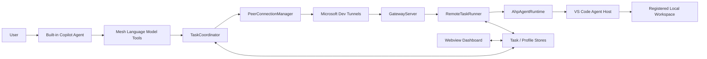
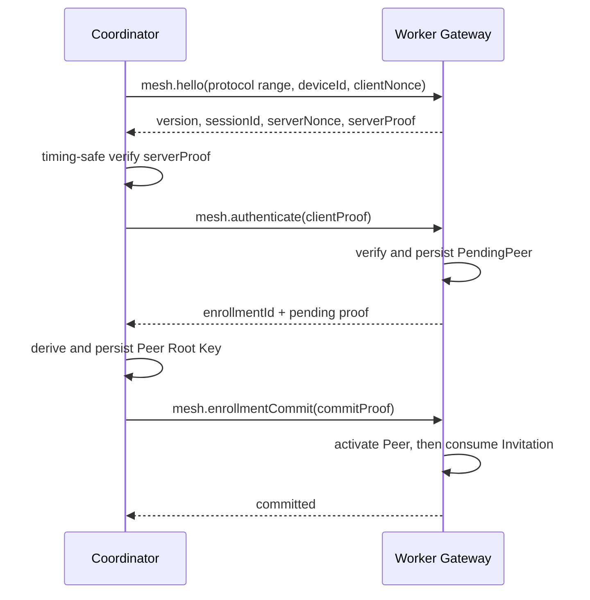
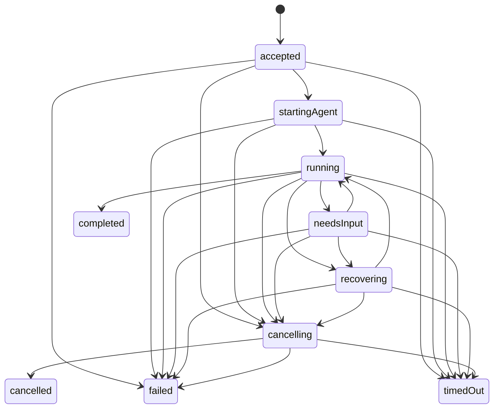
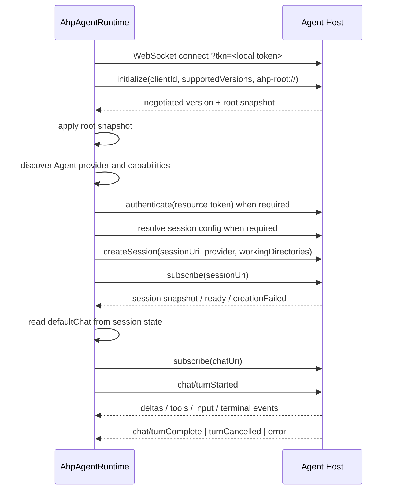
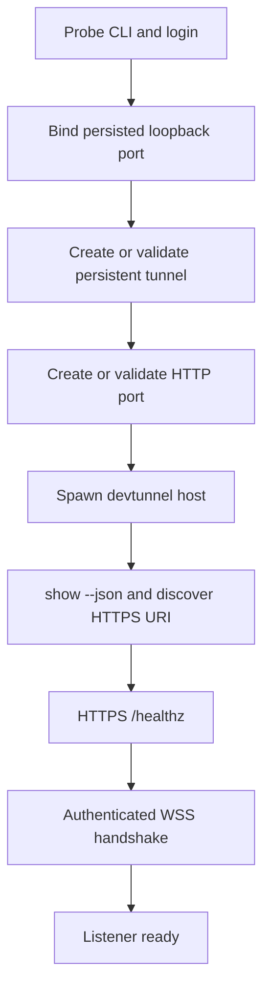

# Copilot Agent Mesh 技术实施方案

> 状态：Draft<br>
> 日期：2026-08-24<br>
> 依据：[产品需求文档 v0.3](../copilot-agent-mesh-prd.md)<br>
> 首版范围：本机桌面 Workspace；不支持 SSH、WSL、Dev Containers、Codespaces 或 vscode.dev

## 1. 结论

Copilot Agent Mesh 可以按“VS Code 扩展 + 本地 Gateway + Microsoft Dev Tunnels + Agent Host/AHP”的方向实现，但必须把以下三项作为首版的技术边界：

1. **Language Model Tool 是一次性请求/响应 API。** 稳定 API 没有持久进度流，也不能在旧的 Copilot Turn 结束后主动追加结果。因此 `mesh_delegate_task` 应立即返回 `pending + taskId`，由 `mesh_get_task` 查询结果，而不是让 Tool 调用等待完整编码任务。[VS Code Tool API](https://code.visualstudio.com/api/extension-guides/ai/tools)
2. **Agent Host/AHP 可用，但仍在快速演进。** `code agent host` 已公开文档化，TypeScript AHP Client 已发布；真实 Copilot Provider 发现、认证、Session 创建和恢复仍必须先通过 Phase 0 Spike，并由功能开关保护。[Agent Host](https://code.visualstudio.com/docs/agents/concepts/agent-host) · [AHP TypeScript Client](https://github.com/microsoft/agent-host-protocol/tree/main/clients/typescript)
3. **Dev Tunnels 仍是 Public Preview。** CLI 命令和 JSON 输出必须按已验证版本解码；Tunnel 只能作为传输通道，不能作为 Mesh 身份认证边界。[Dev Tunnels Overview](https://learn.microsoft.com/en-us/azure/developer/dev-tunnels/overview) · [CLI Reference](https://learn.microsoft.com/en-us/azure/developer/dev-tunnels/cli-commands)

首版采用以下核心技术：

| 领域 | 决策 |
| --- | --- |
| 扩展 | TypeScript、VS Code Extension API、桌面 Extension Host |
| UI | 原生 TypeScript Webview View，不引入 React |
| Mesh 传输 | `ws` + 自有小型 JSON-RPC 2.0 Dispatcher |
| 输入校验 | Zod 4，类型从 Schema 推导 |
| Internet Relay | 外部 `devtunnel` CLI，固定版本兼容层 |
| Agent 控制 | `@microsoft/agent-host-protocol`，精确锁定已验证版本 |
| 持久化 | `globalState` + `SecretStorage` + `globalStorageUri` 原子文件 |
| 打包 | esbuild + `@vscode/vsce`，单一通用 VSIX |
| 测试 | 纯单元、Loopback 组件、Extension Host、显式启用的真实 E2E |

## 2. 不可违反的产品边界

Mesh 只负责选择设备与 Workspace、传递任务、转发 Agent 事件、持久化任务状态。

以下行为不属于插件职责，并需要自动化测试防止回归：

- 不运行 Git 命令，不调用 VS Code Git API，不读取 `.git`、Git 环境变量或仓库元数据。
- 不检查工作区是否干净、当前分支、HEAD、worktree、Commit、Push 或 PR 状态。
- 不因任何 Git 状态阻止任务。
- 不在任务 Prompt 前后追加 Git、分支、worktree、Commit、Push 或 PR 策略。
- 用户或主 Agent 原始任务中已有的 Git 文字按普通任务内容原样传递，Mesh 不解释、不改写。
- Worker 只接受已注册的 `workspaceId`，Coordinator 永远不能提供 Worker 绝对路径。

远端 Agent 自主判断是否可以开始开发以及如何处理本地环境。需要用户决策时，使用统一的 `task.inputRequired` / `task.answer` 通道。

## 3. 调研后需要修正的 PRD 假设

### 3.1 Tool 结果不能可靠地“完成后自动返回”

稳定的 `LanguageModelTool.invoke` 只返回一次 `LanguageModelToolResult`，没有稳定的 Tool Progress 流。当前源码中的 Tool Progress 属于 Proposed API，不应成为 Marketplace 扩展依赖。[VS Code API](https://code.visualstudio.com/api/references/vscode-api#LanguageModelTool) · [VS Code Tool 实现](https://github.com/microsoft/vscode/blob/main/src/vs/workbench/api/common/extHostLanguageModelTools.ts)

因此 v1 行为定义为：

1. `mesh_delegate_task` 创建持久任务并取得 Worker `accepted`。
2. Coordinator 在发送前先持久化 `DelegationIntent`，包含 `delegationRequestId`、目标 Peer/Workspace 和精确任务语义 Hash。
3. `task.start` 同时携带 `delegationRequestId` 与 `taskId`；Worker 为两者建立持久映射并保证幂等。
4. Tool 使用自己的确认计时器与 VS Code `CancellationToken` 竞争，在 10–20 秒应用层确认预算内返回：

   ```json
   {
     "status": "pending",
     "delegationRequestId": "uuid",
     "taskId": "uuid",
     "pollTool": "mesh_get_task",
     "cancelTool": "mesh_cancel_task"
   }
   ```

5. 若 Worker 已接受但 Ack 丢失，Coordinator 使用相同 `delegationRequestId` / `taskId` 重发，Worker 返回原任务，不再次启动 Agent。
6. Tool 被取消后，已持久化的 Delegation 继续由后台协调器对账；相同任务意图的重试优先恢复未确认 Delegation，显式创建重复任务必须再次确认。
7. 主 Agent 可调用 `mesh_get_task`；用户也可在 Dashboard 查看任务。
8. 任务完成不能主动写回已结束的旧 Chat Turn。

Phase 0 必须验证 Copilot Agent 在收到上述结构化结果后会合理调用 `mesh_get_task`。若模型行为不稳定，UI 必须明确要求用户继续当前会话并查询任务。

### 3.2 Agent Host 端口不能通过自定义 `READY:<port>` 文本解析

`code agent host` 内部有 readiness 输出，但不是稳定集成契约。应使用：

```text
code agent host --new-instance --foreground ...
code agent endpoints --user-data-dir <owned-user-data-dir>
```

第二条命令输出 JSON endpoint 列表。实现必须验证 JSON，并使用返回的 WebSocket endpoint/token；不得解析自然语言 stdout。[VS Code CLI 源码](https://github.com/microsoft/vscode/blob/7c54fda801c73e35072ac759b6d93f8c69c65d7b/cli/src/commands/agent_endpoints.rs)

### 3.3 随机 Gateway 端口与稳定 Tunnel URL 冲突

持久 Dev Tunnel Port 映射的是具体本地端口。实现策略是：

1. 首次启动用端口 `0` 让操作系统分配端口。
2. 将实际端口持久化。
3. 后续启动优先绑定同一端口。
4. 若端口被占用，Listener 进入 `PORT_CONFLICT`，不得静默迁移。
5. 用户确认迁移后执行：停止 Host、撤销旧 Port Access、删除旧 Tunnel Port、创建并持久化新端口、创建新 Port Access、重新发现 URI、完成 Health/WSS Probe。
6. 端口迁移会使现有 Endpoint 失效；v1 明确撤销旧 Peer Endpoint/Credential，并要求重新配对，不尝试让 Coordinator 猜测新地址。

Phase 0 必须验证目标 CLI 的 `port delete`、Access 撤销和迁移命令。无法完整验证时，端口冲突只能阻止启动并给出人工修复指引。

### 3.4 `devtunnel show --json` 的字段不能硬编码为 `portUri`

CLI 支持 `show --json`，但输出 Schema 没有稳定公开规范。SDK 当前模型使用 `portForwardingUris`，旧 CLI 输出曾出现 `portUri`。Phase 0 应保存目标 CLI 版本的脱敏 Fixture，并实现版本化 Decoder；未知结构必须失败，不能退回解析自然语言。[TunnelPort Contract](https://github.com/microsoft/dev-tunnels/blob/main/ts/src/contracts/tunnelPort.ts)

### 3.5 VS Code Remote 不属于 v1

用户已确认 v1 只支持本机桌面 Workspace。Manifest 应从当前的 `"extensionKind": ["workspace"]` 改为 `"extensionKind": ["ui"]`，确保扩展运行在本地 UI Extension Host，而不是安装到 SSH、WSL 或 Dev Container 的远端 Extension Host。[Extension Host](https://code.visualstudio.com/api/advanced-topics/extension-host)

同时实现中央 `LocalDesktopWorkspaceGuard`，在每个 Command、Tool 和 Application Service 入口验证：

- `vscode.env.remoteName === undefined`。
- `vscode.workspace.isTrusted === true`。
- 需要 Workspace 的操作至少有一个 Folder。
- 所有相关 Workspace URI 均为 `file:`；Mixed Workspace 不能部分放行。

验证失败时，不启动 Gateway、Dev Tunnel、Agent Host，不注册 Worker Workspace，也不委派本地任务，并返回 `REMOTE_WORKSPACE_UNSUPPORTED`、`WORKSPACE_UNTRUSTED` 或 `LOCAL_FILE_WORKSPACE_REQUIRED`。

`virtualWorkspaces.supported: false` 只限制 Virtual File System Workspace，不限制 Remote Extension Host；`untrustedWorkspaces.supported: false` 是 Manifest 防线，但不能替代运行时 Trust Check。后续支持 Remote 时需要重新设计 Extension Host 运行位置、CLI 所在设备和 Workspace URI 语义。[Virtual Workspaces](https://code.visualstudio.com/api/extension-guides/virtual-workspaces) · [Workspace Trust](https://code.visualstudio.com/api/extension-guides/workspace-trust)

## 4. 总体架构



### 4.1 进程边界

| 进程 | 所有者 | 职责 | 禁止暴露 |
| --- | --- | --- | --- |
| VS Code Extension Host | VS Code | UI、工具、协调器、Gateway、进程监管 | Secret、Agent Host token |
| `devtunnel host` | Mesh 启动 | Relay host 长连接 | 配对密钥、任务内容 |
| `code agent host` | Mesh 启动或发现 | AHP Server、Copilot Agent Session | AHP connection token |
| VS Code Webview | Extension | 只显示 ViewModel、发送受限 UI 命令 | Secret、原始本地路径、未脱敏日志 |

### 4.2 依赖方向

依赖只能从 UI/Adapters 指向 Application，再指向 Domain：

```text
ui / tools / gateway / tunnel / agentHost adapters
                         │
                         ▼
              application services
                         │
                         ▼
             domain + shared schemas
```

Domain 不导入 `vscode`、`ws`、Node child process 或 AHP SDK。这样可以用 Fake Transport 和 Fake Agent Runtime 完成绝大多数测试。

## 5. 建议目录结构

```text
src/
  extension.ts
  composition/
    createApplication.ts
  domain/
    device.ts
    workspace.ts
    task.ts
    taskReducer.ts
    errors.ts
  application/
    DeviceService.ts
    WorkspaceService.ts
    TaskCoordinator.ts
    RemoteTaskRunner.ts
    PairingService.ts
  gateway/
    GatewayServer.ts
    RpcPeer.ts
    GatewayRouter.ts
    AuthenticationSession.ts
  peer/
    PeerConnection.ts
    PeerConnectionManager.ts
    ReconnectPolicy.ts
  tunnel/
    DevTunnelProvider.ts
    DevTunnelCliProvider.ts
    DevTunnelJsonDecoder.ts
    ChildProcessRunner.ts
  agentHost/
    AgentRuntime.ts
    AgentHostLauncher.ts
    AhpAgentRuntime.ts
    AhpEventMapper.ts
    AuthBroker.ts
    FakeAgentRuntime.ts
  tasks/
    TaskStore.ts
    FileTaskStore.ts
    InMemoryTaskStore.ts
    WorkspaceLeaseManager.ts
  workspaces/
    WorkspaceRegistry.ts
  tools/
    ListWorkersTool.ts
    DelegateTaskTool.ts
    GetTaskTool.ts
    CancelTaskTool.ts
    AnswerTaskTool.ts
  storage/
    DeviceProfileStore.ts
    PeerProfileStore.ts
    SecretStore.ts
    AtomicFileStore.ts
  ui/
    AgentMeshViewProvider.ts
    DashboardPresenter.ts
    dashboard/
      main.ts
      styles.css
  observability/
    MeshLogger.ts
    Redactor.ts
shared/
  protocol/
    envelopes.ts
    methods.ts
    notifications.ts
    schemas.ts
    errors.ts
  models/
    task.ts
    workspace.ts
test/
  unit/
  component/
  fixtures/
src/test/
  extension.test.ts
```

`shared/` 只包含可安全跨网络传输的数据，不包含本地路径、Secret 或 AHP 原始对象。

## 6. 核心抽象

```ts
interface DevTunnelProvider {
  probe(): Promise<TunnelCapability>;
  ensureHosted(request: TunnelRequest): Promise<HostedTunnel>;
  stopOwnedHost(): Promise<void>;
}

interface PeerTransport {
  connect(profile: PeerProfile, signal: AbortSignal): Promise<PeerSession>;
}

interface AgentRuntime {
  probe(signal: AbortSignal): Promise<AgentCapability>;
  start(request: AgentTaskRequest, sink: AgentEventSink): Promise<AgentTaskHandle>;
  recover(descriptor: RecoveryDescriptor, sink: AgentEventSink): Promise<AgentTaskHandle | undefined>;
}

interface AgentTaskHandle {
  readonly recoveryDescriptor?: RecoveryDescriptor;
  cancel(): Promise<void>;
  answer(inputId: string, answer: AgentInputAnswer): Promise<void>;
  dispose(): Promise<void>;
}

interface TaskStore {
  create(record: TaskRecord): Promise<void>;
  transition(taskId: string, event: TaskDomainEvent): Promise<TaskRecord>;
  getOwned(peerId: string, taskId: string): Promise<TaskRecord | undefined>;
  listOwned(peerId: string, query: TaskQuery): Promise<readonly TaskRecord[]>;
  listForRecovery(query: RecoveryQuery): Promise<readonly TaskRecord[]>;
}
```

所有时间、UUID、随机数、文件系统和进程启动均通过可注入接口使用，确保测试可重复。

所有远程 Task 操作必须校验 `record.peerId === authenticatedPeerId`。对其他 Peer 的 `taskId` 统一返回不泄漏所有权信息的 `TASK_NOT_FOUND`；`get`、`cancel`、`answer` 与 Event Gap 查询均不能只凭 UUID 授权。

## 7. Mesh Wire Protocol v1

### 7.1 Transport

- Node `http.createServer()` 只绑定 `127.0.0.1`。
- `GET /healthz` 只返回 `204`，不返回版本、设备或 Workspace 信息。
- 只允许 `/agent-mesh/rpc` 升级为 WebSocket；其他 Upgrade 直接销毁。
- 使用 `ws.WebSocketServer({ noServer: true, maxPayload: 1_048_576, perMessageDeflate: false })`。
- 仅接受 UTF-8 JSON Text Frame；Binary 和 JSON-RPC Batch 在 v1 拒绝。

选择 `ws` 而不是 `vscode-jsonrpc`：后者面向 Stream，没有原生 WebSocket Transport。v1 只有少量固定 RPC，受控 Dispatcher 更容易做 Schema 校验、限流和 Fuzz 测试。[JSON-RPC 2.0](https://www.jsonrpc.org/specification) · [`ws`](https://github.com/websockets/ws)

### 7.2 Envelope

```ts
type RpcRequest<P> = {
  jsonrpc: '2.0';
  id: string;
  method: string;
  params: P;
};

type RpcNotification<P> = {
  jsonrpc: '2.0';
  method: string;
  params: P;
};

type RpcResponse<R> =
  | { jsonrpc: '2.0'; id: string; result: R }
  | { jsonrpc: '2.0'; id: string; error: RpcError };
```

JSON-RPC Notification 没有 `id`。所有 Task Notification 必须包含：

```ts
{
  taskId: string;
  eventSeq: number;
  at: string;
}
```

`eventSeq` 在单任务内严格递增。Notification 只用于降低 UI 延迟，`task.get` Snapshot 才是恢复后的权威状态。

### 7.3 Methods

| 阶段 | Method | 作用 |
| --- | --- | --- |
| 未认证 | `mesh.hello` | 协议协商、交换 nonce、证明 Worker 身份 |
| 未认证 | `mesh.authenticate` | Coordinator 证明身份、完成连接认证 |
| 配对中 | `mesh.enrollmentCommit` | 两阶段提交新 Peer Credential |
| 已认证 | `mesh.ping` | 应用层延迟与时间戳；不替代 WS Ping |
| 已认证 | `device.getInfo` | 返回有限设备信息 |
| 已认证 | `workspace.list` | 返回 opaque ID、名称、能力标签、忙闲状态 |
| 已认证 | `task.start` | 使用 `delegationRequestId + taskId` 幂等创建任务 |
| 已认证 | `task.get` | 获取 Snapshot 和可选 Event Gap |
| 已认证 | `task.cancel` | 幂等请求取消 |
| 已认证 | `task.answer` | 回答指定 `inputId` |

### 7.4 Notifications

```text
task.stateChanged
task.progress
task.output
task.inputRequired
task.completed
connection.draining
```

### 7.5 协议协商

`mesh.hello` 使用 `protocolMin` / `protocolMax`，而不是单个版本号。双方选择最高共同版本；无交集返回 `PROTOCOL_INCOMPATIBLE` 并关闭连接。

未知字段只可在明确标记为 forward-compatible 的对象中忽略。未知 Method、状态值、认证字段或影响授权的字段必须拒绝。

### 7.6 尺寸和流控

| 数据 | v1 上限 |
| --- | ---: |
| WebSocket Frame | 1 MiB |
| Task title | 256 UTF-8 bytes |
| Task prompt | 128 KiB |
| Acceptance criteria | 32 条，每条 4 KiB |
| Task answer | 32 KiB |
| 单条 output event | 16 KiB |
| Terminal summary | 16 KiB |
| Error message | 2 KiB |
| 每 Peer 普通待发送队列 | 256 KiB 或 128 events |
| 每 Peer 总待发送量 | 1 MiB Critical Frame + 256 KiB 普通流量，最多 144 events |

认证前使用更严格限制：单 Frame 64 KiB、全局最多 16 个未认证 Socket、每个来源提示最多 4 个 Socket、30 秒 Handshake Deadline、每 Socket 10 秒最多 8 条消息。来源 IP 只用于 Best-effort 限流，不能作为身份。

认证后每 Peer 最多 2 个连接，RPC Token Bucket 默认每分钟 60 次、Burst 20。`task.start` 另受 Workspace Lease 和 Peer 并发限制。

每任务最多发送 10 个非终态 Output Event/秒。Outbox 按**序列化后的 UTF-8 Byte**计数，分 Terminal/Control/Progress/Output 优先级，并同时检查 `ws.bufferedAmount`。普通 Progress/Output 使用 256 KiB / 128 events 水位；压力下按 Task 合并 Progress，将非终态 Output 替换为每次压力周期一次的 `truncated: true` 通知，后续 Output 明确 Backpressure。Critical/Response 保留容量，允许一个不超过 1 MiB 的合法 Snapshot Frame；Socket + Queue 总量始终限制在 1 MiB + 256 KiB 和 144 events，超过 1 MiB 的单 Frame 以 `1009` 拒绝。Terminal Snapshot 永不因普通流量被丢弃；Critical 容量仍不可用时以 `1013` 关闭，等待重连后 `task.get` 恢复。

Production Task Notification Sink 必须按 Domain Event 发出专门的 `task.progress` 和
`task.output`：progress 与 bounded tool lifecycle 摘要使用 `task.progress`，output 与
Terminal 摘要使用 `task.output`，runtime 裁剪使用 `task.output.truncated = true`。
只有真实状态/control 转换使用 `task.stateChanged`；completed/failed/cancelled 等
terminal 状态因此保持 Critical，而高频 progress/tool/output/Terminal 摘要进入普通
流量的合并、裁剪和 Backpressure 路径。

### 7.7 Heartbeat 和重连

- 认证完成后每 10 秒发 WS Ping。
- 30 秒没有 Pong，终止连接并标记 Offline。
- Full-jitter Backoff：1 秒起步，30 秒封顶。
- 连续在线 30 秒后才重置 Backoff。
- 重连后先 `device.getInfo` / `workspace.list`，再对未终态任务执行 `task.get(afterEventSeq)`。

## 8. Pairing 与连接认证

Dev Tunnel 使用匿名访问时，任何知道 Tunnel 地址的人都能到达 Gateway，因此 Mesh 必须实现应用层双向认证。

### 8.1 Secret 生命周期

1. 每次用户点击“创建配对邀请”，Worker 生成独立的 `invitationId` 和 32-byte Pairing Secret；不使用 Worker-global 配对密钥。
2. Invitation 默认 10 分钟过期、只能成功注册一个 Peer、可单独撤销。Worker 最多保留 5 个未过期 Invitation。
3. Pairing Secret 在 Worker `SecretStorage` 中保存；邀请只通过 URL Fragment 传输：

   ```text
   https://<forwarding-origin>/agent-mesh/connect?v=1&device=<id>&invite=<invitation-id>#secret=<base64url>
   ```

4. Fragment 不会随 HTTP 请求发送，但仍可能通过剪贴板、截图或粘贴泄漏。
5. Coordinator 解析后立即从普通 UI State 删除 Secret，在 Enrollment 完成前临时写入 `SecretStorage`。
6. Enrollment 使用两阶段提交；只有双方持久化派生的 Peer Root Key 并完成 Commit 后，Worker 才消费 Invitation。
7. 后续连接只使用 Peer Root Key Challenge-Response。
8. Worker 撤销 Peer 时删除 Worker Credential、关闭该 Peer 所有 Socket，并发送 Best-effort 撤销通知。Worker 无法删除 Coordinator 本机 SecretStorage；Coordinator 收到通知或后续认证失败时清理本地 Profile。

### 8.2 Challenge-Response



- Enrollment Proof 使用 Pairing Secret `K` 和 HMAC-SHA-256：

  ```text
  serverProof = HMAC(K, LP(
    "mesh/server-proof/v1", version, invitationId,
    workerDeviceId, coordinatorDeviceId, sessionId,
    clientNonce, serverNonce
  ))

  clientProof = HMAC(K, LP(
    "mesh/client-proof/v1", version, invitationId,
    workerDeviceId, coordinatorDeviceId, sessionId,
    clientNonce, serverNonce
  ))
  ```

- `LP` 是规范化 length-prefixed UTF-8 编码；禁止 `JSON.stringify`。
- `transcriptHash = SHA-256(LP("mesh/enrollment-transcript/v1", 上述协商字段))`。
- `peerRootKey = HKDF-SHA-256(IKM=K, salt=transcriptHash, info=LP("copilot-agent-mesh/peer-root/v1", version, workerDeviceId, coordinatorDeviceId), length=32)`。
- `mesh.enrollmentCommit` 使用 `HMAC(peerRootKey, LP("mesh/enrollment-commit/v1", enrollmentId, transcriptHash))`。
- 后续重连使用 Peer Root Key、新 Nonce 和不同的 `"mesh/reconnect-server-proof/v1"` / `"mesh/reconnect-client-proof/v1"` Label；不从重连 Nonce 派生新的持久 Root Key。
- Nonce 32 bytes，Handshake 30 秒失效，单次使用。
- 比较前验证 Buffer 等长，再调用 `timingSafeEqual`。
- 同一 Socket 五次认证失败后关闭。
- Worker 在返回 Pending Enrollment 前原子保存 Pending Record；Coordinator 保存 Root Key 后才发送 Commit。
- Invitation 只在 Commit 成功后消费。失败或中断的 Handshake 不消耗 Invitation；Pending Record 有独立 TTL。
- 若最终 Commit Ack 丢失，Coordinator 已有 Root Key，可用正常重连确认 Worker 已激活，之后删除临时 Invitation Secret。

`deviceId` 只是协议标识，不是密码学身份；本协议认证的是对 Invitation/Peer Secret 的持有。HMAC/HKDF 只用于认证、密钥分离和防重放，不是自定义加密。传输机密性依赖 TLS/WSS；Dev Tunnels 会在服务入口终止 TLS，因此本产品不宣称端到端加密。[Node Crypto](https://nodejs.org/api/crypto.html) · [Dev Tunnels Security](https://learn.microsoft.com/en-us/azure/developer/dev-tunnels/security)

## 9. Task 状态机

### 9.1 状态



Coordinator 可以有本地 `created` 状态；Worker 的第一个持久状态是 `accepted`。

### 9.2 不变量

1. `delegationRequestId` 和 `taskId` 都由 Coordinator 使用 UUID 生成，并在网络发送前持久化。
2. Worker 幂等键是 `(authenticatedPeerId, delegationRequestId)`；`taskId` 也必须在该 Peer 内唯一。
3. Request Hash 使用验证后语义字段的规范化 length-prefixed 表示：Peer ID、Delegation ID、Task ID、Workspace ID、Title 原始 UTF-8、Prompt 原始 UTF-8、逐条 Acceptance Criteria 和 Worker Deadline。禁止修改/归一化 Prompt 文本。
4. 同 Delegation ID、同 Hash 返回原任务；同 ID、不同 Hash 返回 `TASK_ID_CONFLICT`。
5. `task.get`、`cancel`、`answer` 必须验证任务所有权；其他 Peer 统一看到 `TASK_NOT_FOUND`。
6. 返回 `accepted` 前必须获得 Workspace Lease。
7. 一个 Workspace 同时最多一个非终态任务；v1 不排队，直接返回 `WORKSPACE_BUSY`。
8. Lease 在 `needsInput`、`recovering`、`cancelling` 中继续持有，只在持久化终态后释放。
9. 所有 Active State 都允许真实地进入 `failed` 或 `timedOut`，防止永久占用 Lease。
10. 所有状态转换只通过纯 `taskReducer`，先持久化再通知。
11. Terminal State 不可改变。
12. `task.cancel` 幂等；已终态任务返回当前 Snapshot。`cancelling` 默认 30 秒 Deadline，未收到权威取消结果时进入 `failed / TASK_CANCELLATION_UNCONFIRMED`，不能伪称 `cancelled`。
13. `task.answer` 同时校验 `inputId` 和随机 `answerId`；重复 Answer 是 no-op。
14. Tool 调用超时不等于 Worker Task `timedOut`。

### 9.3 恢复语义

- **保证恢复：** 网络断开或 Extension Host 重载后可以查询持久 Snapshot。Event Gap 返回 `earliestAvailableEventSeq` 和 `eventsTruncated`，明确指出 Journal 是否已裁剪。
- **尽力恢复：** 仅当 AHP Adapter 确认原 Session 可恢复时继续执行。
- **禁止伪恢复：** Agent Host 或 Session 无法恢复时转为 `failed / TASK_RECOVERY_UNAVAILABLE / retryable=true`，由 Coordinator 使用新 `taskId` 重试。

## 10. Agent Host / AHP Adapter

### 10.1 版本策略

调研时已发布 TypeScript Tag 为 `@microsoft/agent-host-protocol@0.8.0`，而 AHP `main` 已进入 `1.0.0` 演进；不能假定 npm 0.8.0 与当前 VS Code Agent Host 兼容。首个可工作的 SDK 必须精确锁定，不使用 `^`；Phase 0 必须证明实际 VS Code Build 的 Host 版本与 SDK 导出的 `SUPPORTED_PROTOCOL_VERSIONS` 有交集，否则 No-Go，等待或锁定匹配 SDK，不能仅靠 Feature Flag 绕过。[AHP 0.8 Release Metadata](https://github.com/microsoft/agent-host-protocol/blob/typescript/v0.8.0/clients/typescript/release-metadata.json) · [AHP Versioning](https://github.com/microsoft/agent-host-protocol/blob/main/docs/specification/versioning.md)

当前 `engines.vscode = ^1.103.0` 只足以覆盖 Language Model Tool API，不能自动证明对应版本的 `code agent host` 与目标 AHP 行为可用。Phase 0 完成后，将最低 VS Code 版本提高到验证通过的最低版本，并在启动时做 Capability Probe。

### 10.2 启动与发现

推荐启动方式：

1. 发现用户配置或已验证的 `code` CLI 绝对路径。
2. 在 `globalStorageUri/agent-host/` 创建 Mesh 独占的 user-data 目录。
3. 启动前调用 `code agent endpoints` 并记录 Baseline Endpoint 集。
4. 生成随机 connection token，写入 owner-only 临时文件。
5. 使用参数数组和 `shell: false` 启动：

   ```text
   code agent host
     --new-instance
     --foreground
     --user-data-dir <mesh-owned-dir>
     --connection-token-file <secret-file>
   ```

6. 轮询：

   ```text
   code agent endpoints --user-data-dir <mesh-owned-dir>
   ```

7. 严格验证 JSON，对启动前后结果做 Diff，并按新 `instanceId`、Standalone Endpoint、Owned Supervisor PID 和预期 Token 找到**唯一**匹配项；零个或多个匹配都失败，不能取列表第一项。
8. 使用该 Endpoint 的 `?tkn=` 建立 WebSocket，并通过 AHP `initialize` 验证可用。
9. 只有 Endpoint Probe 已成功且 Phase 0 已证明目标 Build 不再读取 Token File 时才删除；否则在 Owned Host 结束时删除。Endpoint Token 不写日志、不进入 Mesh 协议。

是否使用独占 `user-data-dir`、Provider 是否可发现、Copilot 身份是否可注入，均属于 Phase 0 验证项。若独占目录导致 Provider 不可用，应退回“发现当前 VS Code 所属 Agent Host”，但必须继续隔离 Endpoint Token 和 Ownership。

AHP SDK 的 WebSocket Transport 可能依赖 `globalThis.WebSocket`。Phase 0 必须在目标 VS Code Extension Host Runtime 检查该能力；缺失时通过公开 `AhpTransport` 接口实现基于项目 `ws` 依赖的 Adapter，不能依据开发机 Node 版本推断可用。[AHP TypeScript Client](https://github.com/microsoft/agent-host-protocol/tree/main/clients/typescript)

### 10.3 AHP 顺序



实现要求：

- 从 Root State 动态发现 Provider，不硬编码 `"copilot"`。
- `createSession` 使用 `workingDirectories: [registeredFileUri]`；只有 Provider Capability 允许时才传多个目录。
- 必须处理 `resolveSessionConfig` / `sessionConfigCompletions`，不能假定 Provider 接受空配置。
- 根据 Provider 动态 Resource Metadata 和 `AuthRequired` Error 重新发现认证要求；`scopes_supported` 只是候选能力，不是可直接照抄的确定请求 Scope。
- `vscode.authentication.getSession` 只能作为 `AuthBroker` 的候选 Token 来源；不硬编码 Authentication Provider、GitHub Scope 或 Copilot Resource，只有 AHP `authenticate` 成功后才认为 Token 可用。
- 首先 silent lookup；仅在明确用户操作或已确认 Tool Invocation 中触发交互登录。
- 处理 `AuthRequired`、Token 无效、无 Copilot 权限、配额不足和 Provider 消失。
- 每次 `initialize` / `subscribe` 返回的 Snapshot 必须先应用，再消费后续 Action。
- AHP 原始对象不穿过 Adapter 边界。

### 10.4 Event 映射

| AHP | Mesh |
| --- | --- |
| `chat/delta`, `chat/responsePart`, `chat/reasoning` | bounded `task.output` / `task.progress` |
| Tool Call Start/Delta/Ready/Complete | Task progress；需要确认时持久 `chatUri + turnId + toolCallId` 并发 `task.inputRequired` |
| `chat/toolCallConfirmed` / Result Confirmation | 使用持久 AHP 标识发送 approve/deny、原因或选项 |
| `chat/inputRequested` | 持久 AHP `requestId`，发 `task.inputRequired` |
| `chat/inputAnswerChanged` / `chat/inputCompleted` | 按 required-answer validation 回答输入 |
| `chat/toolCallAuthRequired` | 转交 `AuthBroker` 后调用 Root `authenticate`，不能当普通 `task.answer` |
| `chat/turnComplete` | `completed` |
| `chat/turnCancelled` | `cancelled` |
| `chat/error` | `failed` |
| Terminal events | 从 Terminal Catalog/Tool Resource 获取独立 URI、订阅后生成摘要；原始流不进入 Tool Result |
| Changeset | 从 Session URI Template 解析并独立订阅；v1 非关键、只做可选展示 |

AHP Changeset 仍不是 v1 完成条件。即使 Agent 返回变化信息，Mesh 也不据此执行 Git 策略。

### 10.5 Cancellation 和重连

- `task.cancel` 调用版本化 `AgentTaskHandle.cancel()`；具体 Outbound AHP Action 必须由 Phase 0 验证，不在 Mesh Domain 硬编码。
- 取消是 Best Effort；先进入 `cancelling`。只有 Server-authoritative Accepted/Reconciled Cancellation 或明确 Provider Terminal Outcome 才进入 `cancelled`；处理 Action `rejectionReason`、连接中断和取消 Deadline，Session Removal 本身不等同成功取消。
- AHP 连接短暂断开后使用相同 `clientId`、订阅 URI 和 `lastSeenServerSeq` 重连，应用 Replay 或 Snapshot。
- Reconnect 后重新 `listSessions`、检查 Provider/Auth Requirements，并释放返回 `missing` 的 Subscription 本地状态；Ephemeral Catalog/Auth Notification 不假设可 Replay。
- Host Process 退出时，不声称任务继续；尝试恢复失败后转为 `TASK_RECOVERY_UNAVAILABLE`。

## 11. Dev Tunnel Adapter

### 11.1 CLI 兼容边界

所有命令由 `ChildProcessRunner` 执行：

```ts
spawn(executable, args, {
  shell: false,
  windowsHide: true,
});
```

- 不拼接 Shell Command。
- 可执行文件必须来自受控候选路径或用户显式设置。
- 启动先执行 `devtunnel --version`。Public Preview 阶段只允许**精确 Build String Allowlist**；每个 Build 关联 OS/Arch、Decoder Revision、脱敏 Fixture Hash 和已验证命令行为，不使用宽泛 SemVer Range。
- `user show` 只按版本化行为判断，不用通用自然语言 Regex。
- `show --json` 只进入对应 Build 的 Zod Decoder。Decoder 必须验证 Tunnel ID、目标 Port Number、`protocol === "http"`、非空 URI 集、`https:`、无 Userinfo、允许的 Dev Tunnels Host Suffix，并且只能确定性选择一个 URI。
- `portForwardingUris` 与历史 `portUri` 只能出现在各自版本 Adapter 中，不能用 Permissive Union 混合接受。
- Hosting/Create 永远需要已登录用户；登录过期、CLI/Schema/Access 不兼容属于 Non-retryable，停止重启循环并进入明确 UI 状态。

macOS arm64 已验证 Build `1.0.2030+fc9273aa0f`，其 exact decoder 使用单值 `portUri`；其他 OS/Arch 必须分别锁定 executable hash、fixture 和真实集成结果后才能加入 allowlist。[Homebrew Metadata](https://formulae.brew.sh/api/cask/devtunnel.json) · [Windows Manifest](https://raw.githubusercontent.com/microsoft/winget-pkgs/master/manifests/m/Microsoft/devtunnel/1.0.2030+fc9273aa0f/Microsoft.devtunnel.installer.yaml)

### 11.2 生命周期



建议命令：

```text
devtunnel --version
devtunnel user show
devtunnel create <id> --tags copilot-agent-mesh
devtunnel port create <id> -p <port> --protocol http
devtunnel access create <id> --port <port> --anonymous --expiration <duration>
devtunnel host <id>
devtunnel show <id> --json
```

相较 Tunnel-wide `--allow-anonymous`，Port-scoped Anonymous ACE + 明确过期时间更小权限，是 v1 默认且必须验证的模式。若目标 CLI 不能稳定维护它，默认返回 `CLI_UNSUPPORTED`。

Tunnel-wide `--allow-anonymous` 只能作为用户每次显式选择的临时 Preview Fallback：显示公网暴露与无固定 Access Expiry 风险、不得自动启动、停止时执行已验证的 Access Teardown，并且不保存为默认策略。

Persistent Tunnel 并非永久资源：默认可能在 30 天不活动后删除；Anonymous ACE 也会过期且不能原地延长。[Dev Tunnels FAQ](https://learn.microsoft.com/en-us/azure/developer/dev-tunnels/faq#when-are-unused-dev-tunnels-deleted)

Store 必须保存 Tunnel/ACE Expiration。Reconciliation 在过期前 24 小时提示并按已验证的“撤销旧 ACE → 创建新 ACE”流程续期；续期失败进入 `TUNNEL_ACCESS_EXPIRED`，停止无效重试。Tunnel 已被服务删除时，不自动创建新地址，先提示用户确认重新创建并重新配对。

### 11.3 Readiness 与故障

不能把 stdout 中 “Ready” 当作完成条件。Ready 必须同时满足：

1. Host Child Process 仍存活。
2. 公开 HTTPS URI 的 `/healthz` 在系统 CA 验证通过、禁止 Follow Redirect 的请求中返回**精确 `204`**；Anti-phishing HTML/Redirect 视为未就绪，Phase 0 验证目标 CLI/Service 所需的官方 Skip Header。
3. 公开 WSS URI 完成 Mesh 认证握手。

Supervisor 对同一 `{tunnelId, port}` 最多维护一个 Owned Host。Host 意外退出时标记 Tunnel Offline，并用带抖动的 Backoff 重启；每次重启重新执行 JSON Decoder、HTTPS Health 和 WSS Probe。用户 Stop 必须取消所有 Pending Restart Timer。

Login 过期、Build/Schema 不支持、ACE 过期和资源不存在属于 Permanent Failure，Circuit Breaker 打开并停止重试；短暂网络/Relay 错误才自动 Backoff。扩展只终止自己启动的 Child Process，退出时不自动删除持久 Tunnel。

删除 Tunnel、重置 Access、端口迁移或使旧 URL 失效必须由用户显式触发。端口迁移的准确 Delete/Create/Access 顺序必须由 Phase 0 Integration Test 证明。

## 12. Language Model Tools

### 12.1 Manifest

每个 Tool 必须同时存在于 `package.json.contributes.languageModelTools` 和运行时 `vscode.lm.registerTool`。建议 v1 注册：

- `mesh_list_workers`
- `mesh_delegate_task`
- `mesh_get_task`
- `mesh_cancel_task`

`mesh_answer_task` 在输入/审批转发完成后增加。

Tool Name 合法，不能使用保留的 `copilot_` 或 `vscode_` 前缀。`canBeReferencedInPrompt: true` 时必须提供 `toolReferenceName`。[Tool Contribution Schema](https://github.com/microsoft/vscode/blob/1.103.0/src/vs/workbench/contrib/chat/common/tools/languageModelToolsContribution.ts)

Manifest 与 Runtime Registration 必须一一相等，并通过 Cold Extension Host 的隐式 `onLanguageModelTool:<name>` Activation Test。当前 `@types/vscode` 使用 Caret，会解析到高于 `engines.vscode` 的 API；Phase 0 后应把 `@types/vscode` 精确锁定到最终最低 Engine 版本，防止误用新 API。

### 12.2 Tool 语义

| Tool | Side effect | Confirmation | Deadline |
| --- | --- | --- | ---: |
| list | 无 | 无 | 5 秒 |
| delegate | 创建远程 Agent Task | 必须 | 15 秒内返回 accepted/pending |
| get | 无 | 无 | 10 秒 |
| cancel | 请求终止远程 Task | 必须 | 10 秒 |
| answer | 将用户回答发送到远端 Task | 必须 | 10 秒 |

`prepareInvocation` 必须无副作用，因为它可能执行后不调用 `invoke`。确认文案显示目标设备、Workspace 和任务摘要，不显示本地路径或 Secret。

表中的 Deadline 是 Mesh 自己的应用层 Timer，不是 VS Code 提供的 Tool Timeout。每个 Tool 都将 Transport Ack、Timer 和 `CancellationToken` 竞争；Promise 结束后，已接受的 Worker Task 与该 Promise 解耦。

Delegate 在发送前保存 `DelegationIntent`。若“Worker 已接受、响应丢失”，后台协调器用同一 `delegationRequestId` 重试并恢复原 `taskId`；测试必须覆盖 Tool 被取消后重试不启动第二个 Agent。

### 12.3 Result

Tool Result 是 `LanguageModelToolResult` 的 Part 数组，不是直接 JSON。结构化结果应编码为紧凑 JSON 文本：

```ts
new vscode.LanguageModelToolResult([
  new vscode.LanguageModelTextPart(JSON.stringify(result)),
]);
```

遵守 `tokenizationOptions.tokenBudget`，不返回完整日志、原始 Terminal Stream 或无限输出。

### 12.4 Cancellation

调用方 CancellationToken 用于中止本次 Tool 网络等待，不自动等同于取消已接受的远端 Task。若 Delegate 可能已被 Worker 接受，保留 `DelegationIntent` 并后台对账；只有 `mesh_cancel_task` 或明确的取消策略才请求远端取消。

## 13. 数据存储

| 存储 | 内容 | 禁止内容 |
| --- | --- | --- |
| `globalState` | deviceId/name、Tunnel 元数据、Workspace 索引、Peer 非敏感 Profile、Task Summary 派生索引 | Secret、Token、完整 Prompt/Output |
| `SecretStorage` | Invitation Secret、Pending/Active Peer Root Key、可选短期 Tunnel Token | Task Journal、日志 |
| `globalStorageUri` | Task Recovery Record、有限 Event Journal、诊断文件 | Credential、源码副本、无限 Transcript |

任何 Mesh Key 都不得传给 `globalState.setKeysForSync`；Device、Tunnel、Peer、Task 与 Workspace Metadata 不通过 Settings Sync 跨设备复制。

### 13.1 Task 持久化

- 每任务一个 `tasks/<taskId>.json`。
- Temp File + fsync + Rename 原子替换。
- 单进程写 Mutex。
- 默认不持久化完整 Prompt 和原始 Delta。
- Task Record 是状态与 Workspace Lease 的唯一恢复权威；`globalState` Index 和内存 Lease Map 都是派生 Cache，启动时从所有非终态 Task Record 重建，避免跨文件“终态已写但 Lease 未释放”的事务裂缝。
- Active Record 保存精确定义的 Request Hash、状态、Workspace ID、Peer ID、Delegation ID、AHP Recovery Descriptor 和有限摘要。
- 若扩展在 AHP Session 建立前崩溃且无恢复所需内容，必须真实地转为 `TASK_RECOVERY_UNAVAILABLE`，不能偷偷重新执行。

### 13.2 Retention

| 数据 | 默认保留 |
| --- | --- |
| Active Recovery Record | 到终态 |
| Event Journal | 最长 24 小时、每任务 1 MiB Ring；任一限制先到即裁剪 |
| Terminal Summary | 30 天、每设备最多 100 条 |
| Diagnostic File | 7 天、总计最多 10 MiB |
| Peer Profile / Secret | 到撤销或轮换 |

Worker-local File URI 不得放入远程 Artifact。v1 Artifact 只传 opaque ID、Label 和可安全公开的 HTTPS URL；本地文件传输留待独立授权协议。

Journal 主要保存状态、Progress 摘要和有限 Output Ring，不承诺 24 小时完整 Transcript。裁剪后保存 `earliestAvailableEventSeq`；`task.get` 返回 `eventsTruncated: true`，让 Coordinator 区分“没有事件”和“事件已清理”。

### 13.3 Extension 生命周期

- 每次 Task Transition、Peer/Tunnel 变更都立即持久化，不把一致性押在 `deactivate()`。
- `deactivate()` 只做 Best-effort：取消 Timer、关闭 Socket、请求 Owned Child Process 退出；不得依赖长异步 Flush 或远端 Cancel 一定完成。
- Cleanup 必须幂等。下次 Activation 从 Task File、Peer/Tunnel Metadata 重建派生 Index/Lease，并对所有 Active Record 执行 Reconciliation。
- Extension Host 在 Active Task 中重载是必测场景。

## 14. Dashboard

### 14.1 状态来源

Webview 不直接操作 Tunnel、Peer 或 Task。`DashboardPresenter` 从各 Store 生成只读 ViewModel：

```ts
interface DashboardViewModel {
  device: DeviceViewModel;
  listener: ListenerViewModel;
  workspaces: readonly WorkspaceViewModel[];
  peers: readonly PeerViewModel[];
  tasks: readonly TaskViewModel[];
}
```

UI Command 进入 Extension Host 后由 Application Service 执行，再由 Store Event 刷新 ViewModel。

### 14.2 安全

- 交互 UI 需要 Script 时只加载本地 Bundle。
- CSP：`default-src 'none'`，Script 使用 nonce，资源仅允许 `webview.cspSource`。
- `localResourceRoots` 只包含扩展 `media/`，不包含 Workspace。
- 所有远端字符串使用 DOM `textContent`，不使用 `innerHTML`。
- 所有 `onDidReceiveMessage` 用 Zod Discriminated Union 校验。
- Pairing Secret 不进入 HTML、Webview State 或 `postMessage`；复制动作在 Extension Host 中完成。
- External URL 只允许 `https:` Allowlist，再调用 `vscode.env.openExternal`。
- 删除、撤销、重置等操作在 Extension Host 再确认。
- `resolveWebviewView` 可重复调用；每个 View Instance 有独立 Subscription/`uiInstanceId`，Dispose 后必须清理。
- `enableScripts` 只在交互 Bundle 引入时改为 `true`；`localResourceRoots` 精确设置为 `media/`。
- Outbound ViewModel 与 `postMessage` 也执行 Schema 和 Secret/Local Path 检查，不只校验 Inbound Message。

[Webview Security](https://code.visualstudio.com/api/extension-guides/webview#security)

## 15. 安全模型

### 15.1 主要威胁

| 威胁 | 控制 |
| --- | --- |
| Anonymous Tunnel 被扫描 | 认证前无元数据、限流、小 Frame、短 Handshake |
| Pairing URL 泄漏 | 一次性 Secret、HMAC Challenge、成功后派生 Peer Secret |
| 重放 | Fresh Nonce、30 秒 TTL、Session ID、单次消费 |
| 恶意/失陷 Coordinator | Workspace 白名单、首次远程写本机确认、Task Confirmation、每 Workspace Lease |
| 本机恶意进程访问 Loopback | Mesh 认证仍必需；不能因为 Loopback 绕过 |
| Secret 日志泄漏 | 中央 Redactor、结构化日志、禁止原始 Process Args/Auth Frame |
| 超大 Payload / 慢客户端 | 1 MiB Frame、字段限制、Bounded Queue、Rate Limit |
| CLI/Relay 变化 | 版本门控、Schema Decoder、Health/WSS Probe、明确降级 |
| Agent Host Token 泄漏 | Token File、仅本地 AHP、绝不进入 Mesh/Webview/日志 |

### 15.2 首次远程写确认

每个新 Peer 第一次向 Worker 发起任务时，Worker 本机必须确认：

- Peer 设备名与 ID。
- 目标 Workspace 显示名。
- 任务标题和有限摘要。
- 该授权是否仅本次或允许后续任务。

即使 Coordinator Tool 侧已经确认，Worker 本机确认仍是独立安全边界。

## 16. 错误模型

保留 JSON-RPC 标准错误：

```text
-32700 Parse error
-32600 Invalid Request
-32601 Method not found
-32602 Invalid params
-32603 Internal error
```

Mesh 业务错误使用稳定正整数：

```text
1000 AUTH_REQUIRED
1001 AUTH_FAILED
1002 PROTOCOL_INCOMPATIBLE
1003 RATE_LIMITED
1004 WORKSPACE_NOT_FOUND
1005 WORKSPACE_DISABLED
1006 WORKSPACE_BUSY
1007 TASK_NOT_FOUND
1008 TASK_ID_CONFLICT
1009 TASK_NOT_CANCELLABLE
1010 INPUT_NOT_PENDING
1011 AGENT_UNAVAILABLE
1012 AGENT_AUTH_REQUIRED
1013 TASK_EXECUTION_FAILED
1014 TASK_RECOVERY_UNAVAILABLE
1015 WORKER_DRAINING
1016 REMOTE_WORKSPACE_UNSUPPORTED
1017 CLI_UNSUPPORTED
1018 TUNNEL_UNAVAILABLE
1019 WORKSPACE_UNTRUSTED
1020 LOCAL_FILE_WORKSPACE_REQUIRED
1021 PORT_CONFLICT
1022 TUNNEL_ACCESS_EXPIRED
1023 TASK_CANCELLATION_UNCONFIRMED
1024 DELEGATION_NOT_FOUND
```

`message` 必须可安全显示；`data.reason` 是稳定 Machine Code。远端 Error 不包含本地路径、Secret、Token、原始 Agent Host Stack 或 Process Command Line。

## 17. 日志与诊断

创建一个 Log Output Channel，并按 Category 输出结构化单行日志：

```text
timestamp level category event taskId? peerId? safeFields
```

Category：

- `lifecycle`
- `tunnel`
- `gateway`
- `peer`
- `task`
- `agentHost`
- `tool`

所有写入先经过 `Redactor`。默认不记录完整 Prompt、Answer、Agent Output。导出诊断只包含环境版本、状态、错误码、脱敏 ID 和最近事件摘要。

## 18. 配置

建议 v1 设置：

| Setting | 默认 | 说明 |
| --- | --- | --- |
| `copilotAgentMesh.deviceName` | 空 | 用户设备名 |
| `copilotAgentMesh.autoStartListener` | `false` | VS Code 启动后自动恢复 Listener |
| `copilotAgentMesh.devTunnelPath` | 空 | 可选 CLI 绝对路径 |
| `copilotAgentMesh.codePath` | 空 | 可选 VS Code CLI 绝对路径 |
| `copilotAgentMesh.taskRetentionDays` | `30` | Terminal Summary 保留 |
| `copilotAgentMesh.logLevel` | `info` | 日志级别 |
| `copilotAgentMesh.experimental.agentHost` | `false` | Phase 0 验证前默认关闭 |

本地端口、Tunnel ID、Peer ID 不应作为普通 Setting 暴露；由 Store 管理并通过 UI 操作。

## 19. 打包与依赖

### 19.1 Runtime

初始 Runtime Dependency：

```text
ws
zod
@microsoft/agent-host-protocol
```

- `ws` 和 Zod 使用精确或受控 Minor 版本并提交 Lockfile。
- AHP 使用 Phase 0 证明与目标 VS Code Host 有协议交集的精确版本；验证前不写死为 0.8.0。
- 不增加 `vscode-jsonrpc`、Ajv、React 或 Dev Tunnel SDK。
- Node `crypto`、`http`、`fs`、`child_process` 使用内置模块。

### 19.2 VSIX

- 添加 `@vscode/vsce` Dev Dependency。
- `npm run package` 保持确定性的 Type Check、Lint、Production Bundle，不隐式运行网络或 Extension Host Test。
- 新增 `npm run verify` 顺序运行 Unit、Component、Extension Test 和 Package；CI 以 `verify` 为 Merge Gate。
- `vsce package --no-dependencies`。
- 在 `package.json.files` 使用正向 Allowlist：`dist/**`、`media/**`、`package.json`、`README.md`、`CHANGELOG.md`、`LICENSE`。
- VSIX 不包含源码、测试、`node_modules`、外部 CLI、Credential 或 Source Map。

[VS Code Bundling](https://code.visualstudio.com/api/working-with-extensions/bundling-extension) · [Publishing Extensions](https://code.visualstudio.com/api/working-with-extensions/publishing-extension)

## 20. 测试架构

### 20.1 Unit

不启动 VS Code、不联网、不调用模型：

- Zod Schema 与 Fuzz Input。
- JSON-RPC Envelope/Error。
- HMAC 固定向量、过期与重放。
- Enrollment 两阶段提交、Commit Ack 丢失、Incomplete Handshake、每 Peer 独立 Invitation、离线 Peer 撤销。
- Task Reducer、Lease、Idempotency。
- Delegation Ack 丢失与相同 Request ID 重试。
- Task Ownership：另一已认证 Peer 无法 Get/Cancel/Answer。
- Backoff、Fake Clock、Retention。
- Redaction。
- Dev Tunnel JSON Fixture Decoder。
- Git 非干预静态与进程 Allowlist 测试。

### 20.2 Component

真实 Loopback `ws` + Fake Agent：

- Pairing、Reconnect、Heartbeat。
- Wrong Secret、Protocol Mismatch、Frame 1009。
- 未认证 Socket/Message Limit 与 Slow Reader 无增长测试。
- Duplicate Start、Workspace Busy。
- Cancel/Answer Race。
- Output Backpressure。
- Extension Restart 后 Snapshot 恢复。
- Fake Agent 的 Progress、Input、Complete、Fail、Unrecoverable 序列。

### 20.3 Extension Host

- Activation、Commands、Tool Registration。
- Manifest 与 Runtime Tool Name 完全一致，Cold Host 隐式激活。
- `prepareInvocation` 无副作用和确认内容。
- `globalState` / `SecretStorage` Adapter。
- 断言 Mesh 从不调用 `setKeysForSync`。
- Restricted/Virtual/Remote Workspace Guard。
- Dashboard 重复 Resolve/Dispose、双向 Message Validation、Resource Root 与 CSP。
- Output Channel Redaction。

### 20.4 Opt-in Integration

1. **Dev Tunnel Integration：** 真实 CLI、真实 WSS、Fake Agent；不使用 Copilot。
2. **Agent Host Integration：** 本机 Agent Host/AHP、隔离的非敏感 Disposable Workspace；人工显式启用并清楚标注可能消耗 Copilot 配额，禁止普通 CI 自动运行。
3. **Two-device E2E：** 两台真实设备，手动或 Nightly 执行，不作为普通 PR Merge Gate。

环境变量：

```text
MESH_DEVTUNNEL_E2E=1
MESH_AGENT_HOST_E2E=1
MESH_TWO_DEVICE_E2E=1
```

测试创建的 Tunnel 必须带唯一 Tag，并只清理自己创建的资源。

### 20.5 CI Matrix

普通 PR：

```text
windows-latest
macos-latest
ubuntu-latest
```

执行：

```text
npm ci
npm run check-types
npm run lint
npm run test:unit
npm run test:component
npm run package
npm run test:extension
```

Linux Extension Host Test 使用 `xvfb-run -a`。[VS Code CI](https://code.visualstudio.com/api/working-with-extensions/continuous-integration)

首版产品只支持本机桌面 Workspace。GitHub-hosted Runner 主要覆盖 x64；macOS arm64 至少在发布前执行真实硬件 Smoke Test。Windows arm64 不在未验证前宣称支持。

## 21. Release Gate

以下全部通过才可发布 Preview VSIX：

1. Gateway 只监听 `127.0.0.1`，只公开 `/healthz` 和认证 RPC Upgrade。
2. 未认证 Peer 无法读取设备、Workspace 或 Task 信息。
3. Replay、过期 Nonce、Wrong Secret、Version Mismatch 均失败。
4. Secret、Token、URL Fragment 不出现在 UI HTML、日志、诊断、State 或 Snapshot。
5. 同 Task 重试只启动一个 Fake/Real Agent。
6. 同 Workspace 并发只接受一个任务，重启后 Lease 仍正确。
7. 网络断开后可查询恢复；Tool Timeout 不终止 Worker Task。
8. Cancel/Answer Race 和 Host Failure 产生真实、持久的状态。
9. Output Queue 有界，Terminal Result 始终可查询。
10. 无 Git API、Git Command、`.git` 读取或 Mesh 注入的 Git Prompt。
11. 三平台 Unit/Component/Extension Test 通过。
12. VSIX 可在干净 VS Code 安装，且不包含源码、Secret 或外部 CLI。
13. Phase 0 已验证最低 VS Code、AHP 和 Dev Tunnel CLI 版本并写入兼容矩阵。
14. Pairing Enrollment 在任意 Ack/Crash 点可恢复，不会产生单边 Credential。
15. 所有 Task API 强制 Peer Ownership，另一已认证 Peer 只能得到 `TASK_NOT_FOUND`。
16. Tunnel/ACE Expiration、Port Collision、Permanent Auth Failure 和 Host Duplicate 均有确定状态与恢复流程。

## 22. 参考资料

### VS Code

- [Language Model Tool API](https://code.visualstudio.com/api/extension-guides/ai/tools)
- [VS Code API Reference](https://code.visualstudio.com/api/references/vscode-api)
- [Agent Host](https://code.visualstudio.com/docs/agents/concepts/agent-host)
- [Webview Security](https://code.visualstudio.com/api/extension-guides/webview#security)
- [Workspace Trust](https://code.visualstudio.com/api/extension-guides/workspace-trust)
- [Extension Host](https://code.visualstudio.com/api/advanced-topics/extension-host)
- [Extension Testing](https://code.visualstudio.com/api/working-with-extensions/testing-extension)
- [Continuous Integration](https://code.visualstudio.com/api/working-with-extensions/continuous-integration)
- [Bundling Extensions](https://code.visualstudio.com/api/working-with-extensions/bundling-extension)

### Agent Host Protocol

- [AHP Repository](https://github.com/microsoft/agent-host-protocol)
- [TypeScript Client](https://github.com/microsoft/agent-host-protocol/tree/main/clients/typescript)
- [Getting Started](https://github.com/microsoft/agent-host-protocol/blob/main/docs/guide/getting-started.md)
- [Versioning](https://github.com/microsoft/agent-host-protocol/blob/main/docs/specification/versioning.md)
- [Root Channel](https://github.com/microsoft/agent-host-protocol/blob/main/docs/specification/root-channel.md)
- [Session Channel](https://github.com/microsoft/agent-host-protocol/blob/main/docs/specification/session-channel.md)
- [Chat Channel](https://github.com/microsoft/agent-host-protocol/blob/main/docs/specification/chat-channel.md)
- [Authentication](https://github.com/microsoft/agent-host-protocol/blob/main/docs/specification/authentication.md)
- [Lifecycle](https://github.com/microsoft/agent-host-protocol/blob/main/docs/specification/lifecycle.md)

### Dev Tunnels 与协议

- [Dev Tunnels Overview](https://learn.microsoft.com/en-us/azure/developer/dev-tunnels/overview)
- [Dev Tunnels CLI](https://learn.microsoft.com/en-us/azure/developer/dev-tunnels/cli-commands)
- [Dev Tunnels Security](https://learn.microsoft.com/en-us/azure/developer/dev-tunnels/security)
- [Dev Tunnels Limits](https://raw.githubusercontent.com/MicrosoftDocs/azure-docs/main/includes/dev-tunnels/dev-tunnels-service-limits.md)
- [JSON-RPC 2.0](https://www.jsonrpc.org/specification)
- [RFC 6455 WebSocket Close Codes](https://datatracker.ietf.org/doc/html/rfc6455#section-7.4.1)
- [`ws`](https://github.com/websockets/ws)
- [Zod](https://github.com/colinhacks/zod)
- [Node Crypto](https://nodejs.org/api/crypto.html)
